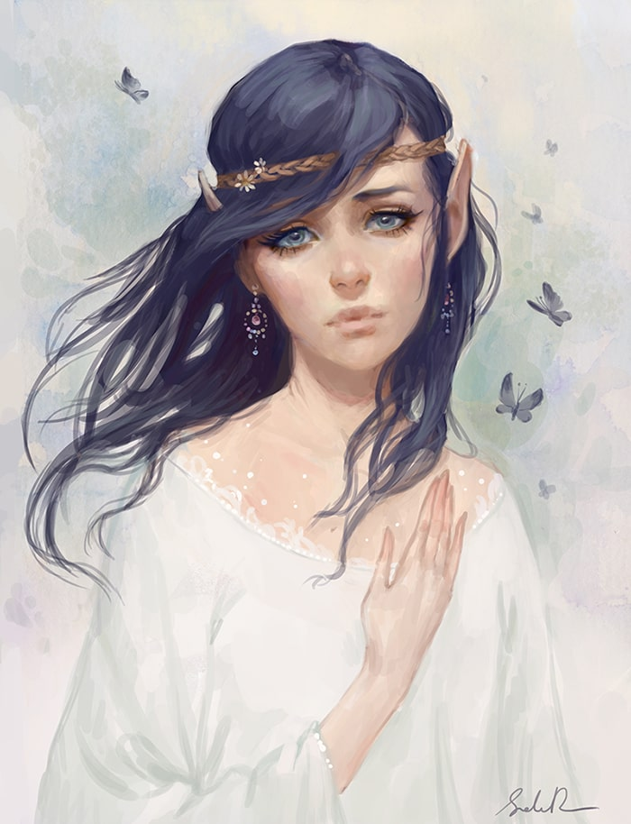
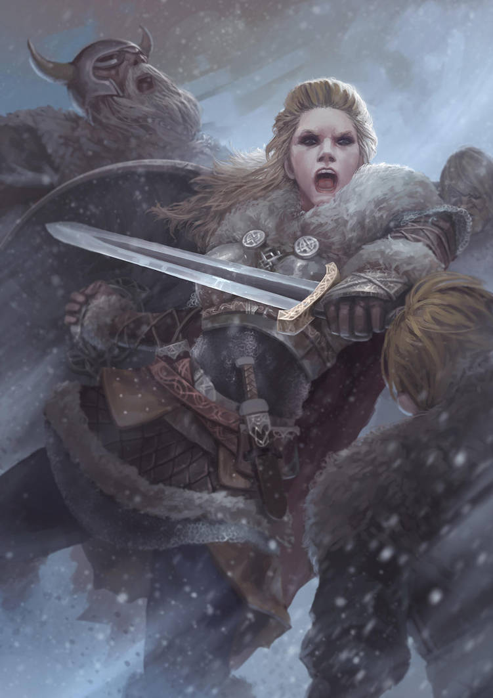
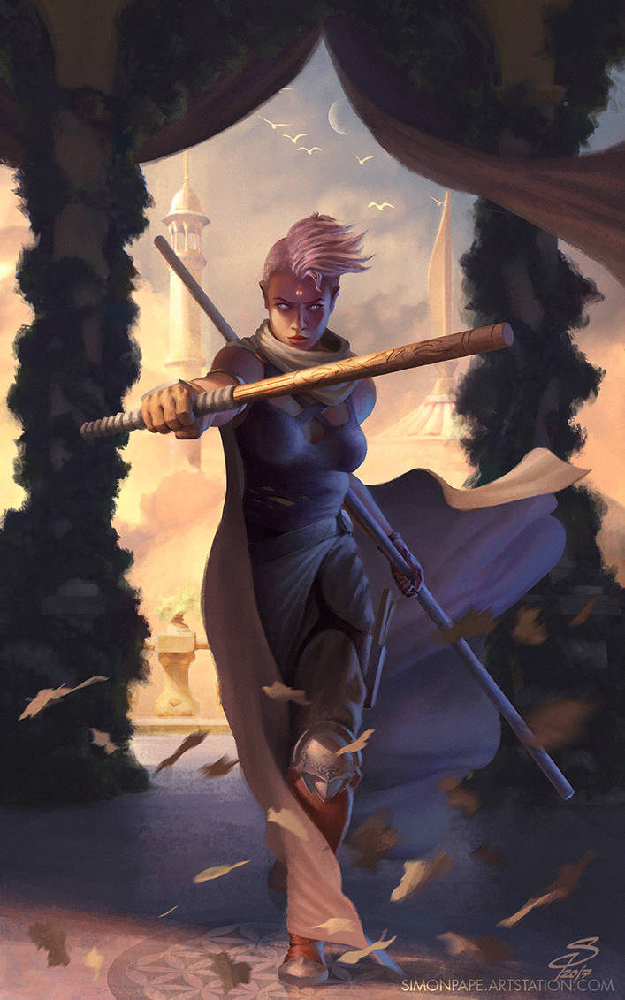

---

landscape_banner_path: /docs/images/backdrops/landscape_character_creation.jpg

landscape_banner_link: https://www.deviantart.com/hifarry/art/Tavern-Meeting-742777343

landscape_banner_name: Tavern Meeting

landscape_banner_artist: hifarry

landscape_banner_artist_link: https://www.deviantart.com/hifarry

landscape_banner_license: CC BY-NC-ND 3.0

landscape_banner_license_link: https://creativecommons.org/licenses/by-nc-nd/3.0/


portrait_banner_path: /docs/images/backdrops/portrait_character_creation.jpg

portrait_banner_link: https://www.deviantart.com/zezhou/art/Knight-of-Lies-562010429

portrait_banner_name: Knight of Lies

portrait_banner_artist: Zezhou

portrait_banner_artist_link: https://www.deviantart.com/zezhou

portrait_banner_license: CC BY-NC-ND 3.0

portrait_banner_license_link: https://creativecommons.org/licenses/by-nc-nd/3.0/


title: The Compendium of Character Creation

description: Everything you need to build your character!

show_download: false

---

  
# Compendium of Character Creation
_Version 2.1.3_  

   * [Building a Character](#building-a-character)  
     * [Personality and Background](#personality-and-background)  
     * [Health Dice Pieces](#health-dice-pieces)  
   * [Races](#races)  
     * [Automaton](#automaton)  
     * [Catterwol](#catterwol)  
     * [Daemonspawn](#daemonspawn)  
     * [Deep Elf](#deep-elf)  
     * [Dwarf](#dwarf)  
     * [Fleetfoot Halfling](#fleetfoot-halfling)  
     * [Gnome](#gnome)  
     * [Goblin](#goblin)  
     * [Hardfoot Halfling](#hardfoot-halfling)  
     * [High Elf](#high-elf)  
     * [Hissling](#hissling)  
     * [Human](#human)  
     * [Kragraven](#kragraven)  
     * [Lizkin](#lizkin)  
     * [Orc](#orc)  
     * [Sprout](#sprout)  
     * [Waterborn](#waterborn)  
     * [Wood Elf](#wood-elf)  
   * [Classes](#classes)  
     * [Archer](#archer)  
     * [Bard](#bard)  
     * [Beastmaster](#beastmaster)  
     * [Cleric](#cleric)  
     * [Druid](#druid)  
     * [Fighter](#fighter)  
     * [Gunslinger](#gunslinger)  
     * [Highborn](#highborn)  
     * [Knight](#knight)  
     * [Monk](#monk)  
     * [Necromancer](#necromancer)  
     * [Paladin](#paladin)  
     * [Path of Nature Barbarian](#path-of-nature-barbarian)  
     * [Path of Rage Barbarian](#path-of-rage-barbarian)  
     * [Ranger](#ranger)  
     * [Rogue](#rogue)  
     * [Sorcerer](#sorcerer)  
     * [Wizard](#wizard)  
   * [Skills](#skills)  

  
## Building a Character
  
  
This manual contains the __Races__, __Classes__, and __Skills__ that you may choose from to create a character
in Rangers and Ruffians. This compendium assumes that you have looked over the rules set forth in
the [Rangers and Ruffians Rulebook](Rulebook.md).
  
  
In terms of gameplay, a character is made up of two major components: a __Race__ and a __Class.__
A Race represents the racial background that your character comes from. Your choice of race grants you base
abilities and stats, and can greatly affect the way that you interact with the world. If you choose to play a
tiny _Sprout_, you might ride atop the shoulders of the another player's _Orc_ character.
  
  
  
  
__Class,__ meanwhile, affects your role within your adventuring party. A _Rouge_ might spend their time
scouting, skulking, and sneaking. A _Highborn_ might use their high Charisma to barter for goods or
get information out of an important non-player character. A _Barbarian_ will spend their time in combat
shielding and soaking up damage for their more-squishy counterparts.
When you level up in Rangers and Ruffians, it is your class that grants you new abilities.
  
  
  
  
  
  
  
  

  
### Personality and Background
It is important to remember that a character can be much, _much_ more than just a sack of stats an abilities.
As a player, it is up to you to breathe life into your character, and make them into a living, breathing
part of the world that your Poohbah is weaving. To this end, consider the following:
1. Where did my character come from? Do they have family? Friends?
2. Is my character family or friends with any of the other players' characters?
2. What does my character want? Where are they going? What motivates them?
3. Why would my character be interested in going on an adventure?
4. What are a few of my characters virtues? What about vices?
5. How did my character end up being the class that they are?
6. How does my character interact with others? How do they speak? What are they're mannerisms?
  
  
  
  
As you come up with a backstory for your character remember the following:
Try to keep things vague but evocative, and which is open ended. That way, your Poohbah can easily weave it into their world.
Consider the following simple backstory: 
> "Elizabeth is from the town of Lindhearth. Some years ago she 
was visited by an aged wizard, who warned her of a great trial approaching in her future. Ever since that
day, she has been preparing for an evil that may never come." 
  
  
  
  
While quite basic, let's examine what the above backstory does well.
1. While it introduces a town, ```Lindhearth```, the town is not rigidly defined, and is simple for a Poohbah to add to their campaign setting.
  As a bonus, wouldn't it be cool if the Poohbah included Lindhearth in their campaign! Maybe some of your friends or family could make an appearance,
  or maybe even the mysterious wizard!
2. While you have been warned of a "great trial," the nature of that trial is left entirely up to the Poohbah. That means that it can easily 
  be tied into the adventure. This is awesome, as it can easily fit into any story that the Poohbah might want to tell. Just like that, you
  are personally invested in the adventure!
3. It provides a basis for you to start further fleshing out Elizabeth's character. How has she been preparing? Has she been learning magic?
  Practicing her skill with the sword? Praying to her deity? How has this training affected her personality? Is her adventuring career part
  of these preparations?
  
  
  
  
Let's make a second backstory.
> "Richard spent his entire childhood in the Lost Library. Only, it wasn't called the 'Lost' Library, but the Holy Library back then.
   He had made friends with the old Clerics and Paladins that kept their noses in books all day, and had even gotten them to
   teach him some of their divine magics. His favorite of them was an old greybeard named Scanderbeg. All of this changed
   when a Gold Dragon descended on the Library, tearing through the roof and killing many of those within. With the help of
   Scanderbeg, Richard had fled, helpless, with no home and nowhere to go, displaced and a refugee."
  
  
  
  
Again, this backstory introduces a location, the Lost Library, which can easily be integrated into a Poohbah's campaign. This
backstory also introduces a villain, an evil ```Gold Dragon.``` Perhaps this fits perfectly into the Poohbah's plans, but maybe it doesn't.
Perhaps the Poohbah is planning on running an ```undead``` heavy campaign, in which a ```Lich``` is the main villain. Together, the player and
the Poohbah can tailor Richards backstory, so that instead, it reads:
  
  
  
  
> "All of this changed the army of the dead arrived, swarming throughout the City of Linth and leaving a path of carnage in their wake. 
   With the help of the holy magics he had learned from Scanderbeg, Richard fled, but not before laying eyes on ___him.___ The face of death itself. Hozius the
   Defiler. As Richard watched, Hozius raised his hands, and all of those who had been dead rose up to join his army."
  
  
  
  
Now the backstory fits the Poohbah's campaign, and it's maybe even cooler than it was before! This is the benefit of talking things through with
your Poohbah before the game begins, and why it is a great idea to come up with vague and evocative character concepts to run past them.
  
  
  
  
  
  
  
  

  
### Health Dice Pieces
Races and Classes each have ```Health Dice Pieces```. When building a character,
you add these pieces together to get your total health dice. For example,
if you race has ```2``` health dice pieces, and your class has ```4```,
your health dice would be ```6```.
  
  
  
  
__To Create Your Character__
1. Decide how you will compute their stats as detailed in [here](Rulebook.md#how-do-i-compute-my-characters-stats) in the Rulebook.
2. Choose a race.
3. Choose a class.
4. Choose a skill, gained for free at level zero.
5. If your character is of a level greater than zero, follow the rules for [Leveling Up](Rulebook.md#leveling-up).
6. If your character is able to learn spells, select the [appropriate number of spells for your level](Rulebook.md#new-spells) from
   [The Book of Lore](Book_of_Lore.md).
  
  

  
## Races
Your racial background in Rangers and Ruffians can greatly impact the way that you interact with the world.
Will you play a short but hearty _Hardfoot Halfling?_ The incredibly  tiny _Sprout?_ A metalic _Automaton?_ Perhaps you
brutish _Orc_ or a lithe, erudite _High Elf._ Or, you could stick to the basics and play a _Human._ Races provide
you with minor stat increases and a handful of starting abilities. Any race should easily be able to be paired with any
class, though some pairings will start out slightly stronger than others. That's fine, though! It will all balance out in the end!
  
### Automaton


"[Rose"](https://www.deviantart.com/vagocool/art/Rose-488273011) by Vagocool is licensed under [CC BY-ND 3.0](https://creativecommons.org/licenses/by-nd/3.0/)  
>Well, for a time, I was working on a project to produce artificial life forms, automata, if you will. The project had limited success, and was on the brink of being defunded. In a desperate attempt to keep things going, we turned to magic as a solution. So it was, that he soul gem was discovered. To this day, I wonder what it is exactly that we created. Was it life, or was it some crude approximation? I know not. Nor, I think, does the automaton.
>
>—Simon, Gnome Tinker

  
  
The biproduct of tinkers and mages, the automaton is considered by many to be an artificial being. For this reason, many are persecuted, and treated as mere objects. And perhaps they are. To question your place is to be an automaton, and the quest for meaning is a path that all such beings must walk.
  
  
|STR|DEX|INT|INF|CHR|PER|LUK|HD|  
|:---:|:---:|:---:|:---:|:---:|:---:|:---:|:---:|  
|2|-1|0|0|-1|0|0|6|  
  
  
__Automaton Abilities:__ 
* __Rules:__   
  * __Power Core:__ The source of your power is housed within you. If you are destroyed in combat, you can be rebuilt so long as the power core survives.  
  * __Repair:__ You cannot heal using potions or rest. Rather, you must perform repairs. Self repair counts as rest. Repair with help counts as sleep. Repair with a tinker or blacksmith's help counts as sleep in a bed. Blacksmith's must have access to a forge, and tinkers to their tools. Tinker and blacksmith repairs take a minimum of 6 hours.  
  * __Upgrades:__ A tinker can craft upgrades for you.  
* __General Abilities:__   
  * __Overdrive:__ Spend 2 health per minute or turn to increase strength and dexterity by 1. Can be stacked to a maximum of +5 STR and DEX.  
  * __True Sleeplessness:__ You cannot grow tired, nor can you sleep.  
  * __Armored Exterior:__ You naturally take half damage from the following types of attack: piercing, slashing, blunt, fire, and ice. Does not stack with Berserk.  
* __Combat Abilities:__   
  * __Self Repair:__ During combat, you can self repair as an action.  
  * __Gyroscopic Center of Mass:__ It is difficult to knock you over. Add 5 to any check that involves knocking you prone.  
  * __Piston Punch:__ _(Cost 1)_ You may perform a 1d8 strength based punch on an enemy of your choice. If the enemy fails a contested strength check, it is knocked prone. Enemies larger than your size take advantage, smaller take disadvantage. At level 4, increase damage to 1d12. At level 8, to 2d12. At level 12 to 3d12.  
  
  
  
___

  
### Catterwol


"[Portrait of warrior"](https://www.deviantart.com/alsareslynx/art/Portrait-of-warrior-415698430) by AlsaresLynx is licensed under [CC BY-NC-ND 3.0](https://creativecommons.org/licenses/by-nc-nd/3.0/)  
>Ah, yes, well... It was then that we stumbled upon an encampment of cat-folk. They seemed a nice enough sort, so we bought some of their wares, beads and knives and potions, that sort of thing. After that, we supped with them. Well, before we knew it, we were all unconcious; they drugged the food, no doubt. They made off with everything; my staff, my hat, and even my sandles!
>
>—Archibold, the Wizard

__Silent and Dexterous__  
Stalking on padded feet, the Catterwol Rouge makes her way carefully across the rooves of the city of Linth. Her target is simple, information and nothing more. Unfortunately, the information that she needs is buried inside of a chest locked in the room of Lord Edmire himself. Far below, her party waits with baited breath, as she hops from roof to roof, and then slips into Edmire's quarters. *Roll a Stealth Check!*  
  
__Perceptive__  
Needlelike teeth show in a sharp smile as the Catterwol Bard steps forward. "Hold on, surely we can work something out?" Isak, the kingpin of the city's thieves' guild, scoffs. "Not this time." From the corner of his eye, the Bard just notices two shadowy figures slip into view. His smile grows, and with a flash, he whips around and slings a throwing knife at one of the figures. *Roll for initiative!*  
  
__Tribal__  
Cattterwol tend to live in loose, nomadic tribes. As a general rule, they are deeply distrustful of outsiders, and are known to act in their own self-interest more often than not.  
  
__Building a Cattwol Character__  
When building your Catterwol, consider how they came to belong to your party. Remember that, while Catterwol are tribal, they are deeply protective of those close to them. Is the party their family now? What members of the party is your character close to?  
  
  
  
Catterwol are among the most lithe and dexterous of the races, and are adept at passign unseen and unheard. With padded feet and strong claws for climing, more than one Catterwol has turned to the life of a sneak-theif. Catterwol hail from dense, thicketed jungles and dry, dusty deserts. They make average mages, but prefer slim, dexterity based weapons.
  
  
|STR|DEX|INT|INF|CHR|PER|LUK|HD|  
|:---:|:---:|:---:|:---:|:---:|:---:|:---:|:---:|  
|-1|1|0|-1|0|1|1|4|  
  
  
__Catterwol Abilities:__ 
* __General Abilities:__   
  * __Dark Vision:__ You can see even in perfect darkness.  
  * __Land on your feet:__ You can fall 40 feet before taking fall damage.  
  * __Fast Paws:__ Gain an additional offhand action.  
* __Advantages:__   
  * __Predator:__ When tracking, you have advantage on perception checks.  
  * __Loose Skin:__ You have advantage when breaking grapples.  
* __Disadvantages:__   
  * __Fear of Water:__ You have disadvantage when soaked through.  
* __Combat Abilities:__   
  * __They're Retractable:__ You have retractable, razor sharp claws capable of doing 1d4 damage.  
  
  
  
___

  
### Daemonspawn


"[Tiefling Bard Custom DnD Char Comission"](https://www.deviantart.com/surugamonkey/art/Tiefling-Bard-Custom-DnD-Char-Comission-663338002) by SurugaMonkey is licensed under [CC BY-NC-ND 3.0](https://creativecommons.org/licenses/by-nc-nd/3.0/)  
>Never trust a daemonspawn, that's what I've alwasy been told. They're as liable to use their dark and terrible magicks as to give you a passing smile. I've never met one though; I've been careful to avoid them.
>
>—Miss Maribel Merkland, Busybody and Baker of Exquisite Pies.

  
  
The daemonspawn were born of an unholy union between elves and the demons of old. When the demons were thrown down and destroyed, the daemonspawn remained. Now, the daemonspawn are left in a world that at best doesn't understand them, and at worst fears and persecutes them. As such, the wise daemonspawn is always vigilant and trusts no one.
  
  
|STR|DEX|INT|INF|CHR|PER|LUK|HD|  
|:---:|:---:|:---:|:---:|:---:|:---:|:---:|:---:|  
|1|-1|1|0|-1|0|1|4|  
  
  
__Daemonspawn Abilities:__ 
* __General Abilities:__   
  * __True Sight:__ You are able to see invisible entities.  
  * __Sleepless:__ Your can rest without sleeping for one day, allowing you to keep watch long into the night.  
  * __Incombustible:__ You take half damage from heat and fire.  
* __Combat Abilities:__   
  * __Fix Your Eyes on Me:__ _(Cost 1)_ Conversation spell. If the person you are talking with fails an inner fire saving throw against your spell power, the world goes black for them except for you. Make charisma and intimidation checks with advantage for the remainder of the conversation. In combat, force the enemy to attack only you.  
  * __Sacrificial Rite:__ At the cost of half your level in health (minimum 1, round up), make a second action during combat.  
  
  
  
___

  
### Deep Elf


"[Fydriel Silentbloon [C]"](https://www.deviantart.com/jeleynai/art/Fydriel-Silentbloon-C-791379624) by Jeleynai is licensed under [CC BY-NC-ND 3.0](https://creativecommons.org/licenses/by-nc-nd/3.0/)  
>Elves can be slippery folk. It seems to me that rarely say what they mean, and they seldom mean what they say. They're strong mages, though, and too clever for their own good. If you're dealing with elves, try to appeal to their pride, but be careful about it. They can see through simple flattery.
>
>—Ser Gillthunder, Human Knight, Leader of the Hetzer Company (Mercenaries)

  
  
Elves are the most magical of the races. Forest-dwellers with long lives, many elves spend their days practicing magic and honing their skills. Elves are naturally beautiful, and this beauty benefits them when they deal with the other races. Elves make strong mages and good dexterity based fighters.
  
  
|STR|DEX|INT|INF|CHR|PER|LUK|HD|  
|:---:|:---:|:---:|:---:|:---:|:---:|:---:|:---:|  
|1|0|0|0|-2|1|1|4|  
  
  
__Deep Elf Abilities:__ 
* __General Abilities:__   
  * __Sleepless:__ Your can rest without sleeping for one day, allowing you to keep watch long into the night.  
  * __Dark Vision:__ You can see even in perfect darkness.  
* __Advantages:__   
  * __Winged Feet:__ You have advantage on acrobatics checks.  
* __Disadvantages:__   
  * __Born in Darkness:__ You are incredibly light sensitive, and take 1d6 damage per hour spent with your skin exposed to bright light or to the sun. As a result, you must wear protective garments during the day.  
* __Combat Abilities:__   
  * __Counter Attack:__ _(Cost 1)_ Reaction. You may strike back when an enemy attacks you.  
  
  
  
___

  
### Dwarf


"[The Hunter"](https://www.deviantart.com/ortsmor/art/The-Hunter-590846159) by ortsmor is licensed under [CC BY-NC-ND 3.0](https://creativecommons.org/licenses/by-nc-nd/3.0/)  
>Dwarves are difficult to hunt. They're thick, and sturdy; your shot has to be well placed if you want to bring one down.
>
>—Orkinshield, Orc Gunslinger

  
  
A stocky, brooding people, many dwarves are natural craftsman and artisans. Dwarves prefer low places, and many of their strongholds can be found deep within mountain ranges. Dwarves have a shrewd eye for business, and have been known to drink their adversaries under the table.
  
  
|STR|DEX|INT|INF|CHR|PER|LUK|HD|  
|:---:|:---:|:---:|:---:|:---:|:---:|:---:|:---:|  
|1|-2|0|1|0|0|1|4|  
  
  
__Dwarf Abilities:__ 
* __General Abilities:__   
  * __Incombustible:__ You take half damage from heat and fire.  
* __Advantages:__   
  * __Stocky:__ You have advantage against any check that could cause you to go prone.  
  * __Very Dangerous Over Short Distances:__ If you begin your turn next to an enemy, take advantage on your attack roll. Do not take short range disadvantage.  
  * __Boozehound:__ You have a very high tolerance for alcohol. Do not take disadvantage when drunk.  
  * __Thick Headed:__ You have advantage on any checks involving an enemy breaking into your mind or dominating you.  
  * __Forgeborn:__ When dealing with minerals or works made of stone, gain advantage on any checks made to assess or manipulate them.  
  
  
  
___

  
### Fleetfoot Halfling


"[On a Quest"](https://www.deviantart.com/nathanparkart/art/On-a-Quest-721516754) by NathanParkArt is licensed under [CC BY-NC-ND 3.0](https://creativecommons.org/licenses/by-nc-nd/3.0/)  
>Halflings are decent enough, and fun to be around. They have potential as rogues since they can see without being seen, but I'm not sure if they're clever enough.
>
>—Vasha, Catterwol Thief

  
  
Small folk, the Halflings would rather be drinking tea and eating toast in their holes than adventuring. They are naturally tricksters, are hardy for their size, and are adept at sqeezing into tight spots. On average, the Halflings stand at three-and-a-half feet, and have warm, chestnut colored eyes and hair.
  
  
|STR|DEX|INT|INF|CHR|PER|LUK|HD|  
|:---:|:---:|:---:|:---:|:---:|:---:|:---:|:---:|  
|-2|1|0|0|0|1|2|2|  
  
  
__Fleetfoot Halfling Abilities:__ 
* __General Abilities:__   
  * __Carry a Tune:__ _(Cost 1)_ Offhand. You know a song which, when sung, grants all members of your party +1 to a stat of your choice. Concentration.  
  * __Lightweight:__ Any cup of alcohol affects you like two.  
* __Starting Items:__   
  * __Sling:__ Your character begins their journey with a 1d4 sling.  
* __Advantages:__   
  * __Padfoot:__ You have advantage on stealth checks.  
* __Combat Abilities:__   
  * __Nimble:__ Targeted ranged attacks take disadvantage against you.  
  
  
  
___

  
### Gnome


"[Explorer"](https://www.deviantart.com/yanporfirio/art/Explorer-606889176) by Yanporfirio is licensed under [CC BY-NC-SA 3.0](https://creativecommons.org/licenses/by-nc-sa/3.0/)  
>Gnomes are tiny. They make things, sometimes. I can crush them.
>
>—Throgar, Barbarian and Sheriff

__Tinker__  
Moonlight paints the room as the Gnomish Tinker bites her lip. Her project is coming along quite well, better than expected, actually. Not far away, the rest of her party snores as they sleep. She should be sleeping as well, tomorrow is the big day. But then, that's why she needs a spring loaded spear-thrower in the first place. For a moment, she considers lying down, but then pulls her goggles over her eyes. Hopefully, her party was sleeping heavily. With a grin, she lights her acetaline torch, and sparks begin to fly. *Roll an intelligence check!*  
  
__None__  
__Eccentric__  
Most consider gnomes to be eccentric at best, and obtuse at worse.  
  
  
  
Tinkerers by nature, Gnomes are known to craft miraculous inventions to help them deal with difficult situations. Gnomes typically stand about three feet in height, and can be recognized by their signature goggles. Gnomes are well rounded and are capable of succeeding at anything they put their minds to.
  
  
|STR|DEX|INT|INF|CHR|PER|LUK|HD|  
|:---:|:---:|:---:|:---:|:---:|:---:|:---:|:---:|  
|0|0|1|1|-1|-1|2|2|  
  
  
__Gnome Abilities:__ 
* __Rules:__   
  * __Build:__ Once you have a recipe for an item, you can build it. You can attempt to build one item per rest, or two per sleep.  
* __General Abilities:__   
  * __Tinker:__ Every night, you can attempt to to create a device. Once you create one, you get its recipe. Must have ingredients. You begin with recipes for smokebombs, firebombs, and saddles. (Tinkering requires an intelligence check)  
  * __See and Remember:__ Once you see something, you will probably remember it.  
  * __Gather:__ You passively collect ingredients for your tinkering.  
* __Starting Items:__   
  * __Grapple Gun:__ You carry a retractable grappling gun. The gun carries 40 feet of rope.  
* __Advantages:__   
  * __Resist Magic:__ You make any rolls against an enemy's spell power with advantage.  
  
  
  
___

  
### Goblin


"[Goblin archer"](https://www.deviantart.com/fjft-art/art/Goblin-archer-551201383) by FJFT-Art is licensed under [CC BY-NC-ND 3.0](https://creativecommons.org/licenses/by-nc-nd/3.0/)  
>It is a rarity to find a kindly goblin, but when I have, I have found them to be most agreeable companions. Mind you, their penchant for raw flesh can be most off-putting... As can their little yellow eyes. Still, though, if ever you are in a pinch, a loyal goblin-ling can be a fierce, nay, a vicious ally.
>
>—Tamberdoodle, Bard Extraordinare

  
  
Small and wicked, most goblins are tricksters and thieves. Known for eating their kills and living in the dark, goblins prefer to fight with ranged or short weapons. Morally good goblins are rare, and have often been outcast from their clan and family. This can be very painful, as goblins are communal creatures by nature.
  
  
|STR|DEX|INT|INF|CHR|PER|LUK|HD|  
|:---:|:---:|:---:|:---:|:---:|:---:|:---:|:---:|  
|0|1|0|-1|-1|1|2|2|  
  
  
__Goblin Abilities:__ 
* __General Abilities:__   
  * __Still Warm:__ You can eat raw meat without penalty.  
  * __Dark Vision:__ You can see even in perfect darkness.  
  * __Seek Gold:__ You are able to smell gold. You can perform gold detection checks.  
* __Advantages:__   
  * __Mantel:__ You have advantage on dexterity checks when climbing.  
* __Combat Abilities:__   
  * __Cheap Blow:__ On a critical hit, knock an enemy prone.  
  
  
  
___

  
### Hardfoot Halfling


"[Houma"](https://www.deviantart.com/junica-hots/art/Houma-743629249) by Junica-Hots is licensed under [CC BY-NC-ND 3.0](https://creativecommons.org/licenses/by-nc-nd/3.0/)  
>Halflings are decent enough, and fun to be around. They have potential as rogues since they can see without being seen, but I'm not sure if they're clever enough.
>
>—Vasha, Catterwol Thief

  
  
Small folk, the Halflings would rather be drinking tea and eating toast in their holes than adventuring. They are naturally tricksters, are hardy for their size, and are adept at sqeezing into tight spots. On average, the Halflings stand at three-and-a-half feet, and have warm, chestnut colored eyes and hair.
  
  
|STR|DEX|INT|INF|CHR|PER|LUK|HD|  
|:---:|:---:|:---:|:---:|:---:|:---:|:---:|:---:|  
|0|-1|-1|1|1|0|1|4|  
  
  
__Hardfoot Halfling Abilities:__ 
* __General Abilities:__   
  * __Warm Butter:__ Your are naturally talented chef. You may cook food which heals allies for an extra dice of health while resting.  
  * __Soft Bed:__ You recover two extra health dice from sleeping in a real bed.  
  * __Carry a Tune:__ _(Cost 1)_ Offhand. You know a song which, when sung, grants all members of your party +1 to a stat of your choice. Concentration.  
* __Starting Items:__   
  * __Sling:__ Your character begins their journey with a 1d4 sling.  
* __Advantages:__   
  * __Thick Headed:__ You have advantage on any checks involving an enemy breaking into your mind or dominating you.  
* __Combat Abilities:__   
  * __Courageous Blow:__ _(Cost 1)_ Add twice your Inner Fire to an attack.  
  
  
  
___

  
### High Elf


"[Elf Girl"](https://www.deviantart.com/selenada/art/Elf-Girl-459931558) by Selenada is licensed under [CC BY-NC-ND 3.0](https://creativecommons.org/licenses/by-nc-nd/3.0/)  
>High Elves can be slippery folk. It seems to me that rarely say what they mean, and they seldom mean what they say. They're strong mages, though, and too clever for their own good. If you're dealing with elves, try to appeal to their pride, but be careful about it. They can see through simple flattery.
>
>—Ser Gillthunder, Human Knight, Leader of the Hetzer Company (Mercenaries)

  
  
High elves are among the most magical of the races. Reclusive by nature, high elves often confine themselves to gleaming costal cities. When a high elf does venture out into the world at large, it is often in a diplomatic capacity. High elves are as charming as they are naturally beautiful, and commonly feel as though it is their duty to maintain balance in the world. High elves make good mages.
  
  
|STR|DEX|INT|INF|CHR|PER|LUK|HD|  
|:---:|:---:|:---:|:---:|:---:|:---:|:---:|:---:|  
|-1|0|1|-1|1|0|2|2|  
  
  
__High Elf Abilities:__ 
* __Choices:__   
  * __Learned:__ You are fluent in an extra language of your choosing.  
* __General Abilities:__   
  * __Sleepless:__ Your can rest without sleeping for one day, allowing you to keep watch long into the night.  
  * __Low-Light Vision:__ You can see in low light.  
  * __Inherent Magic:__ You are able to cast tier zero spells naturally, and begin with 2 extra tier zero spells from any spellbook.  
  * __Detect Magic:__ _(Cost 1)_ Perform a magic detection check.  
* __Advantages:__   
  * __Wink Wink, Nudge Nudge:__ Due to your beauty, you have advantage on charisma checks when dealing with races that find you attractive.  
  
  
  
___

  
### Hissling


"[Kobold Sketch"](https://www.deviantart.com/kronteisdrawing/art/Kobold-Sketch-796966664) by Kronteisdrawing is licensed under [CC BY-NC-ND 3.0](https://creativecommons.org/licenses/by-nc-nd/3.0/)  
>So here's one for you: A while back, we were called to a town by the name of Broshtik to help some yokels. Apparently, things had been going missing. Little things, mostly; utensils and fire pokers and the like. Normally, we wouldn't have taken such a small job, but work had been scarce and beggars can't be choosers. So, anyway, we get to Broshtik, and we spend a good three days poking around, but can't find anything. It gets to the point that we are ready to call it quits and get out of there. Then, one of Harley's rings goes missing overnight. We look around, and find a trail, barely anything, leading through one of the windows. So, out we go, and over to one of the sewer grates in town. We pried it open, and dropped down in. And what do you think we saw? An entire civilization of tiny little lizardlings, that's what. Generations of them, all living in houses built of mud and candlesticks. All at once, the little buggers start taking off like they'd seen Melikar, skittering and running in every direction. Then, an elder approaches us. Or, at least, I think it was an elder; it only came to my knees, and wore a robe made out of a piece of towel. In broken speech, it asked us to leave them be in return for a great gift: two necklaces and a pair of children's shoes. Some times, I wonder if they're still down there.
>
>—Gillthunder, Human Knight

  
  
Next to Sprouts, Hisslings are the smallest of races. Lizardlike entities, Hisslings try their very best to be ferocious. While naturally clever, Hisslings do not cherish knowledge, but rather focus upon helping their clan flourish. The life of a Hissling is often a bleak one: while hisslings can live upwards of 40 years, they rarely do. Instead, most die early due to their fragile nature and disregard for their own safety. Because of the commonality of death in Hissling tribes, most Hisslings put the long-term wellbeing of the collective above that of themselves or even their closest friends and family. Hisslings reach full maturity after only two years, and can reproduce just a few years after. 
  
  
|STR|DEX|INT|INF|CHR|PER|LUK|HD|  
|:---:|:---:|:---:|:---:|:---:|:---:|:---:|:---:|  
|-1|1|0|-1|0|1|2|2|  
  
  
__Hissling Abilities:__ 
* __Choices:__   
  * __I'm a Red One!:__ At the start of your journey, choose your color. This choice affects elemental resistances.  
* __General Abilities:__   
  * __Small Fry:__ Your size is considered tiny. You can fit into small spaces, be easily carried, and be easily thrown.  
  * __All Tuckered Out:__ You must sleep once every six hours, or suffer exhaustion.  
  * __Tossed Around:__ You take half damage from blunt attacks, but are tossed 5 feet backward for every size larger than you your enemy is. Take full damage if you hit something as a result.  
* __Combat Abilities:__   
  * __Chomp Chomp:__ You can make a 1d4 bite attack as an offhand action. Once you have bitten an enemy, your jaw sets, and you won't let go until even after you are dead. The enemy can attempt contested dexterity checks to try to free themselves of you.  
  * __Riding High:__ Allies take no disadvantage while you ride them. You gain advantage on attacks while riding a party member.  
  * __Dig Dig Dig:__ You are able to burrow through earth at a rate of 1 foot per minute.  
  
  
  
___

  
### Human


"[Escape"](https://www.deviantart.com/gkb3rk/art/Escape-464097162) by gkb3rk is licensed under [CC BY-NC-ND 3.0](https://creativecommons.org/licenses/by-nc-nd/3.0/)  
>Humans are good, but a little bit tough. That's why you have to eat them raw.
>
>—Orkensheild, Orc Archer

  
  
Humans are the most average of the races. The race of men can become good at most things, but it takes a concerted effort for them to become great at anything. That doesn't stop them from trying, though, and it is this natural willpower that makes them a force to be reckoned with.
  
  
|STR|DEX|INT|INF|CHR|PER|LUK|HD|  
|:---:|:---:|:---:|:---:|:---:|:---:|:---:|:---:|  
|1|-1|0|1|0|-1|1|4|  
  
  
__Human Abilities:__ 
* __Choices:__   
  * __Skilled:__ Begin your journey with one extra skill.  
* __General Abilities:__   
  * __Adaptable:__ Once affected by an effect or spell, gain advantage on saves against it for the remainder of the day.  
* __Combat Abilities:__   
  * __Last Stand:__ When your health is below 25%, you can take an extra action on your turn.  
  * __Strength of Men:__ _(Cost 1)_ You have basic healing abilities. You may heal a party member for 1d6 + inner fire health.  
  * __Rally:__ _(Cost 1)_ You may use an aura which gives all of your allies a 1d8 inspiration dice.  
  
  
  
___

  
### Kragraven


"[The Reaping Raven"](https://www.deviantart.com/foxtrack/art/The-Reaping-Raven-by-burdfish-396214428) by Foxtrack is licensed under [CC BY-NC-ND 3.0](https://creativecommons.org/licenses/by-nc-nd/3.0/)  
>I don't trust them, those bird-men that live to the west. Don't trust them one bit.
>
>—Old Man Mcuffit, Racist Old Man

  
  
Kragraven stand at about the height of a human, though they are known to hunch over, slightly. Kragraven are reclusive, taking to lofty homes amidst ancient forests. Myths say that Kragraven were first created by the god Ragnhall, and that they are his servants.
  
  
|STR|DEX|INT|INF|CHR|PER|LUK|HD|  
|:---:|:---:|:---:|:---:|:---:|:---:|:---:|:---:|  
|0|0|1|-1|-1|1|1|4|  
  
  
__Kragraven Abilities:__ 
* __Choices:__   
  * __Peck:__ _(Cost 1)_ As an offhand action, peck an enemy, dealing 1d6 damage. On a critical hit, blind them until they succeed a SP save.  
* __General Abilities:__   
  * __High Jump:__ Flap your vestigial wings to jump twice your height directly upward.  
  * __Coast:__ Use your wings to coast from great heights.  
  * __Carrion:__ You can eat raw and rotten meat without penalty.  
  * __Mimic:__ You can mimic any voice you've heard.  
  
  
  
___

  
### Lizkin


"[Cleric of the three moons"](https://www.deviantart.com/themefinland/art/Cleric-of-the-three-moons-709879645) by ThemeFinland is licensed under [CC BY-NC-SA 3.0](https://creativecommons.org/licenses/by-nc-sa/3.0/)  
>Skin changes like mist. Poisoned teeth lurking within. A Lizkin fighter.
>
>—Mister Li, Gnomeish Monk

  
  
  
  
  
  
|STR|DEX|INT|INF|CHR|PER|LUK|HD|  
|:---:|:---:|:---:|:---:|:---:|:---:|:---:|:---:|  
|1|-1|0|0|-1|1|1|4|  
  
  
__Lizkin Abilities:__ 
* __General Abilities:__   
  * __Poison Resist:__ You are resistant to most poisons. You have advantage on any poison related checks, and take half damage at worst.  
  * __Shed Tail:__ Once per week, you can shed your tail to escape a grapple.  
  * __Taste Air:__ Gain advantage on tracking perception checks by tasting the air. Works in all environments.  
* __Advantages:__   
  * __Color Choice:__ _(Cost 1)_ You may choose what color your scales are. Scales may hold only three colors at a time unless Camouflage is being used. This may be used to gain advantage on a stealth check.  
  * __Smokevision:__ Your double eyelids allows you to see well when underwater or in smoke.  
* __Combat Abilities:__   
  * __Poison Bite:__ _(Cost 1)_ You may make a bite attack for 1d6 damage. If your enemy fails a D10 inner fire saving throw, they are poisoned and take an additional 1d6 damage at the start of each turn until they pass a D14 inner fire saving throw. At level 5, increase this damage to 1d12. At level 8, increase it to 10, increase it to 2d12.  
  
  
  
___

  
### Orc


"[Rakhven portrait"](https://www.deviantart.com/jeleynai/art/Rakhven-portrait-732800784) by Jeleynai is licensed under [CC BY-NC-ND 3.0](https://creativecommons.org/licenses/by-nc-nd/3.0/)  
>The full-orc is a dangerous specimen. Known to hunt and eat the other races, it is difficult to domesticate them. As the saying goes, you can take the orc out of the wilderness, but you can't stop him from trying to eat you.
>
>—unattributed folk wisdom

  
  
A brutish and warlike race, orcs stab first and ask questions later. Orcs are often used to living in harsh environments, and living off the land.
  
  
|STR|DEX|INT|INF|CHR|PER|LUK|HD|  
|:---:|:---:|:---:|:---:|:---:|:---:|:---:|:---:|  
|1|0|0|1|-2|0|1|4|  
  
  
__Orc Abilities:__ 
* __General Abilities:__   
  * __Still Warm:__ You can eat raw meat without penalty.  
* __Advantages:__   
  * __Predator:__ When tracking, you have advantage on perception checks.  
* __Combat Abilities:__   
  * __Bellow:__ _(Cost 1)_ On your turn, spend one action point to unleash a mighty bellow. All who hear must make an Spell Power save of be frightened.  
  * __Thunderous Blow:__ _(Cost 1)_ Roll an extra dice for your attack. On a critical hit, knock the enemy prone.  
  * __Vengeful Death:__ When you are reduced to zero hit points, you may make one last retaliatory action. If you take the retaliatory action, you must make your death coin flips with disadvantage.  
  
  
  
___

  
### Sprout


"[Kynitia"](https://www.deviantart.com/deevad/art/Kynitia-322571692) by Deevad is licensed under [CC BY-SA 3.0 US](https://creativecommons.org/licenses/by-sa/3.0/us/)  
>And as I walked through the forest, I heard a sound, like the laughter of children. Fearing some trick, I summoned forth my hammer of light. To my shock, the sound came from a race of tree folk, smaller even than the smallest halfling. They were quite dexterous, and spoke the language of my people. I spent some time among their woodland village before continuing on my way.
>
>—Harley, Elf Paladin

  
  
Sprouts are among the smallest of the races, standing at about 2 feet. As a result, they are very weak, but are fast, and good at sneaking. The wise sprout should avoid the front line of combat, and instead stay in relative hiding, jumping out to attack at opportune moments. Sprouts are not necessarily wise, however, and it is not strange to see a sprout knight attempting to make a name for themself.
  
  
|STR|DEX|INT|INF|CHR|PER|LUK|HD|  
|:---:|:---:|:---:|:---:|:---:|:---:|:---:|:---:|  
|-2|1|0|0|0|1|2|2|  
  
  
__Sprout Abilities:__ 
* __General Abilities:__   
  * __Photosynthesis:__ Every turn or once per hour, regain 1d4 health.  
  * __Small Fry:__ Your size is considered tiny. You can fit into small spaces, be easily carried, and be easily thrown.  
  * __Soft Landing:__ Reduce any falling damage by 20 feet.  
  * __Commune with Nature:__ You are naturally able to speak with plants and animals.  
  * __Lightweight:__ Any cup of alcohol affects you like two.  
  * __Blade of Grass:__ Summon a 1d6 blade of woven plant fiber on command.  
  * __Harden:__ As an offhand action, harden or unharden yourself. While hardened, gain 2 armor but loose 2 dexterity. Does not stack with other armor.  
* __Advantages:__   
  * __Scurry:__ You have advantage on dexterity based athletics checks.  
* __Combat Abilities:__   
  * __Dodge:__ Any time you are attacked, roll a d20 and add your dexterity. If you get above a 15, the attack misses.  
  
  
  
___

  
### Waterborn


"[Dark Elf"](https://www.deviantart.com/junica-hots/art/Dark-Elf-706830603) by Junica-Hots is licensed under [CC BY-NC-ND 3.0](https://creativecommons.org/licenses/by-nc-nd/3.0/)  
>Most Waterborn I've seen have been dried up and dying. Their need for water is their undoing, out here in the desert. Once they've been wetted down a bit, they perk right up. It's then that you have to watch yourself; Waterborn are liable to charm you when you're not looking.
>
>—Leaf, Gnome Rogue from the Wild Desert

  
  
Alien among the other races, Waterborn hail from the depths of oceans, lakes, and rivers. Waterborn come in a pleathora of colors, and have ruddy, splotched skin which dries up if it isn't exposed to water regularly. Waterborn are powerful magic users, and are naturally adept at charming the other races.
  
  
|STR|DEX|INT|INF|CHR|PER|LUK|HD|  
|:---:|:---:|:---:|:---:|:---:|:---:|:---:|:---:|  
|-1|0|1|-1|1|0|2|2|  
  
  
__Waterborn Abilities:__ 
* __General Abilities:__   
  * __Water Breathing:__ You only need to breathe once every three days. If you do not go underwater to breath, you will suffocate.  
  * __Flows Like Water:__ You can walk on water, and swim as fast as a horse can run.  
  * __Water Healing:__ When you sleep in water, it is as if you are in a bed.  
  * __Lightweight:__ Any cup of alcohol affects you like two.  
* __Combat Abilities:__   
  * __Become Mist:__ _(Cost 1)_ Spend one action point to become mist to have an attack pass right through you as a reaction.  
  * __Charm:__ _(Cost 1)_ As an action, you may cast a charm spell on an entity. If the entity fails an inner fire saving throw against your spell power, they cannot attack you until you attack them or they succeed, and you gain advantage on charisma checks with them.  
  
  
  
___

  
### Wood Elf


"[Rinn"](https://www.deviantart.com/jeleynai/art/Rinn-Gift-767109597) by Jeleynai is licensed under [CC BY-NC-ND 3.0](https://creativecommons.org/licenses/by-nc-nd/3.0/)  
>Elves can be slippery folk. It seems to me that rarely say what they mean, and they seldom mean what they say. They're strong mages, though, and too clever for their own good. If you're dealing with elves, try to appeal to their pride, but be careful about it. They can see through simple flattery.
>
>—Ser Gillthunder, Human Knight, Leader of the Hetzer Company (Mercenaries)

  
  
Elves are the most magical of the races. Forest-dwellers with long lives, many elves spend their days practicing magic and honing their skills. Elves are naturally beautiful, and this beauty benefits them when they deal with the other races. Elves make strong mages and good dexterity based fighters.
  
  
|STR|DEX|INT|INF|CHR|PER|LUK|HD|  
|:---:|:---:|:---:|:---:|:---:|:---:|:---:|:---:|  
|-1|1|0|-1|0|1|1|4|  
  
  
__Wood Elf Abilities:__ 
* __General Abilities:__   
  * __Sleepless:__ Your can rest without sleeping for one day, allowing you to keep watch long into the night.  
  * __Low-Light Vision:__ You can see in low light.  
* __Advantages:__   
  * __Winged Feet:__ You have advantage on acrobatics checks.  
  * __Tracker:__ You are an excellent tracker, and have advantage when looking for trails and sign of passage.  
* __Combat Abilities:__   
  * __Counter Attack:__ _(Cost 1)_ Reaction. You may strike back when an enemy attacks you.  
  
  
  
___

  
## Classes
Choosing your class in Rangers and Ruffians is perhaps the most important choice that you will make.
While your race determines what you look like, your class determines what your role will be in your
adventuring party. Will you play a high charisma _Bard_, or a heavily armored _Knight?_ Perhaps a
_Gunslinger_ or an _Archer?_ Is magic more your style? Then perhaps you will play as a priestly _Cleric_,
an intelligent _Wizard_ or a naturalistic _Druid._ Perhaps you want an animal companion ever at your side.
In that case, the wild _Beastmaster_ may be right up your alley. While there are many choices at your fingertips,
we have worked hard to make sure that all of them are very fun, so no matter what you pick, you're certain
to have a good time!
  
### Archer


"[Archer-Comission"](https://www.deviantart.com/robcv/art/Archer-Comission-786575653) by RobCV is licensed under [CC BY-SA 3.0](https://creativecommons.org/licenses/by-sa/3.0/)  
  
  
Some of the best marksmen in the world, archers are naturals with ranged weapons. They are often attached to their bow, and carry it with them everywhere. Archers come from all walks of life; some compete in tournaments, others are hunters and farmer's sons. Still others have served in the military. Archers should stay off of the front line, instead picking off foes from a distance.
  
  
|STR|DEX|INT|INF|CHR|PER|LUK|HD|  
|:---:|:---:|:---:|:---:|:---:|:---:|:---:|:---:|  
|-3|1|-1|-2|0|2|1|4|  
  
  
__Archer Abilities:__ 
* __Starting Items:__   
  * __Longbow:__ You begin your journey with a d6 longbow.  
  * __Boot Knife:__ You carry a hidden d6 knife in your boot.  
  
  
__Level 0 Archer__

* __General Abilities:__   
  * __Fletcher:__ You know how to craft your own arrows, and always seem to have some on hand.  
  
  
* __Combat Abilities:__   
  * __Focus:__ _(Cost 1)_ Focus before a shot to gain advantage on it. Removes distance penalties.  
  * __Huntsman:__ You have advantage when attacking beasts.  
  
  
__Level 1 Archer__

* __Choices:__   
  * __Minor Stat Increase:__ You gain one stat point to add to a stat of your choosing.  
  
  
* __Advantages:__   
  * __Mantel:__ You have advantage on dexterity checks when climbing.  
  
  
* __Combat Abilities:__   
  * __Called Shot:__ _(Cost 1)_ Aim for a specific part of an enemy. The enemy must make a spell power save or drop a weapon, be blinded, or be knocked prone.  
  
  
__Level 2 Archer__

* __Choices:__   
  * __Major Stat Increase:__ You gain two stat points to add to a stat or stats of your choosing.  
  
  
__Level 3 Archer__

* __Choices:__   
  * __Minor Stat Increase:__ You gain one stat point to add to a stat of your choosing.  
  
  
* __General Abilities:__   
  * __Fire and Ice Arrows:__ _(Cost 1)_ You have mastered the art of crafting fire and ice arrows, and can craft at most 2 per day. Fire arrows do an additional 1d6 fire damage and deal 1d6 burn damage to enemies that fail a saving throw against your spell power. Ice arrows deal an additional 1d8 ice damage, and cause an enemy to move backward 1d4 spaces in the initiative order of they fail a saving throw against your spell power.  
  
  
* __Combat Abilities:__   
  * __Dual Shot:__ _(Cost 1)_ Fire two arrows at the same target in a single attack.  
  
  
__Level 4 Archer__

* __Choices:__   
  * __Major Stat Increase:__ You gain two stat points to add to a stat or stats of your choosing.  
  
  
* __General Abilities:__   
  * __Rope Arrows:__ _(Cost 1)_ You have mastered the art of crafting rope arrows using minor magic. As soon as a rope arrow hits its target, a rope instantly appears connecting the target to your hand. This can be used to climb, or to grapple opponents. To grapple an opponent, you must make a contested strength check.  
  
  
__Level 5 Archer__

* __Choices:__   
  * __Minor Stat Increase:__ You gain one stat point to add to a stat of your choosing.  
  
  
* __General Abilities:__   
  * __Net Arrows:__ _(Cost 1)_ You can now craft net arrows. When a net arrow hits its target, they must make an inner fire saving throw against your spell power. On failure, they are instantly wrapped in a net, and are considered restrained. Each turn, they may make a strength saving throw against your spell power to attempt to break out of the net.  
  * __Smoke Arrow:__ _(Cost 1)_ You can now craft smoke arrows. When a smoke arrow hits the ground, it creates a smokescreen with a 30 foot radius.  
  
  
__Level 6 Archer__

* __Choices:__   
  * __Major Stat Increase:__ You gain two stat points to add to a stat or stats of your choosing.  
  
  
* __General Abilities:__   
  * __Shadow and Light Arrows:__ _(Cost 1)_ You have mastered the art of crafting shadow and light arrows. Shadow arrows do an additional 1d6 dark damage and cause enemies who fail an inner fire saving throw against your spell power to go blind for 1d4 turns. Shadow arrows may also be used to fill a 10 foot radius with pitch darkness. Light arrows deal an additional 1d6 light damage, and deal another 1d6 damage to the undead.  
  
  
__Level 7 Archer__

* __Actions:__   
  * __Offhand Attack:__ You may use an offhand action to make an attack.  
  
  
* __Choices:__   
  * __Minor Stat Increase:__ You gain one stat point to add to a stat of your choosing.  
  
  
* __General Abilities:__   
  * __Reflexes:__ _(Cost 1)_ Reaction, attempt to catch a projectile. Roll a d20, and reduce the projectile's damage by that amount. If reduced to zero, you catch the projectile.  
  
  
* __Advantages:__   
  * __Steady:__ Do not take disadvantage when being jostled about.  
  
  
__Level 8 Archer__

* __Choices:__   
  * __Major Stat Increase:__ You gain two stat points to add to a stat or stats of your choosing.  
  
  
* __General Abilities:__   
  * __Explosive Arrows:__ _(Cost 3)_ After much experimentation, you have finally mastered the art of crafting explosive arrows. Explosive arrows do 2d10 damage to all enemies in a twenty foot radius.  
  
  
__Level 9 Archer__

* __Choices:__   
  * __Minor Stat Increase:__ You gain one stat point to add to a stat of your choosing.  
  
  
* __General Abilities:__   
  * __Vampiric Arrow:__ _(Cost 2)_ You can now craft vampiric arrows. Vampiric arrows do an additional 2d6 damage to an entity. You regain half of the damage done by a vampiric arrow to your health.  
  
  
__Level 10 Archer__

* __Choices:__   
  * __Major Stat Increase:__ You gain two stat points to add to a stat or stats of your choosing.  
  
  
* __General Abilities:__   
  * __True Mastery:__ Every ranged weapon functions as at least a d12 weapon in your hands.  
  
  
__Level 11 Archer__

* __Choices:__   
  * __Minor Stat Increase:__ You gain one stat point to add to a stat of your choosing.  
  
  
* __General Abilities:__   
  * __Blink Arrows:__ _(Cost 2)_ After learning more about magic, you have learned how to create blink arrows. Blink arrows instantly teleport you to the position that they hit.  
  
  
* __Advantages:__   
  * __Uncanny Perception:__ You have uncanny perception, which allows you to sense your way in total darkness, and gives you advantage on all perception checks.  
  
  
__Level 12 Archer__

* __Choices:__   
  * __Major Stat Increase:__ You gain two stat points to add to a stat or stats of your choosing.  
  
  
* __General Abilities:__   
  * __Shock Arrow:__ _(Cost 2)_ You can now craft shock arrows. When a shock arrow hits an enemy, it deals 2d8 shock damage to them and any other entities within 30 feet. If an affected entity is wearing metal armor or is made of or standing in water, they take an extra 2d8 damage. All affected entities must make an inner fire saving throw against your spell power. On failure, they are knocked prone.  
  
  
__Level 13 Archer__

* __Choices:__   
  * __Minor Stat Increase:__ You gain one stat point to add to a stat of your choosing.  
  
  
* __General Abilities:__   
  * __Expert Fletcher:__ All arrows now cost 1 action point less.  
  * __Anti-Gravity Arrows:__ _(Cost 2)_ You can now craft Anti-Gravity arrows. When an Anti-Gravity arrow hits its target, they must make an inner fire saving throw against your spell power. On failure, gravity is reversed for them, and they fly towards the sky. Anti-gravity arrows last for one minute, 1d4 turns, or until the entity succeeds its inner fire saving throw.  
  
  
* __Combat Abilities:__   
  * __Volley:__ _(Cost 2)_ Attack every enemy you can see in a single action.  
  
  
__Level 14 Archer__

* __Choices:__   
  * __Major Stat Increase:__ You gain two stat points to add to a stat or stats of your choosing.  
  
  
__Level 15 Archer__

* __Choices:__   
  * __Minor Stat Increase:__ You gain one stat point to add to a stat of your choosing.  
  
  
* __General Abilities:__   
  * __Firestorm Arrow:__ _(Cost 4)_ You can now craft firestorm arrows. A firestorm arrow does nothing for one turn or one minute after it strikes something. Then, it explodes into a massive pillar of flame with a fifteen foot diameter. All entities caught in the pillar of flame take 4d10 damage instantly. The pillar of flame stays for 3 turns.  
  
  
  
___

  
### Bard


"[Song of nature"](https://www.deviantart.com/yanporfirio/art/Song-of-nature-695972090) by Yanporfirio is licensed under [CC BY-NC-SA 3.0](https://creativecommons.org/licenses/by-nc-sa/3.0/)  
  
  
Showmen by nature, Bards are known for their skills at performing and distracting others from the sorrows of life. Bards are usually at least a little bit gaudy and outgoing. They are quick in a fight, and often fight with dexterity based weapons such a shortswords or knives. Bards are powerful spellcasters, and are excellent at providing support to their party and at making enemies weaker. As you prepare your bard, consider how they chose this way of life. How did they learn magic? How do they perform? Do they play music? Dance? Tell stories? How did they learn to fight? Who did they learn to fight from? How old are they? How many places have they been? Where do they perform? Why do they perform there? How will being a bard change the way you interact with your party?
  
  
|STR|DEX|INT|INF|CHR|PER|LUK|HD|  
|:---:|:---:|:---:|:---:|:---:|:---:|:---:|:---:|  
|-3|0|1|-1|2|-2|1|4|  
  
  
__Bard Abilities:__ 
* __Choices:__   
  * __Spell Choice:__ At the start of your journey, you know 2 extra tier zero spells.  
* __Advantages:__   
  * __Boozehound:__ You have a very high tolerance for alcohol. Do not take disadvantage when drunk.  
  
  
__Level 0 Bard__

* __Rules:__   
  * __Learning Spells:__ New spells or techniques are obtained by leveling up or by finding spellbooks or scrolls in the world. A spellbook may contain a specific spell, or a maximum spell tier. Spellbooks with a maximum spell tier contain one spell of your choice from the spellbooks that you can learn from with a tier up to the spellbook's maximum spell tier.  
  * __Learn Spells:__ Each time you level up, learn one new spell of each spell tier that you have access to. Spells must be learned from one of your spellbooks.  
  
  
* __Choices:__   
  * __My Father's Oboe:__ You are proficient and start with two instruments of your choice.  
  
  
* __General Abilities:__   
  * __Tier Zero Spells:__ You have achieved a basic knowledge of the arcane, and may now learn tier zero spells from any of your spellbooks.  
  
  
* __Starting Items:__   
  * __The Bard's Songbook:__ You can learn spells from the Bard's Songbook.  
  
  
* __Advantages:__   
  * __Regular Patron:__ You may add 1d6 to charisma checks made in a tavern.  
  * __Sleight of Hand:__ You have advantage when performing sleight of hand actions.  
  
  
__Level 1 Bard__

* __Choices:__   
  * __Minor Stat Increase:__ You gain one stat point to add to a stat of your choosing.  
  
  
* __General Abilities:__   
  * __Tier One Spells:__ Your powers are growing. You may now learn tier one spells from any of your spellbooks.  
  * __Minor Restful Melody:__ _(Cost 1)_ When your party is resting or sleeping, you may perform a song for them which grants them an extra dice of healing.  
  
  
* __Combat Abilities:__   
  * __One up the Sleeve:__ _(Cost 1)_ You may make an extra throwing knife attack.  
  
  
__Level 2 Bard__

* __Choices:__   
  * __Major Stat Increase:__ You gain two stat points to add to a stat or stats of your choosing.  
  
  
__Level 3 Bard__

* __Choices:__   
  * __Minor Stat Increase:__ You gain one stat point to add to a stat of your choosing.  
  
  
* __General Abilities:__   
  * __Spell Coin:__ You have one spell coin, which may store a spell of up to tier one. Any person who rubs the coin may cast the spell as an offhand action. Each day, you may re-summon the coin to yourself, and may put a spell into it free of cost.  
  
  
* __Advantages:__   
  * __Nimble Fingers:__ You have advantage on dexterity and stealth checks made while stealing.  
  
  
__Level 4 Bard__

* __Choices:__   
  * __Major Stat Increase:__ You gain two stat points to add to a stat or stats of your choosing.  
  
  
* __General Abilities:__   
  * __Tier Two Spells:__ You have graduated from novice to proficient! You may now learn tier two spells from any of your spellbooks.  
  
  
__Level 5 Bard__

* __Choices:__   
  * __Minor Stat Increase:__ You gain one stat point to add to a stat of your choosing.  
  
  
* __General Abilities:__   
  * __Additional Spell Coin:__ You have an additional spell coin.  
  
  
* __Combat Abilities:__   
  * __Imbue Weapon:__ _(Cost 1)_ As an offhand action, add an additional dice of elemental damage to your weapon at the cost of 1 action point. Lasts 1 battle or 1 hour.  
  
  
__Level 6 Bard__

* __Choices:__   
  * __Major Stat Increase:__ You gain two stat points to add to a stat or stats of your choosing.  
  
  
__Level 7 Bard__

* __Actions:__   
  * __Offhand Attack:__ You may use an offhand action to make an attack.  
  
  
* __Choices:__   
  * __Minor Stat Increase:__ You gain one stat point to add to a stat of your choosing.  
  
  
* __General Abilities:__   
  * __Tier Three Spells:__ Magical energy flows through you. You may now learn tier three spells from any of your spellbooks.  
  * __Greater Restful Melody:__ _(Cost 1)_ When your party is resting or sleeping, you may perform a song for them which grants them an two dice of healing healing.  
  
  
__Level 8 Bard__

* __Choices:__   
  * __Major Stat Increase:__ You gain two stat points to add to a stat or stats of your choosing.  
  
  
__Level 9 Bard__

* __Choices:__   
  * __Minor Stat Increase:__ You gain one stat point to add to a stat of your choosing.  
  
  
* __General Abilities:__   
  * __Greater Spell Coin:__ You have learned the art of storing second tier spells in your spell coins.  
  
  
* __Combat Abilities:__   
  * __Greater Imbue Weapon:__ _(Cost 2)_ As an offhand action, add two dice of elemental damage to your weapon for 2 spell points. Lasts 1 battle or 1 hour.  
  
  
__Level 10 Bard__

* __Choices:__   
  * __Major Stat Increase:__ You gain two stat points to add to a stat or stats of your choosing.  
  
  
* __General Abilities:__   
  * __Tier Four Spells:__ You are a master of your spellcraft. You can now learn tier four spells from any of your spellbooks.  
  
  
__Level 11 Bard__

* __Choices:__   
  * __Minor Stat Increase:__ You gain one stat point to add to a stat of your choosing.  
  
  
* __General Abilities:__   
  * __Major Restful Melody:__ _(Cost 1)_ When your party is resting or sleeping, you may perform a song for them which grants them an extra three dice of healing.  
  
  
__Level 12 Bard__

* __Choices:__   
  * __Major Stat Increase:__ You gain two stat points to add to a stat or stats of your choosing.  
  
  
__Level 13 Bard__

* __Choices:__   
  * __Minor Stat Increase:__ You gain one stat point to add to a stat of your choosing.  
  
  
* __General Abilities:__   
  * __Additional Spell Coin:__ You have an additional spell coin.  
  * __Tier Five Spells:__ You have achieved the highest form of sorcery, and are a mage to be reckoned with. You can now learn tier five spells from any of your spellbooks.  
  
  
__Level 14 Bard__

* __Choices:__   
  * __Major Stat Increase:__ You gain two stat points to add to a stat or stats of your choosing.  
  
  
__Level 15 Bard__

* __Choices:__   
  * __Minor Stat Increase:__ You gain one stat point to add to a stat of your choosing.  
  
  
* __General Abilities:__   
  * __Major Spell Coin:__ You have learned the art of storing third tier spells in your spell coins.  
  
  
  
___

  
### Beastmaster


"[Friendship is magic"](https://www.deviantart.com/junowski/art/Friendship-is-magic-787103260) by Junowski is licensed under [CC BY 3.0](https://creativecommons.org/licenses/by/3.0/)  
  
  
For the Beastmaster 'Animal Person' is an understatement. Beastmaster's begin their adventure with a loyal animal companion, which they can select from the Book of Known Beasts. This can include a wolf, a bear, and eagle, or even a dragon! Most Beastmasters have forgone civilization, choosing instead to roam the wilds, capturing and befriending animals. They are quick, dexterity based fighters, and are good at tackling and hobbling enemies and leading their party through the wilds.
  
  
|STR|DEX|INT|INF|CHR|PER|LUK|HD|  
|:---:|:---:|:---:|:---:|:---:|:---:|:---:|:---:|  
|2|1|-1|-2|-3|0|1|4|  
  
  
__Beastmaster Abilities:__ 
  
  
__Level 0 Beastmaster__

* __Choices:__   
  * __Animal Companion:__ You may choose a companion animal. Choose a level 0 light creature denoted as a pup, kid, or cub, from the beasts section or a dragon hatchling from the book of known beasts.  
  
  
* __General Abilities:__   
  * __Animal Magnetism:__ Most animals inherently understand you on some level. You can attempt to persuade the actions of animals.  
  
  
* __Advantages:__   
  * __Tracker:__ You are an excellent tracker, and have advantage when looking for trails and sign of passage.  
  
  
* __Combat Abilities:__   
  * __Leaping Strike:__ _(Cost 1)_ Leap 5 feet forward to attack an enemy, dealing an additional dice of damage. This distance can be added to your movement, but must be used to land an attack.  
  
  
__Level 1 Beastmaster__

* __Choices:__   
  * __Minor Stat Increase:__ You gain one stat point to add to a stat of your choosing.  
  
  
* __General Abilities:__   
  * __Hobble:__ _(Cost 1)_ You are capable of quickly tying very strong knots without a check. If you have an entity grappled, you may hobble them with an action. Hobbled entities may attempt a strength saving throw against your spell power each turn to attempt to escape. Hobbled entities make all movements with disadvantage, and cannot attack with a handheld weapon.  
  
  
* __Advantages:__   
  * __Tackle:__ You can tackle an enemy up to one size larger than you to the ground. Attempt either a dexterity or strength contested throw against the enemy, on which you have advantage. If they fail, you grapple them.  
  
  
__Level 2 Beastmaster__

* __Choices:__   
  * __Major Stat Increase:__ You gain two stat points to add to a stat or stats of your choosing.  
  
  
__Level 3 Beastmaster__

* __Choices:__   
  * __Minor Stat Increase:__ You gain one stat point to add to a stat of your choosing.  
  
  
* __Combat Abilities:__   
  * __Huntsman:__ You have advantage when attacking beasts.  
  
  
__Level 4 Beastmaster__

* __Choices:__   
  * __Major Stat Increase:__ You gain two stat points to add to a stat or stats of your choosing.  
  
  
__Level 5 Beastmaster__

* __Choices:__   
  * __Minor Stat Increase:__ You gain one stat point to add to a stat of your choosing.  
  
  
* __General Abilities:__   
  * __Dog Pile:__ Any sleep taken while with your animal companion counts as sleep in a bed.  
  
  
* __Combat Abilities:__   
  * __Coordinated Attack:__ If you and your animal companion are both attacking the same entity, you both gain advantage on your attacks.  
  
  
__Level 6 Beastmaster__

* __Choices:__   
  * __Major Stat Increase:__ You gain two stat points to add to a stat or stats of your choosing.  
  
  
__Level 7 Beastmaster__

* __Actions:__   
  * __Offhand Attack:__ You may use an offhand action to make an attack.  
  
  
* __Choices:__   
  * __Minor Stat Increase:__ You gain one stat point to add to a stat of your choosing.  
  
  
* __Combat Abilities:__   
  * __Closest Friend:__ Gain advantage in all things if your animal companion is on deaths door or has died in the current battle. Similarly, if you are at death's door or have died, your animal companion takes advantage in all things.  
  
  
__Level 8 Beastmaster__

* __Choices:__   
  * __Major Stat Increase:__ You gain two stat points to add to a stat or stats of your choosing.  
  
  
__Level 9 Beastmaster__

* __Choices:__   
  * __Minor Stat Increase:__ You gain one stat point to add to a stat of your choosing.  
  
  
* __General Abilities:__   
  * __Wild Sight:__ _(Cost 1)_ Cast a minor spell to see through the eyes of your animal companion.  
  
  
__Level 10 Beastmaster__

* __Choices:__   
  * __Major Stat Increase:__ You gain two stat points to add to a stat or stats of your choosing.  
  
  
__Level 11 Beastmaster__

* __Choices:__   
  * __Minor Stat Increase:__ You gain one stat point to add to a stat of your choosing.  
  
  
* __General Abilities:__   
  * __Inseparable:__ _(Cost 1)_ Cost a minor spell to instantly teleport from your current position to a spot within five feet of your animal companion. The same can be done by your animal companion. Counts as an offhand action.  
  
  
__Level 12 Beastmaster__

* __Choices:__   
  * __Major Stat Increase:__ You gain two stat points to add to a stat or stats of your choosing.  
  
  
__Level 13 Beastmaster__

* __Choices:__   
  * __Minor Stat Increase:__ You gain one stat point to add to a stat of your choosing.  
  
  
* __General Abilities:__   
  * __Dominate:__ _(Cost 1)_ You may attempt to dominate an enemy. If they fail an inner fire saving throw, they must obey you. They can attempt a saving throw every turn thereafter or if you give them an order that causes them significant distress.  
  
  
__Level 14 Beastmaster__

* __Choices:__   
  * __Major Stat Increase:__ You gain two stat points to add to a stat or stats of your choosing.  
  
  
__Level 15 Beastmaster__

* __Choices:__   
  * __Minor Stat Increase:__ You gain one stat point to add to a stat of your choosing.  
  
  
* __General Abilities:__   
  * __Beast Form:__ _(Cost 2)_ Transform yourself into a dire creature of your choosing. For one hour, you may transform back and forth as an action. While in your beast form, you have the physical stats of the chosen creature. If your health falls to zero, you are instantly transformed back into your normal form, with the health that you had prior to using beast shape.  
  
  
  
___

  
### Cleric


"[Before the world ends"](https://www.deviantart.com/zezhou/art/Before-the-world-ends-482099982) by Zezhou is licensed under [CC BY-NC-ND 3.0](https://creativecommons.org/licenses/by-nc-nd/3.0/)  
  
  
After pledging their allegiance to their deity, Clerics have made it their duty to follow their will. Clerics are weak, and do not fight with physical magic. However, they are powerful spellcasters who are adept at healing, and who can make a huge difference in combat. Clerics try to embody the ideals of their deity, paying them homage and working to enact their will in the world. As you design your cleric, ask yourself how they chose this path. When and how did their deity reach out to them? How did they make their pledge? Under what circumstances? How often do they pray to their deity? How do they react to people who don't believe? What do they believe in? What is their moral code, and how does that interact with that of their deity? How will being a cleric affect the way that you interact with your party?
  
  
|STR|DEX|INT|INF|CHR|PER|LUK|HD|  
|:---:|:---:|:---:|:---:|:---:|:---:|:---:|:---:|  
|-3|-1|2|0|1|-2|2|2|  
  
  
__Cleric Abilities:__ 
* __Choices:__   
  * __Spell Choice:__ At the start of your journey, you know 2 extra tier zero spells.  
  
  
__Level 0 Cleric__

* __Rules:__   
  * __Learning Spells:__ New spells or techniques are obtained by leveling up or by finding spellbooks or scrolls in the world. A spellbook may contain a specific spell, or a maximum spell tier. Spellbooks with a maximum spell tier contain one spell of your choice from the spellbooks that you can learn from with a tier up to the spellbook's maximum spell tier.  
  * __Learn Spells:__ Each time you level up, learn one new spell of each spell tier that you have access to. Spells must be learned from one of your spellbooks.  
  
  
* __Spellbooks:__   
  * __The Book of Healing:__ You are able to learn spells from the Book of Healing.  
  
  
* __Choices:__   
  * __Pledge:__ At the start of your journey, you may select a deity to pledge yourself to.  
  
  
* __General Abilities:__   
  * __Tier Zero Spells:__ You have achieved a basic knowledge of the arcane, and may now learn tier zero spells from any of your spellbooks.  
  
  
__Level 1 Cleric__

* __Choices:__   
  * __Minor Stat Increase:__ You gain one stat point to add to a stat of your choosing.  
  
  
* __General Abilities:__   
  * __Tier One Spells:__ Your powers are growing. You may now learn tier one spells from any of your spellbooks.  
  
  
* __Combat Abilities:__   
  * __Purge Decay:__ Gain 1d6 damage when fighting the undead.  
  
  
__Level 2 Cleric__

* __Choices:__   
  * __Major Stat Increase:__ You gain two stat points to add to a stat or stats of your choosing.  
  
  
__Level 3 Cleric__

* __Actions:__   
  * __Minor Offhand Spell:__ You may cast a tier zero spell as an offhand action.  
  
  
* __Choices:__   
  * __Minor Stat Increase:__ You gain one stat point to add to a stat of your choosing.  
  
  
* __Combat Abilities:__   
  * __Last Ditch Prayer:__ _(Cost 1)_ Say a fervent prayer to your deity, and add 1d8 to your roll.  
  
  
__Level 4 Cleric__

* __Choices:__   
  * __Major Stat Increase:__ You gain two stat points to add to a stat or stats of your choosing.  
  
  
* __General Abilities:__   
  * __Tier Two Spells:__ You have graduated from novice to proficient! You may now learn tier two spells from any of your spellbooks.  
  
  
__Level 5 Cleric__

* __Choices:__   
  * __Minor Stat Increase:__ You gain one stat point to add to a stat of your choosing.  
  
  
* __Combat Abilities:__   
  * __Feint:__ _(Cost 1)_ You may roll a d20 against an enemy attack. Reduce the attack by the amount rolled.  
  
  
__Level 6 Cleric__

* __Actions:__   
  * __Greater Offhand Spell:__ You may cast a tier one spell as an offhand action.  
  
  
* __Choices:__   
  * __Major Stat Increase:__ You gain two stat points to add to a stat or stats of your choosing.  
  
  
__Level 7 Cleric__

* __Actions:__   
  * __Offhand Attack:__ You may use an offhand action to make an attack.  
  
  
* __Choices:__   
  * __Minor Stat Increase:__ You gain one stat point to add to a stat of your choosing.  
  
  
* __General Abilities:__   
  * __Tier Three Spells:__ Magical energy flows through you. You may now learn tier three spells from any of your spellbooks.  
  
  
__Level 8 Cleric__

* __Choices:__   
  * __Major Stat Increase:__ You gain two stat points to add to a stat or stats of your choosing.  
  
  
__Level 9 Cleric__

* __Choices:__   
  * __Minor Stat Increase:__ You gain one stat point to add to a stat of your choosing.  
  
  
* __Combat Abilities:__   
  * __Link Lifeforce:__ As an action, link your lifeforce to that of another. Any damage they take is transferred directly to you. Remove the link as an offhand action.  
  
  
__Level 10 Cleric__

* __Choices:__   
  * __Major Stat Increase:__ You gain two stat points to add to a stat or stats of your choosing.  
  
  
* __General Abilities:__   
  * __Tier Four Spells:__ You are a master of your spellcraft. You can now learn tier four spells from any of your spellbooks.  
  
  
__Level 11 Cleric__

* __Choices:__   
  * __Minor Stat Increase:__ You gain one stat point to add to a stat of your choosing.  
  
  
* __General Abilities:__   
  * __True Heal:__ Re-roll any ones or twos rolled while healing.  
  
  
__Level 12 Cleric__

* __Actions:__   
  * __Major Offhand Spell:__ You may cast a tier two spell as an offhand action.  
  
  
* __Choices:__   
  * __Major Stat Increase:__ You gain two stat points to add to a stat or stats of your choosing.  
  
  
__Level 13 Cleric__

* __Choices:__   
  * __Minor Stat Increase:__ You gain one stat point to add to a stat of your choosing.  
  
  
* __General Abilities:__   
  * __Tier Five Spells:__ You have achieved the highest form of sorcery, and are a mage to be reckoned with. You can now learn tier five spells from any of your spellbooks.  
  
  
* __Advantages:__   
  * __Halo:__ A halo shines about your head. Take advantage when dealing with god-fearing people, and when intimidating anyone wicked.  
  
  
* __Combat Abilities:__   
  * __Burning Bright:__ At will, you can make your halo blaze with the same intensity as the light spell, dealing damage 1d6 damage to the undead.  
  
  
__Level 14 Cleric__

* __Choices:__   
  * __Major Stat Increase:__ You gain two stat points to add to a stat or stats of your choosing.  
  
  
__Level 15 Cleric__

* __Choices:__   
  * __Minor Stat Increase:__ You gain one stat point to add to a stat of your choosing.  
  
  
* __General Abilities:__   
  * __Angelic Wings:__ _(Cost 1)_ Summon angelic wings to your back for one hour. These give you an effect identical to the fly spell.  
  
  
* __Combat Abilities:__   
  * __Aura of Advantage:__ _(Cost 1)_ Give all party members advantage on their next action.  
  
  
  
___

  
### Druid


"[Firbolg Druid [C]"](https://www.deviantart.com/jeleynai/art/Firbolg-Druid-C-767712399) by Jeleynai is licensed under [CC BY-NC-ND 3.0](https://creativecommons.org/licenses/by-nc-nd/3.0/)  
  
  
Gaurdians of nature, most druids prefer to live in tribes in the forests, mountains, prairie, tundra, or desert. Druid's command powerful nature based magic, which they use to smite those who threaten them, their friends, or their home. Druids utilize intelligence based action points to cast spells, and are a good match for players interested in playing a mage. As you build your druid, consider where they came from. Why are they so attached to nature? How does their attachment to the natural world change how they think? How do they react to large towns and cities? What do they wear, and how do they speak? How do they feel about other types of magic? Why are they on their adventure? How do they feel about eating meat? What are their values? What do they think the place of people is in the world? How will being a druid change the way you interact with your party?
  
  
|STR|DEX|INT|INF|CHR|PER|LUK|HD|  
|:---:|:---:|:---:|:---:|:---:|:---:|:---:|:---:|  
|-2|-1|0|2|-3|1|1|4|  
  
  
__Druid Abilities:__ 
* __Choices:__   
  * __Spell Choice:__ At the start of your journey, you know 2 extra tier zero spells.  
  
  
__Level 0 Druid__

* __Rules:__   
  * __Learning Spells:__ New spells or techniques are obtained by leveling up or by finding spellbooks or scrolls in the world. A spellbook may contain a specific spell, or a maximum spell tier. Spellbooks with a maximum spell tier contain one spell of your choice from the spellbooks that you can learn from with a tier up to the spellbook's maximum spell tier.  
  * __Learn Spells:__ Each time you level up, learn one new spell of each spell tier that you have access to. Spells must be learned from one of your spellbooks.  
  
  
* __Spellbooks:__   
  * __Novice Spellbook:__ You are able to learn spells from the Novice Spellbook.  
  * __The Druid's Field Guide:__ You can learn spells from the Druid's Field Guide.  
  
  
* __General Abilities:__   
  * __Tier Zero Spells:__ You have achieved a basic knowledge of the arcane, and may now learn tier zero spells from any of your spellbooks.  
  
  
__Level 1 Druid__

* __Choices:__   
  * __Minor Stat Increase:__ You gain one stat point to add to a stat of your choosing.  
  
  
* __General Abilities:__   
  * __Tier One Spells:__ Your powers are growing. You may now learn tier one spells from any of your spellbooks.  
  
  
__Level 2 Druid__

* __Choices:__   
  * __Major Stat Increase:__ You gain two stat points to add to a stat or stats of your choosing.  
  
  
__Level 3 Druid__

* __Actions:__   
  * __Minor Offhand Spell:__ You may cast a tier zero spell as an offhand action.  
  
  
* __Choices:__   
  * __Minor Stat Increase:__ You gain one stat point to add to a stat of your choosing.  
  
  
__Level 4 Druid__

* __Choices:__   
  * __Major Stat Increase:__ You gain two stat points to add to a stat or stats of your choosing.  
  
  
* __General Abilities:__   
  * __Tier Two Spells:__ You have graduated from novice to proficient! You may now learn tier two spells from any of your spellbooks.  
  
  
__Level 5 Druid__

* __Choices:__   
  * __Minor Stat Increase:__ You gain one stat point to add to a stat of your choosing.  
  
  
* __Advantages:__   
  * __Tracker:__ You are an excellent tracker, and have advantage when looking for trails and sign of passage.  
  
  
__Level 6 Druid__

* __Actions:__   
  * __Greater Offhand Spell:__ You may cast a tier one spell as an offhand action.  
  
  
* __Choices:__   
  * __Major Stat Increase:__ You gain two stat points to add to a stat or stats of your choosing.  
  
  
__Level 7 Druid__

* __Actions:__   
  * __Offhand Attack:__ You may use an offhand action to make an attack.  
  
  
* __Choices:__   
  * __Minor Stat Increase:__ You gain one stat point to add to a stat of your choosing.  
  
  
* __General Abilities:__   
  * __Tier Three Spells:__ Magical energy flows through you. You may now learn tier three spells from any of your spellbooks.  
  
  
__Level 8 Druid__

* __Choices:__   
  * __Major Stat Increase:__ You gain two stat points to add to a stat or stats of your choosing.  
  
  
__Level 9 Druid__

* __Choices:__   
  * __Minor Stat Increase:__ You gain one stat point to add to a stat of your choosing.  
  
  
* __General Abilities:__   
  * __Ascend:__ Once per day, you may enter the ascended state. While ascended you immediately gain 5 action points. The ascended state lasts for 3 turns or five minutes. When you fall out of the ascended state, you are fatigued. Immediately take 4d10 damage, and have disadvantage in all things until you are able to sleep. If you are killed in the ascended state, you cannot be resurrected.  
  
  
__Level 10 Druid__

* __Choices:__   
  * __Major Stat Increase:__ You gain two stat points to add to a stat or stats of your choosing.  
  
  
* __General Abilities:__   
  * __Tier Four Spells:__ You are a master of your spellcraft. You can now learn tier four spells from any of your spellbooks.  
  
  
__Level 11 Druid__

* __Choices:__   
  * __Minor Stat Increase:__ You gain one stat point to add to a stat of your choosing.  
  
  
* __General Abilities:__   
  * __Ascended Flight:__ While in the Ascended state, you may take flight as an offhand action.  
  
  
__Level 12 Druid__

* __Actions:__   
  * __Major Offhand Spell:__ You may cast a tier two spell as an offhand action.  
  
  
* __Choices:__   
  * __Major Stat Increase:__ You gain two stat points to add to a stat or stats of your choosing.  
  
  
__Level 13 Druid__

* __Choices:__   
  * __Minor Stat Increase:__ You gain one stat point to add to a stat of your choosing.  
  
  
* __General Abilities:__   
  * __Tier Five Spells:__ You have achieved the highest form of sorcery, and are a mage to be reckoned with. You can now learn tier five spells from any of your spellbooks.  
  
  
* __Combat Abilities:__   
  * __True Ascension:__ Ascension no longer has a time limit. While ascended, you make all perception checks and inner fire saving throws with advantage. You may enter and leave the ascended state as often as you want. When you leave the ascended state, make an inner fire saving throw. If it is less than 10, you are fatigued.  
  
  
__Level 14 Druid__

* __Choices:__   
  * __Major Stat Increase:__ You gain two stat points to add to a stat or stats of your choosing.  
  
  
* __General Abilities:__   
  * __Power of Ascension:__ While in the ascended state, gain 5 inner fire, strength, and dexterity.  
  
  
__Level 15 Druid__

* __Choices:__   
  * __Minor Stat Increase:__ You gain one stat point to add to a stat of your choosing.  
  
  
* __Combat Abilities:__   
  * __Ascended Action:__ _(Cost 1)_ Once per turn while ascended, you may take an extra action and movement when it is not your turn.  
  
  
  
___

  
### Fighter


"[RHOSLYN - The Lost Princess"](https://www.deviantart.com/hifarry/art/RHOSLYN-The-Lost-Princess-609866359) by hifarry is licensed under [CC BY-NC-ND 3.0](https://creativecommons.org/licenses/by-nc-nd/3.0/)  
  
  
Fighters are powerful strength or dexterity based warriors. Unlike the knight, fighters are unarmored, and have a skillset more suited to keeping themselves alive and bringing down enemies than providing support.
  
  
|STR|DEX|INT|INF|CHR|PER|LUK|HD|  
|:---:|:---:|:---:|:---:|:---:|:---:|:---:|:---:|  
|1|2|-2|-3|-1|0|1|4|  
  
  
__Fighter Abilities:__ 
  
  
__Level 0 Fighter__

* __General Abilities:__   
  * __Determination:__ _(Cost 1)_ Gain a d10 inspiration dice as an offhand action.  
  
  
* __Combat Abilities:__   
  * __Focused Attack:__ _(Cost 1)_ Re-roll an attack after you make it.  
  
  
__Level 1 Fighter__

* __Choices:__   
  * __Minor Stat Increase:__ You gain one stat point to add to a stat of your choosing.  
  
  
* __General Abilities:__   
  * __Minor Second Wind:__ _(Cost 1)_ Heal yourself for 1d6 damage as an offhand action.  
  
  
__Level 2 Fighter__

* __Choices:__   
  * __Major Stat Increase:__ You gain two stat points to add to a stat or stats of your choosing.  
  
  
__Level 3 Fighter__

* __Choices:__   
  * __Minor Stat Increase:__ You gain one stat point to add to a stat of your choosing.  
  
  
* __Combat Abilities:__   
  * __Resolve:__ When your health drops below 25%, all attacks do half damage against you.  
  
  
__Level 4 Fighter__

* __Choices:__   
  * __Major Stat Increase:__ You gain two stat points to add to a stat or stats of your choosing.  
  
  
__Level 5 Fighter__

* __Choices:__   
  * __Minor Stat Increase:__ You gain one stat point to add to a stat of your choosing.  
  
  
* __General Abilities:__   
  * __Greater Second Wind:__ _(Cost 1)_ Heal yourself for 1d12 damage as an offhand action.  
  
  
* __Combat Abilities:__   
  * __Nimble:__ Targeted ranged attacks take disadvantage against you.  
  * __Reduced Critical:__ Decrease your critical hit target by 1.  
  
  
__Level 6 Fighter__

* __Choices:__   
  * __Major Stat Increase:__ You gain two stat points to add to a stat or stats of your choosing.  
  
  
__Level 7 Fighter__

* __Actions:__   
  * __Offhand Attack:__ You may use an offhand action to make an attack.  
  
  
* __Choices:__   
  * __Minor Stat Increase:__ You gain one stat point to add to a stat of your choosing.  
  
  
__Level 8 Fighter__

* __Choices:__   
  * __Major Stat Increase:__ You gain two stat points to add to a stat or stats of your choosing.  
  
  
__Level 9 Fighter__

* __Choices:__   
  * __Minor Stat Increase:__ You gain one stat point to add to a stat of your choosing.  
  
  
* __General Abilities:__   
  * __Major Second Wind:__ _(Cost 1)_ Heal yourself for 2d10 damage as an offhand action.  
  
  
__Level 10 Fighter__

* __Choices:__   
  * __Major Stat Increase:__ You gain two stat points to add to a stat or stats of your choosing.  
  
  
__Level 11 Fighter__

* __Choices:__   
  * __Minor Stat Increase:__ You gain one stat point to add to a stat of your choosing.  
  
  
* __Combat Abilities:__   
  * __Find Center:__ _(Cost 1)_ Free Action. Take advantage in all things for one turn.  
  
  
__Level 12 Fighter__

* __Choices:__   
  * __Major Stat Increase:__ You gain two stat points to add to a stat or stats of your choosing.  
  
  
__Level 13 Fighter__

* __Choices:__   
  * __Minor Stat Increase:__ You gain one stat point to add to a stat of your choosing.  
  
  
* __Combat Abilities:__   
  * __Stay on Your Feet:__ If you fall to zero health, make a D10 inner fire saving throw. If you succeed, drop to 1 health instead.  
  
  
__Level 14 Fighter__

* __Choices:__   
  * __Major Stat Increase:__ You gain two stat points to add to a stat or stats of your choosing.  
  
  
__Level 15 Fighter__

* __Choices:__   
  * __Minor Stat Increase:__ You gain one stat point to add to a stat of your choosing.  
  
  
* __Combat Abilities:__   
  * __Reduced Critical:__ Decrease your critical hit target by 1.  
  * __Whirlwind of Blades:__ _(Cost 2)_ Make an additional 3 attacks on your turn.  
  
  
  
___

  
### Gunslinger


"[Spellslinger"](https://www.deviantart.com/soldevia/art/Spellslinger-609290699) by SolDevia is licensed under [CC BY-NC-ND 3.0](https://creativecommons.org/licenses/by-nc-nd/3.0/)  
  
  
Through luck, valor, or perhaps trickery, the Gunslinger has managed to acquire one of the rarest weapons in the world. As such, they have a close bond with their gun, which is usually their primary means of income. At the beginning of their adventure, a gunsling may choose to start with either a rifle or a pistol, a decision that determines engagement range and their upgrade path.
  
  
|STR|DEX|INT|INF|CHR|PER|LUK|HD|  
|:---:|:---:|:---:|:---:|:---:|:---:|:---:|:---:|  
|-2|1|-1|-3|0|2|1|4|  
  
  
__Gunslinger Abilities:__ 
  
  
__Level 0 Gunslinger__

* __Choices:__   
  * __This is my Weapon:__ Your gun is the only friend you need. Make sure to give it a name.  
  * __Gunslinger or Marksman:__ You may choose to subclass into a Gunslinger or a Marksman. Gunslinger's carry Pistols, and focus on shooting quickly and frequently. Marksmen carry a rifle, and aim to do high damage on single shots. On subsequent level-ups, you will gain unique abilities based on your choice.  
  
  
* __Combat Abilities:__   
  * __Focus:__ _(Cost 1)_ Focus before a shot to gain advantage on it. Removes distance penalties.  
  * __Called Shot:__ _(Cost 1)_ Aim for a specific part of an enemy. The enemy must make a spell power save or drop a weapon, be blinded, or be knocked prone.  
  
  
__Gunslinger Abilities__  
* Combat Abilities:   
  * __Pistol:__ You begin your adventure with a pistol.  
  
  
__Marksman Abilities__  
* Combat Abilities:   
  * __Rifle:__ You begin your adventure with a rifle.  
  * __Bayonet:__ You can affix a dagger to your rifle, which functions as a bayonet.  
  * __Bull Rush:__ _(Cost 1)_ Spend 1 action point to rush forward 10 feet, doing an additional dice of damage to your target. The target must win at a contested strength check or fall prone. This distance can be in addition to you standard movement.  
  
  
__Level 1 Gunslinger__

* __Choices:__   
  * __Minor Stat Increase:__ You gain one stat point to add to a stat of your choosing.  
  
  
__Gunslinger Abilities__  
* Combat Abilities:   
  * __Flash Grenade:__ _(Cost 1)_ Throw a flash grenade. These grenades have a 10ft radius on explosion. If an entity that sees the explosion a D10 dexterity saving throw, they are blinded for 2 turns, and all actions they take have disadvantage.  
  * __Repeating Shot:__ _(Cost 1)_ Make an extra attack during your action.  
  
  
__Marksman Abilities__  
* Combat Abilities:   
  * __Flame Strike:__ _(Cost 1)_ Spend one action point to add one dice of fire damage to an attack.  
  
  
__Level 2 Gunslinger__

* __Choices:__   
  * __Major Stat Increase:__ You gain two stat points to add to a stat or stats of your choosing.  
  
  
__Level 3 Gunslinger__

* __Choices:__   
  * __Minor Stat Increase:__ You gain one stat point to add to a stat of your choosing.  
  
  
* __Combat Abilities:__   
  * __High Grain:__ Add 1 to your firearm damage.  
  * __From the Hip:__ _(Cost 1)_ Reaction. Fire a retaliation shot before you are attacked. If your enemy fails a Spell Power save, they attack is stopped.  
  
  
__Level 4 Gunslinger__

* __Choices:__   
  * __Major Stat Increase:__ You gain two stat points to add to a stat or stats of your choosing.  
  
  
__Level 5 Gunslinger__

* __Choices:__   
  * __Minor Stat Increase:__ You gain one stat point to add to a stat of your choosing.  
  
  
* __Combat Abilities:__   
  * __High Grain:__ Add 1 to your firearm damage.  
  
  
__Gunslinger Abilities__  
* Combat Abilities:   
  * __Quickdraw:__ Add 1d4 to your initiative.  
  
  
__Level 6 Gunslinger__

* __Choices:__   
  * __Major Stat Increase:__ You gain two stat points to add to a stat or stats of your choosing.  
  
  
__Level 7 Gunslinger__

* __Choices:__   
  * __Minor Stat Increase:__ You gain one stat point to add to a stat of your choosing.  
  
  
__Gunslinger Abilities__  
* Actions:   
  * __Twin Guns:__ You are able to wield two firearms. You may attack with both in a single action.  
  
  
__Marksman Abilities__  
* Actions:   
  * __Offhand Attack:__ You may use an offhand action to make an attack.  
  
  
* Combat Abilities:   
  * __Line Them Up:__ If you slay an enemy, gain another attack action.  
  
  
__Level 8 Gunslinger__

* __Choices:__   
  * __Major Stat Increase:__ You gain two stat points to add to a stat or stats of your choosing.  
  
  
__Level 9 Gunslinger__

* __Choices:__   
  * __Minor Stat Increase:__ You gain one stat point to add to a stat of your choosing.  
  
  
__Gunslinger Abilities__  
* Combat Abilities:   
  * __Feeling Lucky:__ _(Cost 1)_ Add a number of d4's equal to your luck to an attack.  
  * __Fastest Gun:__ Add 1d10 to your initiative.  
  
  
__Marksman Abilities__  
* Combat Abilities:   
  * __Armor Penetrating Rounds:__ Your shots now pass through up to 1 foot of stone and are unaffected by armor.  
  * __Savage Critical:__ On a critical hit, do an additional dice of damage and give all enemies within 30 feet disadvantage on their next action.  
  * __Reduced Critical:__ Decrease your critical hit target by 1.  
  
  
__Level 10 Gunslinger__

* __Choices:__   
  * __Major Stat Increase:__ You gain two stat points to add to a stat or stats of your choosing.  
  
  
__Level 11 Gunslinger__

* __Choices:__   
  * __Minor Stat Increase:__ You gain one stat point to add to a stat of your choosing.  
  
  
__Gunslinger Abilities__  
* Combat Abilities:   
  * __Hollowpoint:__ Your shots do 1d6 additional damage to unarmored targets.  
  
  
__Marksman Abilities__  
* Combat Abilities:   
  * __Penetration:__ _(Cost 1)_ Fire a shot that will pass through enemies, hitting multiple.  
  
  
__Level 12 Gunslinger__

* __Choices:__   
  * __Major Stat Increase:__ You gain two stat points to add to a stat or stats of your choosing.  
  
  
__Level 13 Gunslinger__

* __Choices:__   
  * __Minor Stat Increase:__ You gain one stat point to add to a stat of your choosing.  
  
  
* __Combat Abilities:__   
  * __Harrying Shot:__ On a critical hit, the attacked entity must make their next move with disadvantage.  
  
  
__Gunslinger Abilities__  
* Combat Abilities:   
  * __Strike First:__ _(Cost 1)_ Reaction. When an enemy attacks you, attack them first.  
  
  
__Marksman Abilities__  
* Combat Abilities:   
  * __High Grain:__ Add 1 to your firearm damage.  
  
  
__Level 14 Gunslinger__

* __Choices:__   
  * __Major Stat Increase:__ You gain two stat points to add to a stat or stats of your choosing.  
  
  
__Level 15 Gunslinger__

* __Choices:__   
  * __Minor Stat Increase:__ You gain one stat point to add to a stat of your choosing.  
  
  
* __Combat Abilities:__   
  * __Reduced Critical:__ Decrease your critical hit target by 1.  
  
  
__Gunslinger Abilities__  
* Combat Abilities:   
  * __Volley:__ _(Cost 2)_ Attack every enemy you can see in a single action.  
  
  
__Marksman Abilities__  
* Combat Abilities:   
  * __Assassinate:__ If an enemy is unsuspecting, do double damage. An enemy is unsuspecting if they don't know you are present. Hiding for less than one round of combat is not enough.  
  
  
  
___

  
### Highborn


"[Before I leave"](https://www.deviantart.com/maxprodanov/art/Before-I-leave-749261058) by maxprodanov is licensed under [CC BY-NC-SA 3.0](https://creativecommons.org/licenses/by-nc-sa/3.0/)  
  
  
Highborns were born into a noble house and have connections and money as a result. They are well trained fighters, and have the charisma necessary to rally people to their side. While the typical highborn is not as hardened as a knight or fighter, they are able to call upon their gumption for spurts of incredible heroism.
  
  
|STR|DEX|INT|INF|CHR|PER|LUK|HD|  
|:---:|:---:|:---:|:---:|:---:|:---:|:---:|:---:|  
|-2|1|0|-3|2|-1|1|4|  
  
  
__Highborn Abilities:__ 
* __General Abilities:__   
  * __Lightweight:__ Any cup of alcohol affects you like two.  
* __Starting Items:__   
  * __My Father's Coffers:__ Begin your journey with significant additional funds.  
  * __The Family Sword:__ Begin your journey with a 1d6 sword with a ruby on its hilt and an engraving of your family's sigil.  
* __Advantages:__   
  * __Beauty Incarnate:__ Gain advantage and +2 charisma when speaking to individuals who find your sex attractive.  
  
  
__Level 0 Highborn__

* __General Abilities:__   
  * __Happy Smiles:__ Your presence increases party cheer in good weather, giving them a d8 inspiration dice once per day. It also decreases it in bad weather, giving them -1 charisma.  
  
  
* __Advantages:__   
  * __My People:__ Gain advantage when speaking with guards and +2 charisma when speaking with citizens in your family's territory.  
  
  
* __Combat Abilities:__   
  * __Swoon:__ _(Cost 1)_ During battle, you can faint as a reaction or offhand action to avoid further damage. You may wake up after one turn.  
  
  
__Level 1 Highborn__

* __Actions:__   
  * __Gumption:__ _(Cost 1)_ You may spend an action point to add 1d10 to a check.  
  
  
* __Choices:__   
  * __Minor Stat Increase:__ You gain one stat point to add to a stat of your choosing.  
  
  
* __Advantages:__   
  * __Mantel:__ You have advantage on dexterity checks when climbing.  
  
  
__Level 2 Highborn__

* __Choices:__   
  * __Major Stat Increase:__ You gain two stat points to add to a stat or stats of your choosing.  
  
  
__Level 3 Highborn__

* __Choices:__   
  * __Minor Stat Increase:__ You gain one stat point to add to a stat of your choosing.  
  
  
* __General Abilities:__   
  * __Fallen:__ While you are on death's door, all of your allies gain a bonus action.  
  
  
* __Combat Abilities:__   
  * __Disarming:__ Reaction. Force an enemy that attacks you to make an inner fire saving throw against 12 + your charisma. If they fail, their attack must be made with disadvantage.  
  
  
__Level 4 Highborn__

* __Choices:__   
  * __Major Stat Increase:__ You gain two stat points to add to a stat or stats of your choosing.  
  
  
__Level 5 Highborn__

* __Choices:__   
  * __Minor Stat Increase:__ You gain one stat point to add to a stat of your choosing.  
  
  
* __Combat Abilities:__   
  * __Feeling Lucky:__ _(Cost 1)_ Add a number of d4's equal to your luck to an attack.  
  
  
__Level 6 Highborn__

* __Choices:__   
  * __Major Stat Increase:__ You gain two stat points to add to a stat or stats of your choosing.  
  
  
__Level 7 Highborn__

* __Actions:__   
  * __Spurred to Movement:__ _(Cost 1)_ You may can spend an action point to perform an action on your turn.  
  
  
* __Choices:__   
  * __Minor Stat Increase:__ You gain one stat point to add to a stat of your choosing.  
  
  
__Level 8 Highborn__

* __Choices:__   
  * __Major Stat Increase:__ You gain two stat points to add to a stat or stats of your choosing.  
  
  
__Level 9 Highborn__

* __Actions:__   
  * __Offhand Attack:__ You may use an offhand action to make an attack.  
  
  
* __Choices:__   
  * __Minor Stat Increase:__ You gain one stat point to add to a stat of your choosing.  
  
  
__Level 10 Highborn__

* __Choices:__   
  * __Major Stat Increase:__ You gain two stat points to add to a stat or stats of your choosing.  
  
  
__Level 11 Highborn__

* __Choices:__   
  * __Minor Stat Increase:__ You gain one stat point to add to a stat of your choosing.  
  
  
* __Advantages:__   
  * __Lionhearted:__ Gain advantage on SP saves.  
  
  
__Level 12 Highborn__

* __Choices:__   
  * __Major Stat Increase:__ You gain two stat points to add to a stat or stats of your choosing.  
  
  
__Level 13 Highborn__

* __Choices:__   
  * __Minor Stat Increase:__ You gain one stat point to add to a stat of your choosing.  
  
  
* __General Abilities:__   
  * __Aura of Peace:__ Passive. All allies near you take heart, and gain 10 health while in your presence.  
  
  
* __Combat Abilities:__   
  * __Rally Cry:__ _(Cost 1)_ Let out a rally cry as an offhand action which allows all allies to do an additional dice of damage on their next attack.  
  
  
__Level 14 Highborn__

* __Choices:__   
  * __Major Stat Increase:__ You gain two stat points to add to a stat or stats of your choosing.  
  
  
__Level 15 Highborn__

* __Choices:__   
  * __Minor Stat Increase:__ You gain one stat point to add to a stat of your choosing.  
  
  
* __Combat Abilities:__   
  * __Strike First:__ _(Cost 1)_ Reaction. When an enemy attacks you, attack them first.  
  
  
  
___

  
### Knight


"[Warrior Concept"](https://www.deviantart.com/maxprodanov/art/Warrior-Concept-710277635) by maxprodanov is licensed under [CC BY-NC-SA 3.0](https://creativecommons.org/licenses/by-nc-sa/3.0/)  
  
  
Knights are heavy, armored fighters who should place themselves between their party and harm's way. The ideal knight is a bastion of good, a defender of the innocent and the embodiment of chivalry. Knights hold sway over kingsmen, and are able to protect their allies.
  
  
|STR|DEX|INT|INF|CHR|PER|LUK|HD|  
|:---:|:---:|:---:|:---:|:---:|:---:|:---:|:---:|  
|2|-3|-1|1|0|-2|0|6|  
  
  
__Knight Abilities:__ 
* __Starting Items:__   
  * __Armored:__ You begin your journey with a suit of chainmail.  
  
  
__Level 0 Knight__

* __General Abilities:__   
  * __Shield Master:__ Don't take movement penalties from shield use.  
  * __Armor Master:__ Don't take movement penalties from armor use.  
  
  
* __Advantages:__   
  * __Kingsmen:__ Gain advantage on charisma checks when speaking with kingsmen.  
  
  
* __Combat Abilities:__   
  * __Overwhelming Strike:__ _(Cost 1)_ Batter away an enemies defenses. Add a damage dice to your attack and force the enemy to make a size based contested Strength check. On failure, the next attack against the enemy has advantage.  
  * __Pivot:__ As an offhand action, trade spaces with an adjacent ally.  
  * __Steel Yourself:__ _(Cost 1)_ Choose to take half damage from an attack.  
  
  
__Level 1 Knight__

* __Choices:__   
  * __Minor Stat Increase:__ You gain one stat point to add to a stat of your choosing.  
  
  
* __Combat Abilities:__   
  * __Shield Bash:__ _(Cost 1)_ Use an offhand action to shield bash an enemy, dealing 1d4 damage and staggering them if they fail a contested strength check. A staggered enemy looses one of its actions. At level 4, damage increases to 1d8. At level 8, damage increases to 1d10. At level 12, damage increases to 1d12.  
  * __Ready Stance:__ As an offhand action, ready your stance. One time you are attacked before your next turn, counterattack.  
  
  
__Level 2 Knight__

* __Choices:__   
  * __Major Stat Increase:__ You gain two stat points to add to a stat or stats of your choosing.  
  
  
* __Combat Abilities:__   
  * __Shield of Men:__ _(Cost 1)_ Reaction. Once per round of combat, you can throw yourself in front of a teammate, taking their damage for them. Any damage you receive as a result is halved. Works up to 15 feet.  
  * __Last Line of Defense:__ If any of your allies are on death's door or have died during this encounter, add an extra damage dice to all of your attacks.  
  
  
__Level 3 Knight__

* __Choices:__   
  * __Minor Stat Increase:__ You gain one stat point to add to a stat of your choosing.  
  
  
* __Combat Abilities:__   
  * __None Shall Pass:__ If you hit an enemy with your exposed attack, they must make a size based contested strength check or be stopped in their tracks.  
  
  
__Level 4 Knight__

* __Choices:__   
  * __Major Stat Increase:__ You gain two stat points to add to a stat or stats of your choosing.  
  
  
* __Combat Abilities:__   
  * __Press the Advantage:__ When you land a critical hit, gain a free shield bash attack.  
  
  
__Level 5 Knight__

* __Choices:__   
  * __Minor Stat Increase:__ You gain one stat point to add to a stat of your choosing.  
  
  
* __Combat Abilities:__   
  * __Advance:__ If you slay an enemy with a melee attack, you may step forward into the space that they occupied.  
  * __Knight's Challenge:__ _(Cost 1)_ As an offhand action, issue a challenge to one of your enemies. The enemy must make an spell power save or be forced to attack only you. Regardless, you have advantage when attacking a challenged enemy.  
  
  
__Level 6 Knight__

* __Choices:__   
  * __Major Stat Increase:__ You gain two stat points to add to a stat or stats of your choosing.  
  
  
* __Combat Abilities:__   
  * __Charge:__ _(Cost 1)_ As an offhand action, charge forward an additional 10 feet. If you run into someone, make a contested Strength Check. The looser is knocked prone.  
  
  
__Level 7 Knight__

* __Actions:__   
  * __Offhand Attack:__ You may use an offhand action to make an attack.  
  
  
* __Choices:__   
  * __Minor Stat Increase:__ You gain one stat point to add to a stat of your choosing.  
  
  
__Level 8 Knight__

* __Choices:__   
  * __Major Stat Increase:__ You gain two stat points to add to a stat or stats of your choosing.  
  
  
* __Combat Abilities:__   
  * __Inspiring Critical:__ Inspire an ally when you land a critical hit or slay an enemy. Grant a chosen ally a d10 inspiration dice.  
  
  
__Level 9 Knight__

* __Choices:__   
  * __Minor Stat Increase:__ You gain one stat point to add to a stat of your choosing.  
  
  
* __Combat Abilities:__   
  * __Hold the Line:__ Gain a second exposed attack.  
  
  
__Level 10 Knight__

* __Choices:__   
  * __Major Stat Increase:__ You gain two stat points to add to a stat or stats of your choosing.  
  
  
* __Combat Abilities:__   
  * __Cleave:__ Strike up to two adjacent foes when you make a melee attack.  
  * __Greater Charge:__ Your charge now carries you 15 feet, and may end in an attack.  
  
  
__Level 11 Knight__

* __Choices:__   
  * __Minor Stat Increase:__ You gain one stat point to add to a stat of your choosing.  
  
  
* __Combat Abilities:__   
  * __Stay on Your Feet:__ If you fall to zero health, make a D10 inner fire saving throw. If you succeed, drop to 1 health instead.  
  
  
__Level 12 Knight__

* __Choices:__   
  * __Major Stat Increase:__ You gain two stat points to add to a stat or stats of your choosing.  
  
  
* __Combat Abilities:__   
  * __Controlled Advance:__ When you use the Advance ability, gain an action which may be used to either attack again or to ready your stance.  
  
  
__Level 13 Knight__

* __Choices:__   
  * __Minor Stat Increase:__ You gain one stat point to add to a stat of your choosing.  
  
  
* __Combat Abilities:__   
  * __Defender Aura:__ _(Cost 1)_ Grant all allies within 30 feet of you half damage from physical attacks for three turns.  
  
  
__Level 14 Knight__

* __Choices:__   
  * __Major Stat Increase:__ You gain two stat points to add to a stat or stats of your choosing.  
  
  
* __Combat Abilities:__   
  * __Resilient Defense:__ You have become so hardened by combat that a single attack can deal at most 40 damage to you.  
  
  
__Level 15 Knight__

* __Choices:__   
  * __Minor Stat Increase:__ You gain one stat point to add to a stat of your choosing.  
  
  
* __Combat Abilities:__   
  * __Warrior's Vow:__ You gain an extra attack against an entity you have challenged.  
  
  
  
___

  
### Monk


"[Monk Warrior"](https://www.deviantart.com/ekoputeh/art/Monk-Warrior-512015315) by ekoputeh is licensed under [CC BY-NC-ND 3.0](https://creativecommons.org/licenses/by-nc-nd/3.0/)  
  
  
Monks are masters of hand to hand combat, who use their extensive control of their bodies to overcome their foes. Monks are able to learn abilities from scrolls, which they may find scattered throughout the world. Monks have dedicated themself to the art of understanding the natural and spiritual world, and are often levelheaded and intelligent. As you create your monk, consider what their goals are. How did they become a monk, and what are they hoping to gain by doing so? How do they react in stressful situations? How do they interact with other people? Are they quiet and reserved? Confident and sure of themself? How will being a monk affect the way you interact with your party?
  
  
|STR|DEX|INT|INF|CHR|PER|LUK|HD|  
|:---:|:---:|:---:|:---:|:---:|:---:|:---:|:---:|  
|-1|1|-2|0|-3|2|1|4|  
  
  
__Monk Abilities:__ 
* __Choices:__   
  * __Starting Fighting Techniques:__ Begin your journey with two standard fighting techniques.  
  
  
__Level 0 Monk__

* __Rules:__   
  * __Learn Fighting Techniques:__ Each time you level up, learn one fighting technique from each fighting technique tier you have access to.  
  
  
* __Spellbooks:__   
  * __The Book of Chi:__ You may select 2 combat techniques and 2 general techniques from the Book of Chi at the start of your journey.  
  
  
* __General Abilities:__   
  * __Fighting Techniques:__ You may learn a new fighting technique from the book of chi.  
  
  
__Level 1 Monk__

* __Choices:__   
  * __Minor Stat Increase:__ You gain one stat point to add to a stat of your choosing.  
  
  
__Level 2 Monk__

* __Choices:__   
  * __Major Stat Increase:__ You gain two stat points to add to a stat or stats of your choosing.  
  
  
__Level 3 Monk__

* __Choices:__   
  * __Minor Stat Increase:__ You gain one stat point to add to a stat of your choosing.  
  
  
__Level 4 Monk__

* __Choices:__   
  * __Major Stat Increase:__ You gain two stat points to add to a stat or stats of your choosing.  
  
  
__Level 5 Monk__

* __Choices:__   
  * __Minor Stat Increase:__ You gain one stat point to add to a stat of your choosing.  
  
  
__Level 6 Monk__

* __Choices:__   
  * __Major Stat Increase:__ You gain two stat points to add to a stat or stats of your choosing.  
  
  
__Level 7 Monk__

* __Actions:__   
  * __Offhand Attack:__ You may use an offhand action to make an attack.  
  
  
* __Choices:__   
  * __Minor Stat Increase:__ You gain one stat point to add to a stat of your choosing.  
  
  
__Level 8 Monk__

* __Choices:__   
  * __Major Stat Increase:__ You gain two stat points to add to a stat or stats of your choosing.  
  
  
__Level 9 Monk__

* __Choices:__   
  * __Minor Stat Increase:__ You gain one stat point to add to a stat of your choosing.  
  
  
__Level 10 Monk__

* __Choices:__   
  * __Major Stat Increase:__ You gain two stat points to add to a stat or stats of your choosing.  
  
  
* __General Abilities:__   
  * __Master Fighting Techniques:__ You may learn a new master fighting technique from the book of chi.  
  
  
__Level 11 Monk__

* __Choices:__   
  * __Minor Stat Increase:__ You gain one stat point to add to a stat of your choosing.  
  
  
__Level 12 Monk__

* __Choices:__   
  * __Major Stat Increase:__ You gain two stat points to add to a stat or stats of your choosing.  
  
  
__Level 13 Monk__

* __Choices:__   
  * __Minor Stat Increase:__ You gain one stat point to add to a stat of your choosing.  
  
  
__Level 14 Monk__

* __Choices:__   
  * __Major Stat Increase:__ You gain two stat points to add to a stat or stats of your choosing.  
  
  
* __General Abilities:__   
  * __Legendary Fighting Techniques:__ You may learn a new legendary fighting technique from the book of chi.  
  
  
__Level 15 Monk__

* __Choices:__   
  * __Minor Stat Increase:__ You gain one stat point to add to a stat of your choosing.  
  
  
  
___

  
### Necromancer


"[Necromancer"](https://www.deviantart.com/paolapieretti/art/Necromancer-519605226) by PaolaPieretti is licensed under [CC BY-NC-ND 3.0](https://creativecommons.org/licenses/by-nc-nd/3.0/)  
  
  
Death is not my enemy, nor is it my ally, it is my servant. So say Necromancers, mages who study the intricacies of death, and what follows after. Often fuled by macabre fasination or a god complex, Necromancy is deeply feared and considered taboo by almost everyone. Clerics and Paladins, in particular, may despise or hunt necromacers. At the beginning of their journey, necromancers may choose to be vegan, promising only to eat the souls of evil individuals. As you create your necromancer, consider their values. How did they end up studying such horrible magics? Was it out of necessity? Curiosity? What are they hoping to accomplish? How do they rationalize what they do? Do they have any ticks or quirks? How will being a necromancer affect how you interact with your party?
  
  
|STR|DEX|INT|INF|CHR|PER|LUK|HD|  
|:---:|:---:|:---:|:---:|:---:|:---:|:---:|:---:|  
|-1|0|1|2|-3|-2|2|2|  
  
  
__Necromancer Abilities:__ 
* __Choices:__   
  * __Spell Choice:__ At the start of your journey, you know 2 extra tier zero spells.  
  
  
__Level 0 Necromancer__

* __Rules:__   
  * __Learn Spells:__ Each time you level up, learn one new spell of each spell tier that you have access to. Spells must be learned from one of your spellbooks.  
  * __Soul Harvest:__ You may harvest 1 soul from a sentient entity that has died within twenty four hours.  
  * __Learning Spells:__ New spells or techniques are obtained by leveling up or by finding spellbooks or scrolls in the world. A spellbook may contain a specific spell, or a maximum spell tier. Spellbooks with a maximum spell tier contain one spell of your choice from the spellbooks that you can learn from with a tier up to the spellbook's maximum spell tier.  
  * __Soul Based Magic:__ To fuel your magic, you use the concentrated essence of life, which you are able to harvest from the dead. These "souls" are stored in your soul jar until they are expended on a spell or by an ability. At that time, they escape to the hereafter.  
  
  
* __Spellbooks:__   
  * __The Macabre Manual:__ You are able to learn spells from the Macabre Manual.  
  
  
* __Choices:__   
  * __Vegan:__ At the start of your journey you may choose to become a 'vegan.' Deduct 1 point from your vitality and strength, and add 2 to your charisma. As a vegan, you swear not to harvest souls from the innocent, but increase the time limit on Mortal Coil to once per month.  
  
  
* __General Abilities:__   
  * __Mortal Coil:__ Once every week, you must consume a soul. If you do not, your body begins to rot away, causing fear and horror in those who see you.  
  * __Tier Zero Spells:__ You have achieved a basic knowledge of the arcane, and may now learn tier zero spells from any of your spellbooks.  
  
  
* __Starting Items:__   
  * __Soul Jar:__ You have a soul jar, which produces 1d6 souls each day at midnight, the jar can produce 2 souls at maximum. Your soul jar is capable of holding 20 souls at maximum.  
  
  
__Level 1 Necromancer__

* __Choices:__   
  * __Minor Stat Increase:__ You gain one stat point to add to a stat of your choosing.  
  
  
* __General Abilities:__   
  * __Tier One Spells:__ Your powers are growing. You may now learn tier one spells from any of your spellbooks.  
  * __Edge of Eternity:__ You can consume a soul to increase a stat by 1 or to give yourself a temporary increase of 1d10 health. If you consume more than 3 in a day, decrease the time limit on Mortal Coil to once per day for three days.  
  
  
__Level 2 Necromancer__

* __Choices:__   
  * __Major Stat Increase:__ You gain two stat points to add to a stat or stats of your choosing.  
  
  
__Level 3 Necromancer__

* __Actions:__   
  * __Minor Offhand Spell:__ You may cast a tier zero spell as an offhand action.  
  
  
* __Choices:__   
  * __Minor Stat Increase:__ You gain one stat point to add to a stat of your choosing.  
  
  
* __Disadvantages:__   
  * __Fear the Light:__ You are considered undead, and therefore take extra damage from holy weapons.  
  
  
__Level 4 Necromancer__

* __Choices:__   
  * __Major Stat Increase:__ You gain two stat points to add to a stat or stats of your choosing.  
  
  
* __General Abilities:__   
  * __Tier Two Spells:__ You have graduated from novice to proficient! You may now learn tier two spells from any of your spellbooks.  
  
  
__Level 5 Necromancer__

* __Choices:__   
  * __Minor Stat Increase:__ You gain one stat point to add to a stat of your choosing.  
  
  
* __General Abilities:__   
  * __Eyes of the Others:__ Consume a soul to give yourself darkvision and detect life for a day.  
  
  
__Level 6 Necromancer__

* __Rules:__   
  * __Larger Soul Jar:__ Your soul jar can produce at maximum 1 more soul per day.  
  
  
* __Actions:__   
  * __Greater Offhand Spell:__ You may cast a tier one spell as an offhand action.  
  
  
* __Choices:__   
  * __Major Stat Increase:__ You gain two stat points to add to a stat or stats of your choosing.  
  
  
__Level 7 Necromancer__

* __Actions:__   
  * __Offhand Attack:__ You may use an offhand action to make an attack.  
  
  
* __Choices:__   
  * __Minor Stat Increase:__ You gain one stat point to add to a stat of your choosing.  
  
  
* __General Abilities:__   
  * __Tier Three Spells:__ Magical energy flows through you. You may now learn tier three spells from any of your spellbooks.  
  * __Reap:__ When you harvest a soul, roll a d20. If you roll 15 or above, harvest 2.  
  
  
__Level 8 Necromancer__

* __Choices:__   
  * __Major Stat Increase:__ You gain two stat points to add to a stat or stats of your choosing.  
  
  
__Level 9 Necromancer__

* __Rules:__   
  * __Larger Soul Jar:__ Your soul jar can produce at maximum 1 more soul per day.  
  
  
* __Choices:__   
  * __Minor Stat Increase:__ You gain one stat point to add to a stat of your choosing.  
  
  
__Level 10 Necromancer__

* __Choices:__   
  * __Major Stat Increase:__ You gain two stat points to add to a stat or stats of your choosing.  
  
  
* __General Abilities:__   
  * __Tier Four Spells:__ You are a master of your spellcraft. You can now learn tier four spells from any of your spellbooks.  
  
  
__Level 11 Necromancer__

* __Rules:__   
  * __Larger Soul Jar:__ Your soul jar can produce at maximum 1 more soul per day.  
  
  
* __Choices:__   
  * __Minor Stat Increase:__ You gain one stat point to add to a stat of your choosing.  
  
  
* __General Abilities:__   
  * __Phylactery:__ You may remove your soul and put it in a box. If the box is destroyed, are destroyed with it. If your body dies and you have a thrall, your consciousness may be transferred to the thrall. If you have no thralls remaining, your body is regenerated at your phylactery after one day.  
  
  
__Level 12 Necromancer__

* __Actions:__   
  * __Major Offhand Spell:__ You may cast a tier two spell as an offhand action.  
  
  
* __Choices:__   
  * __Major Stat Increase:__ You gain two stat points to add to a stat or stats of your choosing.  
  
  
__Level 13 Necromancer__

* __Choices:__   
  * __Minor Stat Increase:__ You gain one stat point to add to a stat of your choosing.  
  
  
* __General Abilities:__   
  * __Freed from this Mortal Coil:__ You may bond your consciousness to one of your thralls, taking full control of them. If the thrall is destroyed, your soul returns to your primary body, another thrall, or to your phylactery.  
  
  
__Level 14 Necromancer__

* __Rules:__   
  * __Larger Soul Jar:__ Your soul jar can produce at maximum 1 more soul per day.  
  
  
* __Choices:__   
  * __Major Stat Increase:__ You gain two stat points to add to a stat or stats of your choosing.  
  
  
* __General Abilities:__   
  * __Tier Five Spells:__ You have achieved the highest form of sorcery, and are a mage to be reckoned with. You can now learn tier five spells from any of your spellbooks.  
  
  
__Level 15 Necromancer__

* __Choices:__   
  * __Minor Stat Increase:__ You gain one stat point to add to a stat of your choosing.  
  
  
* __General Abilities:__   
  * __Army of the Damned:__ As an action, resurrect every entity within 100 feet as zombies at the cost of 5 souls.  
  
  
  
___

  
### Paladin


"[Dwarf King of the Unicorns"](https://www.deviantart.com/jameszapata/art/Dwarf-King-of-the-Unicorns-244186494) by jameszapata is licensed under [CC BY-NC-ND 3.0](https://creativecommons.org/licenses/by-nc-nd/3.0/)  
  
  
Palidins are Soldiers of the Light, and are adept both at hand to hand combat and basic healing magic. Paladins are devoted to their deity, and aim to bring their influence into the world. Paladins are especially good at taking out evil entities, and are known for their Faithful Weapon ability, which lets them summon their weapon to their hand after throwing it.
  
  
|STR|DEX|INT|INF|CHR|PER|LUK|HD|  
|:---:|:---:|:---:|:---:|:---:|:---:|:---:|:---:|  
|2|-3|-1|1|0|-2|1|4|  
  
  
__Paladin Abilities:__ 
* __Choices:__   
  * __Minor Spell Choice:__ At the start of your journey, you know 1 extra tier zero spells.  
* __Starting Items:__   
  * __Armored:__ You begin your journey with a suit of chainmail.  
  
  
__Level 0 Paladin__

* __Rules:__   
  * __Learning Spells:__ New spells or techniques are obtained by leveling up or by finding spellbooks or scrolls in the world. A spellbook may contain a specific spell, or a maximum spell tier. Spellbooks with a maximum spell tier contain one spell of your choice from the spellbooks that you can learn from with a tier up to the spellbook's maximum spell tier.  
  * __Learn Spells:__ Each time you level up, learn one new spell of each spell tier that you have access to. Spells must be learned from one of your spellbooks.  
  
  
* __Spellbooks:__   
  * __The Book of Healing:__ You are able to learn spells from the Book of Healing.  
  
  
* __Choices:__   
  * __Pledge:__ At the start of your journey, you may select a deity to pledge yourself to.  
  
  
* __General Abilities:__   
  * __Tier Zero Spells:__ You have achieved a basic knowledge of the arcane, and may now learn tier zero spells from any of your spellbooks.  
  
  
__Level 1 Paladin__

* __Choices:__   
  * __Minor Stat Increase:__ You gain one stat point to add to a stat of your choosing.  
  
  
* __Combat Abilities:__   
  * __Hammer of Light:__ Any weapon that you wield does an additional dice of damage to undead.  
  * __Bash:__ Stun an enemy on a critical hit, causing them to miss an action and an offhand action on their next turn.  
  
  
__Level 2 Paladin__

* __Choices:__   
  * __Major Stat Increase:__ You gain two stat points to add to a stat or stats of your choosing.  
  
  
* __General Abilities:__   
  * __Tier One Spells:__ Your powers are growing. You may now learn tier one spells from any of your spellbooks.  
  
  
__Level 3 Paladin__

* __Choices:__   
  * __Minor Stat Increase:__ You gain one stat point to add to a stat of your choosing.  
  
  
* __Combat Abilities:__   
  * __Faithful Weapon:__ After throwing your weapon, you can return it to yourself. You do not take disadvantage when throwing hammers or maces.  
  
  
__Level 4 Paladin__

* __Actions:__   
  * __Minor Offhand Spell:__ You may cast a tier zero spell as an offhand action.  
  
  
* __Choices:__   
  * __Major Stat Increase:__ You gain two stat points to add to a stat or stats of your choosing.  
  
  
__Level 5 Paladin__

* __Choices:__   
  * __Minor Stat Increase:__ You gain one stat point to add to a stat of your choosing.  
  
  
* __Combat Abilities:__   
  * __Link Lifeforce:__ As an action, link your lifeforce to that of another. Any damage they take is transferred directly to you. Remove the link as an offhand action.  
  
  
__Level 6 Paladin__

* __Choices:__   
  * __Major Stat Increase:__ You gain two stat points to add to a stat or stats of your choosing.  
  
  
* __General Abilities:__   
  * __Tier Two Spells:__ You have graduated from novice to proficient! You may now learn tier two spells from any of your spellbooks.  
  
  
__Level 7 Paladin__

* __Actions:__   
  * __Greater Offhand Spell:__ You may cast a tier one spell as an offhand action.  
  * __Offhand Attack:__ You may use an offhand action to make an attack.  
  
  
* __Choices:__   
  * __Minor Stat Increase:__ You gain one stat point to add to a stat of your choosing.  
  
  
* __Combat Abilities:__   
  * __Shield of Men:__ _(Cost 1)_ Reaction. Once per round of combat, you can throw yourself in front of a teammate, taking their damage for them. Any damage you receive as a result is halved. Works up to 15 feet.  
  
  
__Level 8 Paladin__

* __Choices:__   
  * __Major Stat Increase:__ You gain two stat points to add to a stat or stats of your choosing.  
  
  
__Level 9 Paladin__

* __Choices:__   
  * __Minor Stat Increase:__ You gain one stat point to add to a stat of your choosing.  
  
  
* __General Abilities:__   
  * __Beacon of Hope:__ Passive. All allies within 100 feet of you gain +1 to all saving throws.  
  * __Tier Three Spells:__ Magical energy flows through you. You may now learn tier three spells from any of your spellbooks.  
  
  
__Level 10 Paladin__

* __Choices:__   
  * __Major Stat Increase:__ You gain two stat points to add to a stat or stats of your choosing.  
  
  
__Level 11 Paladin__

* __Choices:__   
  * __Minor Stat Increase:__ You gain one stat point to add to a stat of your choosing.  
  
  
* __Combat Abilities:__   
  * __Last Line of Defense:__ If any of your allies are on death's door or have died during this encounter, add an extra damage dice to all of your attacks.  
  
  
__Level 12 Paladin__

* __Choices:__   
  * __Major Stat Increase:__ You gain two stat points to add to a stat or stats of your choosing.  
  
  
* __General Abilities:__   
  * __Tier Four Spells:__ You are a master of your spellcraft. You can now learn tier four spells from any of your spellbooks.  
  
  
__Level 13 Paladin__

* __Choices:__   
  * __Minor Stat Increase:__ You gain one stat point to add to a stat of your choosing.  
  
  
* __Combat Abilities:__   
  * __Winged Jump:__ _(Cost 1)_ Leap up to 40 feet using ethereal, angelic wings. Counts as an action.  
  
  
__Level 14 Paladin__

* __Choices:__   
  * __Major Stat Increase:__ You gain two stat points to add to a stat or stats of your choosing.  
  
  
__Level 15 Paladin__

* __Choices:__   
  * __Minor Stat Increase:__ You gain one stat point to add to a stat of your choosing.  
  
  
* __General Abilities:__   
  * __Tier Five Spells:__ You have achieved the highest form of sorcery, and are a mage to be reckoned with. You can now learn tier five spells from any of your spellbooks.  
  
  
* __Combat Abilities:__   
  * __Fires of Heaven:__ _(Cost 1)_ When you perform a plunging attack, create an explosion dealing 2d10 damage to all entities within a 20 foot radius.  
  
  
  
___

  
### Path of Nature Barbarian
  
  
Barbarians are hearty, and can dole out a lot of damage, making them great tanks for a party of adventurers. They are marked by their berserk ability, which allows them to fly into a battle frenzy, gaining extra attacks and health. Barbarians cannot use magic, and are much better up close than at a distance. They are known for their rugged ways, and usually prefer wide open spaces to cities.
  
  
|STR|DEX|INT|INF|CHR|PER|LUK|HD|  
|:---:|:---:|:---:|:---:|:---:|:---:|:---:|:---:|  
|1|2|0|-2|-3|-1|0|6|  
  
  
__Path Of Nature Barbarian Abilities:__ 
* __General Abilities:__   
  * __Colossal:__ You stand 2 feet taller than the average individual of your race, and are treated as one size larger.  
* __Advantages:__   
  * __Boozehound:__ You have a very high tolerance for alcohol. Do not take disadvantage when drunk.  
  * __Ruffians:__ Gain advantage on charisma checks when speaking with seedy individuals, townspeople, or bandits.  
  
  
__Level 0 Path Of Nature Barbarian__

* __General Abilities:__   
  * __Spiritual Infusion:__ _(Cost 1)_ Equip one of your aspects.  
  * __Elk Aspect:__ Gain an additional 15 feet of movement and advantage on athletics checks.  
  * __Wolf Aspect:__ If you attack an enemy with an ally, gain advantage. Gain advantage on tracking checks.  
  * __Wildcat Aspect:__ When attacked, role 1d20 and add your dexterity. On a 15 or above, dodge the attack. Gain advantage on stealth checks.  
  * __Bull Aspect:__ Whenever you make an attack, make a size based contested Strength check against your enemy. On failure, they fall prone. Gain advantage on Strength checks.  
  * __Bear Aspect:__ You take half blunt and piercing damage.  
  * __Elemental Aspect:__ Convert your damage to a different type. You must declare the type when this aspect is equipped.  
  * __Leech Aspect:__ Recover half your level (round up, minimum 1) in health whenever you land a blow.  
  * __Dolphin Aspect:__ You can swim at twice your running speed and hold your breath for 15 minutes.  
  
  
* __Combat Abilities:__   
  * __Spiritually Reinforced Blow:__ _(Cost 1)_ Reinforce your attack with the spirits of nature. Add an extra damage dice and force an enemy to make a size based contested strength check. On failure, they are knocked back 10 feet.  
  
  
__Level 1 Path Of Nature Barbarian__

* __Choices:__   
  * __Minor Stat Increase:__ You gain one stat point to add to a stat of your choosing.  
  
  
* __Combat Abilities:__   
  * __Spiritual Aid:__ _(Cost 1)_ As an offhand action, grant an ally spiritual aid which gives them advantage on their next action or an extra damage dice on their next attack.  
  
  
__Level 2 Path Of Nature Barbarian__

* __Choices:__   
  * __Major Stat Increase:__ You gain two stat points to add to a stat or stats of your choosing.  
  
  
* __Combat Abilities:__   
  * __Spiritual Shield:__ _(Cost 1)_ As a reaction, stop an enemy attack from hitting you using spiritual energy.  
  
  
__Level 3 Path Of Nature Barbarian__

* __Choices:__   
  * __Minor Stat Increase:__ You gain one stat point to add to a stat of your choosing.  
  
  
* __Combat Abilities:__   
  * __Spiritual Strike:__ _(Cost 1)_ A spiritual version of your weapon appears next to an enemy of your choice up to 30 feet away, allowing you to attack them.  
  
  
__Level 4 Path Of Nature Barbarian__

* __Choices:__   
  * __Major Stat Increase:__ You gain two stat points to add to a stat or stats of your choosing.  
  
  
* __Combat Abilities:__   
  * __Draining Strike:__ _(Cost 1)_ Sap an enemies spirit with an attack. Regain half of the damage as health.  
  
  
__Level 5 Path Of Nature Barbarian__

* __Choices:__   
  * __Minor Stat Increase:__ You gain one stat point to add to a stat of your choosing.  
  
  
* __General Abilities:__   
  * __Greater Spiritual Infusion:__ _(Cost 1)_ Equip two of your aspects.  
  
  
__Level 6 Path Of Nature Barbarian__

* __Choices:__   
  * __Major Stat Increase:__ You gain two stat points to add to a stat or stats of your choosing.  
  
  
* __Combat Abilities:__   
  * __Warrior Spirit:__ If you slay an enemy or land a critical hit, regain one action point.  
  
  
__Level 7 Path Of Nature Barbarian__

* __Actions:__   
  * __Offhand Attack:__ You may use an offhand action to make an attack.  
  
  
* __Choices:__   
  * __Minor Stat Increase:__ You gain one stat point to add to a stat of your choosing.  
  
  
* __Combat Abilities:__   
  * __Spiritual Blast:__ _(Cost 1)_ Make an attack with your weapon which harms all enemies in a 30 foot line in front of you.  
  
  
__Level 8 Path Of Nature Barbarian__

* __Choices:__   
  * __Major Stat Increase:__ You gain two stat points to add to a stat or stats of your choosing.  
  
  
* __Combat Abilities:__   
  * __Chain Strike:__ _(Cost 2)_ Attack an adjacent enemy with a spiritual weapon. The attack immediately chains to a second enemy within 15 feet. Role 1d20. On 10 or greater, continue the chain and repeat.  
  
  
__Level 9 Path Of Nature Barbarian__

* __Choices:__   
  * __Minor Stat Increase:__ You gain one stat point to add to a stat of your choosing.  
  
  
* __Combat Abilities:__   
  * __Greater Spiritual Shield:__ _(Cost 2)_ Block an enemy attack from harming any allies within 15 feet of you using spiritual energy.  
  
  
__Level 10 Path Of Nature Barbarian__

* __Choices:__   
  * __Major Stat Increase:__ You gain two stat points to add to a stat or stats of your choosing.  
  
  
* __General Abilities:__   
  * __Major Spiritual Infusion:__ _(Cost 1)_ Equip three of your aspects.  
  
  
__Level 11 Path Of Nature Barbarian__

* __Choices:__   
  * __Minor Stat Increase:__ You gain one stat point to add to a stat of your choosing.  
  
  
* __General Abilities:__   
  * __Infuse Other:__ _(Cost 1)_ Grant an ally the benefit of your of your aspects for 1 battle or 1 hour.  
  
  
__Level 12 Path Of Nature Barbarian__

* __Choices:__   
  * __Major Stat Increase:__ You gain two stat points to add to a stat or stats of your choosing.  
  
  
* __Combat Abilities:__   
  * __Phase Walk:__ If you strike an enemy with a spiritual weapon, you may instantly teleport to their position.  
  
  
__Level 13 Path Of Nature Barbarian__

* __Choices:__   
  * __Minor Stat Increase:__ You gain one stat point to add to a stat of your choosing.  
  
  
* __Combat Abilities:__   
  * __Rouse to Action:__ _(Cost 1)_ As an offhand action, grant an ally their full movement an an action.  
  
  
__Level 14 Path Of Nature Barbarian__

* __Choices:__   
  * __Major Stat Increase:__ You gain two stat points to add to a stat or stats of your choosing.  
  
  
* __General Abilities:__   
  * __Form Shift:__ _(Cost 1)_ The power of one of your aspects fills you. Transform into the shape of the aspect. Stats in the book of known beasts.  
  
  
__Level 15 Path Of Nature Barbarian__

* __Choices:__   
  * __Minor Stat Increase:__ You gain one stat point to add to a stat of your choosing.  
  
  
* __General Abilities:__   
  * __Legendary Spiritual Infusion:__ _(Cost 1)_ Equip six of your aspects.  
  
  
  
___

  
### Path of Rage Barbarian
  
  
Barbarians are hearty, and can dole out a lot of damage, making them great tanks for a party of adventurers. They are marked by their berserk ability, which allows them to fly into a battle frenzy, gaining extra attacks and health. Barbarians cannot use magic, and are much better up close than at a distance. They are known for their rugged ways, and usually prefer wide open spaces to cities.
  
  
|STR|DEX|INT|INF|CHR|PER|LUK|HD|  
|:---:|:---:|:---:|:---:|:---:|:---:|:---:|:---:|  
|2|1|-3|-1|-2|0|0|6|  
  
  
__Path Of Rage Barbarian Abilities:__ 
* __General Abilities:__   
  * __Colossal:__ You stand 2 feet taller than the average individual of your race, and are treated as one size larger.  
* __Advantages:__   
  * __Boozehound:__ You have a very high tolerance for alcohol. Do not take disadvantage when drunk.  
  * __Ruffians:__ Gain advantage on charisma checks when speaking with seedy individuals, townspeople, or bandits.  
  
  
__Level 0 Path Of Rage Barbarian__

* __General Abilities:__   
  * __Throw Anything:__ You can throw anything up to one size larger than yourself.  
  
  
* __Advantages:__   
  * __Intimidate:__ You have advantage on intimidation checks.  
  
  
* __Combat Abilities:__   
  * __Berserk:__ _(Cost 1)_ Go berserk, giving you +1 effective strength and dexterity. Further, gain advantage on Spell Power Saves when berserk and take half damage from any physical attacks. Going berserk lasts for 1 hour. Leaving berserk prematurely makes you fatigued, and gives you disadvantage on all rolls until you next sleep.  
  * __Brutal Attack:__ _(Cost 1)_ Add an additional dice of damage to an attack and force your enemy to make a contested Strength check. The enemy takes advantage if they are larger than you, or disadvantage if they are smaller. On failure, they are knocked prone.  
  
  
__Level 1 Path Of Rage Barbarian__

* __Choices:__   
  * __Minor Stat Increase:__ You gain one stat point to add to a stat of your choosing.  
  
  
* __Combat Abilities:__   
  * __Taunt:__ _(Cost 1)_ You can taunt your opponents. Foes within 30 feet of you must make an inner fire saving throw or be forced to attack you instead of others. Repeat save each turn.  
  * __Throw Caution to the Wind:__ On your turn, optionally add an extra damage dice to all of your attacks, but all enemy attacks get advantage on you for a turn.  
  
  
__Level 2 Path Of Rage Barbarian__

* __Choices:__   
  * __Major Stat Increase:__ You gain two stat points to add to a stat or stats of your choosing.  
  
  
* __Combat Abilities:__   
  * __Single Out:__ _(Cost 1)_ Single out an enemy as an offhand action. Gain 15ft. of extra movement on any turn when you move towards them, and gain advantage on all attacks made against them.  
  
  
__Level 3 Path Of Rage Barbarian__

* __Choices:__   
  * __Minor Stat Increase:__ You gain one stat point to add to a stat of your choosing.  
  
  
* __Combat Abilities:__   
  * __Hurl Weapon:__ _(Cost 1)_ Throw your weapon up to 5ft. times your Strength or Dexterity. Treat this as a normal attack and then double its damage.  
  
  
__Level 4 Path Of Rage Barbarian__

* __Choices:__   
  * __Major Stat Increase:__ You gain two stat points to add to a stat or stats of your choosing.  
  
  
* __Combat Abilities:__   
  * __Warrior Spirit:__ If you slay an enemy or land a critical hit, regain one action point.  
  
  
__Level 5 Path Of Rage Barbarian__

* __Choices:__   
  * __Minor Stat Increase:__ You gain one stat point to add to a stat of your choosing.  
  
  
* __Combat Abilities:__   
  * __Chain Attack:__ After slaying an enemy, gain an extra 10 feet of movement and a free attack action or Hurl Weapon.  
  * __The Opener:__ If you attack an enemy that has not yet moved in combat, do double damage. If they fail a contested strength saving throw, they are knocked prone.  
  
  
__Level 6 Path Of Rage Barbarian__

* __Choices:__   
  * __Major Stat Increase:__ You gain two stat points to add to a stat or stats of your choosing.  
  
  
* __Combat Abilities:__   
  * __Adrenaline:__ When you are below 50% health, gain an extra 10 feet of movement.  
  
  
__Level 7 Path Of Rage Barbarian__

* __Actions:__   
  * __Offhand Attack:__ You may use an offhand action to make an attack.  
  
  
* __Choices:__   
  * __Minor Stat Increase:__ You gain one stat point to add to a stat of your choosing.  
  
  
* __Combat Abilities:__   
  * __Terrify:__ Singled out enemies must make a spell power save or be frightened.  
  
  
__Level 8 Path Of Rage Barbarian__

* __Choices:__   
  * __Major Stat Increase:__ You gain two stat points to add to a stat or stats of your choosing.  
  
  
* __Combat Abilities:__   
  * __Arching Swing:__ _(Cost 1)_ Make an attack which damages all enemies adjacent to you.  
  
  
__Level 9 Path Of Rage Barbarian__

* __Choices:__   
  * __Minor Stat Increase:__ You gain one stat point to add to a stat of your choosing.  
  
  
* __Combat Abilities:__   
  * __The Closer:__ If you attack an enemy that is prone, add two additional dice of damage.  
  
  
__Level 10 Path Of Rage Barbarian__

* __Choices:__   
  * __Major Stat Increase:__ You gain two stat points to add to a stat or stats of your choosing.  
  
  
* __Combat Abilities:__   
  * __Savage Critical:__ On a critical hit, do an additional dice of damage and give all enemies within 30 feet disadvantage on their next action.  
  
  
__Level 11 Path Of Rage Barbarian__

* __Choices:__   
  * __Minor Stat Increase:__ You gain one stat point to add to a stat of your choosing.  
  
  
* __Combat Abilities:__   
  * __Furious Blows:__ Attack twice in a single attack action while going berserk.  
  
  
__Level 12 Path Of Rage Barbarian__

* __Choices:__   
  * __Major Stat Increase:__ You gain two stat points to add to a stat or stats of your choosing.  
  
  
* __Combat Abilities:__   
  * __The Closer:__ If you attack an enemy that is prone, add two additional dice of damage.  
  
  
__Level 13 Path Of Rage Barbarian__

* __Choices:__   
  * __Minor Stat Increase:__ You gain one stat point to add to a stat of your choosing.  
  
  
* __Combat Abilities:__   
  * __Glory:__ When your health falls below 25%, double all damage you deal.  
  
  
__Level 14 Path Of Rage Barbarian__

* __Choices:__   
  * __Major Stat Increase:__ You gain two stat points to add to a stat or stats of your choosing.  
  
  
* __Combat Abilities:__   
  * __Fury:__ On a turn in which you have taken damage, add an extra damage dice to all of your attacks.  
  
  
__Level 15 Path Of Rage Barbarian__

* __Choices:__   
  * __Minor Stat Increase:__ You gain one stat point to add to a stat of your choosing.  
  
  
* __Combat Abilities:__   
  * __Spirit of Rage:__ After slaying an enemy, gain an additional full turn.  
  
  
  
___

  
### Ranger


"[Swordman-sketch"](https://www.deviantart.com/josephqiuart/art/Swordman-sketch-702721751) by JosephQuiArt is licensed under [CC BY-NC-ND 3.0](https://creativecommons.org/licenses/by-nc-nd/3.0/)  
  
  
Rangers are the vigilante law keepers and monster hunters of the wilds. Rangers are powerful dexterity based fighters, and are known for their abiltiy to dual weild weapons. Rangers are masters of the wilds, and are able to easily traverse the wilds, as well as to prepare simple medicines in times of need. Rangers are often known by common folk to be quiet and mysterious, however, they are well loved, as it is understood that they are the thin line that stands between many villages and an onslaught of monsters. As you create your ranger, consider how they ended up a ranger? How did they become so adept at navigating the wilderness? Do they feel the need to protect villagers? What kinds of monsters have they fought? Who trained them, if anyone? How will being a ranger affect the way that you interact with your party?
  
  
|STR|DEX|INT|INF|CHR|PER|LUK|HD|  
|:---:|:---:|:---:|:---:|:---:|:---:|:---:|:---:|  
|-2|1|-3|-1|0|2|1|4|  
  
  
__Ranger Abilities:__ 
* __General Abilities:__   
  * __Under the Stars:__ You have been forced to learn to sleep anywhere. All sleep acts as though you are in a bed.  
  
  
__Level 0 Ranger__

* __General Abilities:__   
  * __Minor Medicine:__ _(Cost 1)_ Spend 20 minutes to create a salve. Salves keep for 24 hours.  
  
  
* __Advantages:__   
  * __Tracker:__ You are an excellent tracker, and have advantage when looking for trails and sign of passage.  
  * __Camouflage:__ If you stay absolutely still, you can take on the color of your surroundings. This gives you advantage on stealth checks while camouflaged.  
  
  
__Level 1 Ranger__

* __Choices:__   
  * __Minor Stat Increase:__ You gain one stat point to add to a stat of your choosing.  
  
  
* __Combat Abilities:__   
  * __Embers:__ _(Cost 1)_ Cast forth fire from your hand with a range of 10 feet. Deals 1d4 damage. This increases to 1d8 at level 3, 1d10 at level 6, 1d12 at level 9, and 2d12 at level 12.  
  * __Entangling Attack:__ _(Cost 1)_ You may attempt to entangle an enemy during one of your attacks using minor magic. The enemy must make an inner fire saving throw against your spell power. On a failure, the entity is ensnared, and cannot move. It may re-attempt the saving throw to escape every turn thereafter. An ensnared enemy may not move, and all attacks made against it have advantage.  
  
  
__Level 2 Ranger__

* __Choices:__   
  * __Major Stat Increase:__ You gain two stat points to add to a stat or stats of your choosing.  
  
  
__Level 3 Ranger__

* __Choices:__   
  * __Minor Stat Increase:__ You gain one stat point to add to a stat of your choosing.  
  
  
* __General Abilities:__   
  * __Spell of Darkvision:__ _(Cost 1)_ You may use minor magic to give yourself darkvision for one hour.  
  
  
* __Combat Abilities:__   
  * __Finesse Strike:__ _(Cost 1)_ Add an additional dice of damage to an attack of your choosing. If the affected entity fails an inner fire saving throw against your spell power, it suffers as much bleeding damage at the start of its next turn.  
  
  
__Level 4 Ranger__

* __Choices:__   
  * __Major Stat Increase:__ You gain two stat points to add to a stat or stats of your choosing.  
  
  
__Level 5 Ranger__

* __Actions:__   
  * __Twin Blades:__ You are able to wield two weapons. You may attack with both in a single action.  
  
  
* __Choices:__   
  * __Minor Stat Increase:__ You gain one stat point to add to a stat of your choosing.  
  
  
__Level 6 Ranger__

* __Choices:__   
  * __Major Stat Increase:__ You gain two stat points to add to a stat or stats of your choosing.  
  
  
__Level 7 Ranger__

* __Choices:__   
  * __Minor Stat Increase:__ You gain one stat point to add to a stat of your choosing.  
  
  
* __General Abilities:__   
  * __Greater Medicine:__ _(Cost 1)_ Spend 20 minutes to create a Minor Health Potion. Potions last 24 hours.  
  
  
* __Combat Abilities:__   
  * __Twin Blade Parry:__ _(Cost 1)_ Once per round of combat, you may strike back when an enemy attacks you.  
  
  
__Level 8 Ranger__

* __Choices:__   
  * __Major Stat Increase:__ You gain two stat points to add to a stat or stats of your choosing.  
  
  
__Level 9 Ranger__

* __Choices:__   
  * __Minor Stat Increase:__ You gain one stat point to add to a stat of your choosing.  
  
  
* __Combat Abilities:__   
  * __Elemental Weapon:__ _(Cost 1)_ Change the primary damage die for your weapon to deal elemental damage of your choice. Lasts until dispelled.  
  
  
__Level 10 Ranger__

* __Choices:__   
  * __Major Stat Increase:__ You gain two stat points to add to a stat or stats of your choosing.  
  
  
__Level 11 Ranger__

* __Choices:__   
  * __Minor Stat Increase:__ You gain one stat point to add to a stat of your choosing.  
  
  
* __General Abilities:__   
  * __Expert Tracker:__ Add 1d6 to any checks made to track an individual.  
  * __Major Medicine:__ _(Cost 1)_ Spend 20 minutes to create a Greater Health Potion. Potions last 24 hours.  
  
  
__Level 12 Ranger__

* __Choices:__   
  * __Major Stat Increase:__ You gain two stat points to add to a stat or stats of your choosing.  
  
  
__Level 13 Ranger__

* __Actions:__   
  * __Offhand Attack:__ You may use an offhand action to make an attack.  
  
  
* __Choices:__   
  * __Minor Stat Increase:__ You gain one stat point to add to a stat of your choosing.  
  
  
__Level 14 Ranger__

* __Choices:__   
  * __Major Stat Increase:__ You gain two stat points to add to a stat or stats of your choosing.  
  
  
__Level 15 Ranger__

* __Choices:__   
  * __Minor Stat Increase:__ You gain one stat point to add to a stat of your choosing.  
  
  
* __Combat Abilities:__   
  * __Fire and Ice:__ _(Cost 2)_ Imbue one of your blades with fire and the other with ice. Each do an additional 1d6 damage for the duration of a battle.  
  
  
  
___

  
### Rogue


"[Valeros"](https://www.deviantart.com/arckyu/art/Valeros-484518336) by arckyu is licensed under [CC BY-NC-ND 3.0](https://creativecommons.org/licenses/by-nc-nd/3.0/)  
  
  
Sneaktheives and criminals, rogues have often fallen in with bad company. Rogues are incredibly nimble and stealthy, and are able to clime, sneak, and lockpick their way into most anything. Rogues are very weak, however, and will have better luck running away than fighting if caught. When they have to fight, Rogues often pick daggers or shortswords, and strike from on high or from in the shadows, letting their more armored friends soak up the damage.
  
  
|STR|DEX|INT|INF|CHR|PER|LUK|HD|  
|:---:|:---:|:---:|:---:|:---:|:---:|:---:|:---:|  
|-3|2|-1|-2|0|1|2|2|  
  
  
__Rogue Abilities:__ 
* __Starting Items:__   
  * __A Thief's Gear:__ You begin with 100 feet of rope, a lock-picking kit, a smoke-bomb, and a hidden 1d6 dagger.  
  
  
__Level 0 Rogue__

* __Advantages:__   
  * __Lightfoot:__ Gain advantage on stealth checks.  
  * __Nimble Fingers:__ You have advantage on dexterity and stealth checks made while stealing.  
  
  
* __Combat Abilities:__   
  * __Disengage:__ _(Cost 1)_ Spend an action point to avoid provoking exposed attacks.  
  
  
__Level 1 Rogue__

* __Choices:__   
  * __Minor Stat Increase:__ You gain one stat point to add to a stat of your choosing.  
  
  
* __General Abilities:__   
  * __Strike From the Shadows:__ Do an additional dice of damage on an attacks made from hiding.  
  
  
* __Advantages:__   
  * __Mantel:__ You have advantage on dexterity checks when climbing.  
  
  
* __Combat Abilities:__   
  * __Disappear:__ _(Cost 1)_ Spend an action point to attempt to hide.  
  
  
__Level 2 Rogue__

* __Choices:__   
  * __Major Stat Increase:__ You gain two stat points to add to a stat or stats of your choosing.  
  
  
__Level 3 Rogue__

* __Choices:__   
  * __Minor Stat Increase:__ You gain one stat point to add to a stat of your choosing.  
  
  
* __Advantages:__   
  * __Master of Disguise:__ You can easily fashion disguises to hide yourself with. Gain advantage when crafting disguises.  
  
  
* __Combat Abilities:__   
  * __High Ground:__ Gain advantage on any plunging attacks.  
  
  
__Level 4 Rogue__

* __Choices:__   
  * __Major Stat Increase:__ You gain two stat points to add to a stat or stats of your choosing.  
  
  
__Level 5 Rogue__

* __Choices:__   
  * __Minor Stat Increase:__ You gain one stat point to add to a stat of your choosing.  
  * __Thief or Assassin:__ You may choose to subclass into a Thief or an Assassin. Thieves focus on sneaking and theft. Assassins maximize their damage output to kill enemies before they have a chance to react. On subsequent level-ups, you will gain unique abilities based on your choice.  
  
  
__Assassin Abilities__  
* General Abilities:   
  * __Imposter:__ Gain 1d6 on any checks made to imitate someone.  
  * __Spell of Darkvision:__ _(Cost 1)_ You may use minor magic to give yourself darkvision for one hour.  
  
  
__Thief Abilities__  
* General Abilities:   
  * __Soft Landing:__ Reduce any falling damage by 20 feet.  
  * __Soundless:__ Gain an additional 1d6 on stealth checks.  
  * __Sticky Fingers:__ Add 1d6 to any check made to steal something.  
  
  
__Level 6 Rogue__

* __Choices:__   
  * __Major Stat Increase:__ You gain two stat points to add to a stat or stats of your choosing.  
  
  
__Level 7 Rogue__

* __Choices:__   
  * __Minor Stat Increase:__ You gain one stat point to add to a stat of your choosing.  
  
  
__Assassin Abilities__  
* Actions:   
  * __Offhand Attack:__ You may use an offhand action to make an attack.  
  
  
* General Abilities:   
  * __Poison:__ Once per day, create a draught of deadly poison. If ingested, the poison does 3d20 damage. If placed on a blade, the blade does an additional 1d10 damage. Poison keeps for 24 hours. Creating poison takes 6 continuous hours.  
  
  
__Thief Abilities__  
* Actions:   
  * __Offhand Attack:__ You may use an offhand action to make an attack.  
  
  
* Combat Abilities:   
  * __Pickpocket:__ If you land a critical hit, steal an item the enemy is holding.  
  
  
__Level 8 Rogue__

* __Choices:__   
  * __Major Stat Increase:__ You gain two stat points to add to a stat or stats of your choosing.  
  
  
__Level 9 Rogue__

* __Choices:__   
  * __Minor Stat Increase:__ You gain one stat point to add to a stat of your choosing.  
  
  
__Assassin Abilities__  
* General Abilities:   
  * __Minor Blink:__ _(Cost 1)_ Teleport to a position you can see within 100 feet.  
  * __Spell of Minor Invisibility:__ _(Cost 1)_ You may use minor magic to make yourself invisible for 5 minutes.  
  
  
__Thief Abilities__  
* General Abilities:   
  * __Trap Expert:__ Gain advantage when looking for, disarming, or creating traps.  
  
  
__Level 10 Rogue__

* __Choices:__   
  * __Major Stat Increase:__ You gain two stat points to add to a stat or stats of your choosing.  
  
  
__Level 11 Rogue__

* __Choices:__   
  * __Minor Stat Increase:__ You gain one stat point to add to a stat of your choosing.  
  
  
__Assassin Abilities__  
* Combat Abilities:   
  * __Reduced Critical:__ Decrease your critical hit target by 1.  
  
  
__Thief Abilities__  
* General Abilities:   
  * __Lucky Actions:__ You may use your luck tokens to make an additional action on your turn as well as to re-roll any dice. These tokens refill on a long rest.  
  
  
__Level 12 Rogue__

* __Choices:__   
  * __Major Stat Increase:__ You gain two stat points to add to a stat or stats of your choosing.  
  
  
__Level 13 Rogue__

* __Choices:__   
  * __Minor Stat Increase:__ You gain one stat point to add to a stat of your choosing.  
  
  
__Assassin Abilities__  
* Combat Abilities:   
  * __Line Them Up:__ If you slay an enemy, gain another attack action.  
  * __Savage Critical:__ On a critical hit, do an additional dice of damage and give all enemies within 30 feet disadvantage on their next action.  
  
  
__Thief Abilities__  
* General Abilities:   
  * __Party Save:__ _(Cost 1)_ Add 1d10 to one party member's stealth check.  
  * __Superior Mantel:__ Add 1d6 to all climbing checks.  
  
  
__Level 14 Rogue__

* __Choices:__   
  * __Major Stat Increase:__ You gain two stat points to add to a stat or stats of your choosing.  
  
  
__Level 15 Rogue__

* __Choices:__   
  * __Minor Stat Increase:__ You gain one stat point to add to a stat of your choosing.  
  
  
__Assassin Abilities__  
* General Abilities:   
  * __All-consuming Shadow:__ _(Cost 1)_ Fill a 100 foot radius with pitch darkness as an offhand action.  
  
  
* Combat Abilities:   
  * __Assassinate:__ If an enemy is unsuspecting, do double damage. An enemy is unsuspecting if they don't know you are present. Hiding for less than one round of combat is not enough.  
  
  
__Thief Abilities__  
* General Abilities:   
  * __Spider Climb:__ You are able to climb on walls as though you are a spider.  
  
  
  
___

  
### Sorcerer


"[Sorca, Magus of the first Seal"](https://www.deviantart.com/simonpape/art/Sorca-Magus-of-the-first-Seal-645624015) by SimonPape is licensed under [CC BY-NC-ND 3.0](https://creativecommons.org/licenses/by-nc-nd/3.0/)  
  
  
Sorcerer's draw their magic not from cryptic tomes nor nuanced understanding, but rather through raw force of personality. To perform magic, a sorcerer wrestles with a spirit, natural or otherwise, and convinces them to do their bidding. To this end, Sorcerers do not use action points to cast spells, but rather must pass a charisma check to perform magic. As you create your sorcerer, consider how they learned magic. Who did they learn it from? How did they first wrestle a spirit to aid them? When they cast a spell, do they always use the same spirit, or different spirits? Is the spirit natural, or the soul of someone who is gone? How will being a sorcerer change the way that you interact with the world and your party?
  
  
|STR|DEX|INT|INF|CHR|PER|LUK|HD|  
|:---:|:---:|:---:|:---:|:---:|:---:|:---:|:---:|  
|-1|-2|0|1|2|-3|1|4|  
  
  
__Sorcerer Abilities:__ 
* __Choices:__   
  * __Spell Choice:__ At the start of your journey, you know 2 extra tier zero spells.  
  
  
__Level 0 Sorcerer__

* __Rules:__   
  * __Learning Spells:__ New spells or techniques are obtained by leveling up or by finding spellbooks or scrolls in the world. A spellbook may contain a specific spell, or a maximum spell tier. Spellbooks with a maximum spell tier contain one spell of your choice from the spellbooks that you can learn from with a tier up to the spellbook's maximum spell tier.  
  * __Learn Spells:__ Each time you level up, learn one new spell of each spell tier that you have access to. Spells must be learned from one of your spellbooks.  
  * __Charisma Based Spellcaster:__ To succeed at casting spells, you must convince your familiar to perform it for you. To do this, roll a d20 and add your charisma. The result must beat the difficulty of the spell.  
  
  
* __Spellbooks:__   
  * __Novice Spellbook:__ You are able to learn spells from the Novice Spellbook.  
  * __The Sorcerer's Scrolls:__ You are able to learn spells from the Sorcerer's Scrolls.  
  
  
* __General Abilities:__   
  * __Tier Zero Spells:__ You have achieved a basic knowledge of the arcane, and may now learn tier zero spells from any of your spellbooks.  
  * __Influence:__ You may use action points to increase any charisma roll by 2.  
  
  
__Level 1 Sorcerer__

* __Choices:__   
  * __Minor Stat Increase:__ You gain one stat point to add to a stat of your choosing.  
  
  
* __General Abilities:__   
  * __Tier One Spells:__ Your powers are growing. You may now learn tier one spells from any of your spellbooks.  
  
  
__Level 2 Sorcerer__

* __Choices:__   
  * __Major Stat Increase:__ You gain two stat points to add to a stat or stats of your choosing.  
  
  
__Level 3 Sorcerer__

* __Rules:__   
  * __Spell Modification:__ You may make one or more modifications to your spells. For example modifications, see the list of Sorcerer Modification in the Book of Examples.  
  
  
* __Actions:__   
  * __Minor Offhand Spell:__ You may cast a tier zero spell as an offhand action.  
  
  
* __Choices:__   
  * __Minor Stat Increase:__ You gain one stat point to add to a stat of your choosing.  
  
  
__Level 4 Sorcerer__

* __Choices:__   
  * __Major Stat Increase:__ You gain two stat points to add to a stat or stats of your choosing.  
  
  
* __General Abilities:__   
  * __Tier Two Spells:__ You have graduated from novice to proficient! You may now learn tier two spells from any of your spellbooks.  
  
  
__Level 5 Sorcerer__

* __Actions:__   
  * __Prepare Spell:__ At the start of each day, choose a spell to have 2 less difficulty.  
  
  
* __Choices:__   
  * __Minor Stat Increase:__ You gain one stat point to add to a stat of your choosing.  
  
  
__Level 6 Sorcerer__

* __Actions:__   
  * __Greater Offhand Spell:__ You may cast a tier one spell as an offhand action.  
  
  
* __Choices:__   
  * __Major Stat Increase:__ You gain two stat points to add to a stat or stats of your choosing.  
  
  
__Level 7 Sorcerer__

* __Actions:__   
  * __Offhand Attack:__ You may use an offhand action to make an attack.  
  
  
* __Choices:__   
  * __Minor Stat Increase:__ You gain one stat point to add to a stat of your choosing.  
  
  
* __General Abilities:__   
  * __Tier Three Spells:__ Magical energy flows through you. You may now learn tier three spells from any of your spellbooks.  
  
  
__Level 8 Sorcerer__

* __Choices:__   
  * __Major Stat Increase:__ You gain two stat points to add to a stat or stats of your choosing.  
  
  
__Level 9 Sorcerer__

* __Choices:__   
  * __Minor Stat Increase:__ You gain one stat point to add to a stat of your choosing.  
  
  
* __Combat Abilities:__   
  * __Spirits Within:__ Wrestle with a spirit, forcing it to fill you with its strength. Every turn that you are imbued with a spirit, make a D10 inner fire saving throw. If you fail, take 2d6 psychic damage. If you critically fail, the spirit escapes you. While you are imbued with a spirit, you have advantage on all charisma checks. You are also able to take an extra actions each turn, and may add +1 to strength, dexterity, perception, and inner fire.  
  
  
__Level 10 Sorcerer__

* __Choices:__   
  * __Major Stat Increase:__ You gain two stat points to add to a stat or stats of your choosing.  
  
  
* __General Abilities:__   
  * __Tier Four Spells:__ You are a master of your spellcraft. You can now learn tier four spells from any of your spellbooks.  
  
  
__Level 11 Sorcerer__

* __Choices:__   
  * __Minor Stat Increase:__ You gain one stat point to add to a stat of your choosing.  
  
  
* __General Abilities:__   
  * __Spiritual Movement:__ While you contain a spirit, you may instantly teleport between patches of darkness as an offhand action or once per ten minutes out of combat.  
  
  
__Level 12 Sorcerer__

* __Actions:__   
  * __Major Offhand Spell:__ You may cast a tier two spell as an offhand action.  
  
  
* __Choices:__   
  * __Major Stat Increase:__ You gain two stat points to add to a stat or stats of your choosing.  
  
  
__Level 13 Sorcerer__

* __Choices:__   
  * __Minor Stat Increase:__ You gain one stat point to add to a stat of your choosing.  
  
  
* __General Abilities:__   
  * __Tier Five Spells:__ You have achieved the highest form of sorcery, and are a mage to be reckoned with. You can now learn tier five spells from any of your spellbooks.  
  
  
__Level 14 Sorcerer__

* __Choices:__   
  * __Major Stat Increase:__ You gain two stat points to add to a stat or stats of your choosing.  
  
  
__Level 15 Sorcerer__

* __Choices:__   
  * __Minor Stat Increase:__ You gain one stat point to add to a stat of your choosing.  
  
  
* __Combat Abilities:__   
  * __Light and Shadow:__ While you possess a spirit, add 1d10 damage to any attack that you make. Further, gain the darkvision ability, and advantage on any inner fire saving throws, including the one used to keep control of the spirit.  
  
  
  
___

  
### Wizard


"[Spellcaster"](https://www.deviantart.com/ncorva/art/Spellcaster-768564631) by ncorva is licensed under [CC BY-NC-ND 3.0](https://creativecommons.org/licenses/by-nc-nd/3.0/)  
  
  
Often eccentric, wizards are known to be wayfarers and meddlers. Most keep to themselves, approaching others only to entwine them in schemes only they know about. Wizards arrive precisely when they mean to. To use magic, Wizards use action points to cast spells. Wizards gain access to new spell tiers before any other class. As you create your wizard, consider what their past is. How old are they? What kind of family did they come from? How long have they been a wizard? Are they mysterious? Are they competent? How do they interact with others? Who taught them magic? How will being a wizard affect how you interact with your other party members?
  
  
|STR|DEX|INT|INF|CHR|PER|LUK|HD|  
|:---:|:---:|:---:|:---:|:---:|:---:|:---:|:---:|  
|-2|-1|2|1|0|-3|2|2|  
  
  
__Wizard Abilities:__ 
* __Starting Items:__   
  * __The Sword and the Satchel:__ You begin your adventure with a bottomless satchel.  
  * __Walking Stick:__ You begin your adventure with a wizard's staff which gives you +1 additional damage to all spells.  
* __Advantages:__   
  * __Historian:__ You have a deep knowledge of the land in which your adventure takes place. You gave advantage on any history or geography checks.  
  
  
__Level 0 Wizard__

* __Rules:__   
  * __Learn Spells:__ Each time you level up, learn one new spell of each spell tier that you have access to. Spells must be learned from one of your spellbooks.  
  * __Learning Spells:__ New spells or techniques are obtained by leveling up or by finding spellbooks or scrolls in the world. A spellbook may contain a specific spell, or a maximum spell tier. Spellbooks with a maximum spell tier contain one spell of your choice from the spellbooks that you can learn from with a tier up to the spellbook's maximum spell tier.  
  
  
* __Spellbooks:__   
  * __Novice Spellbook:__ You are able to learn spells from the Novice Spellbook.  
  * __The Wizard's Addendum:__ You are able to learn spells from the Wizard's Addendum.  
  
  
* __Choices:__   
  * __Spell Choice:__ At the start of your journey, you know 2 extra tier zero spells.  
  
  
* __General Abilities:__   
  * __Tier Zero Spells:__ You have achieved a basic knowledge of the arcane, and may now learn tier zero spells from any of your spellbooks.  
  
  
__Level 1 Wizard__

* __Choices:__   
  * __Minor Stat Increase:__ You gain one stat point to add to a stat of your choosing.  
  
  
* __General Abilities:__   
  * __Tier One Spells:__ Your powers are growing. You may now learn tier one spells from any of your spellbooks.  
  
  
* __Advantages:__   
  * __Looming Presence:__ Gain advantage when attempting to intimidate anything of lower intelligence than yourself.  
  
  
__Level 2 Wizard__

* __Choices:__   
  * __Major Stat Increase:__ You gain two stat points to add to a stat or stats of your choosing.  
  
  
__Level 3 Wizard__

* __Actions:__   
  * __Minor Offhand Spell:__ You may cast a tier zero spell as an offhand action.  
  
  
* __Choices:__   
  * __Minor Stat Increase:__ You gain one stat point to add to a stat of your choosing.  
  
  
__Level 4 Wizard__

* __Choices:__   
  * __Major Stat Increase:__ You gain two stat points to add to a stat or stats of your choosing.  
  
  
* __General Abilities:__   
  * __Tier Two Spells:__ You have graduated from novice to proficient! You may now learn tier two spells from any of your spellbooks.  
  
  
__Level 5 Wizard__

* __Actions:__   
  * __Greater Offhand Spell:__ You may cast a tier one spell as an offhand action.  
  
  
* __Choices:__   
  * __Minor Stat Increase:__ You gain one stat point to add to a stat of your choosing.  
  
  
__Level 6 Wizard__

* __Choices:__   
  * __Major Stat Increase:__ You gain two stat points to add to a stat or stats of your choosing.  
  
  
__Level 7 Wizard__

* __Actions:__   
  * __Offhand Attack:__ You may use an offhand action to make an attack.  
  
  
* __Choices:__   
  * __Minor Stat Increase:__ You gain one stat point to add to a stat of your choosing.  
  
  
* __General Abilities:__   
  * __Tier Three Spells:__ Magical energy flows through you. You may now learn tier three spells from any of your spellbooks.  
  
  
* __Combat Abilities:__   
  * __Commit to Memory:__ At the beginning of a day, you may commit one spell to memory of tier. For the remainder of the day, that spell costs 1 fewer action points.  
  
  
__Level 8 Wizard__

* __Choices:__   
  * __Major Stat Increase:__ You gain two stat points to add to a stat or stats of your choosing.  
  
  
__Level 9 Wizard__

* __Actions:__   
  * __Major Offhand Spell:__ You may cast a tier two spell as an offhand action.  
  
  
* __Choices:__   
  * __Minor Stat Increase:__ You gain one stat point to add to a stat of your choosing.  
  
  
__Level 10 Wizard__

* __Choices:__   
  * __Major Stat Increase:__ You gain two stat points to add to a stat or stats of your choosing.  
  
  
* __General Abilities:__   
  * __Tier Four Spells:__ You are a master of your spellcraft. You can now learn tier four spells from any of your spellbooks.  
  
  
__Level 11 Wizard__

* __Choices:__   
  * __Minor Stat Increase:__ You gain one stat point to add to a stat of your choosing.  
  
  
__Level 12 Wizard__

* __Choices:__   
  * __Major Stat Increase:__ You gain two stat points to add to a stat or stats of your choosing.  
  
  
* __General Abilities:__   
  * __Spell Invention:__ You are advanced enough in magic that you may begin inventing your own spells. To invent a spell, you must have either encountered something like it, or have a jumping off point in your spellbook. It can take long periods of time to craft a spell, and its success and cost will be determined by multiple rolls and saving throws, depending on complexity.  
  
  
__Level 13 Wizard__

* __Choices:__   
  * __Minor Stat Increase:__ You gain one stat point to add to a stat of your choosing.  
  
  
* __General Abilities:__   
  * __Tier Five Spells:__ You have achieved the highest form of sorcery, and are a mage to be reckoned with. You can now learn tier five spells from any of your spellbooks.  
  
  
__Level 14 Wizard__

* __Choices:__   
  * __Major Stat Increase:__ You gain two stat points to add to a stat or stats of your choosing.  
  
  
__Level 15 Wizard__

* __Spellbooks:__   
  * __Tome of the Ancients:__ You are now able to learn spells from the tome of the ancients.  
  
  
* __Choices:__   
  * __Minor Stat Increase:__ You gain one stat point to add to a stat of your choosing.  
  
  
  
___

  
## Skills
When you reach an even level, you are presented with a choice. You can either gain
2 stat points to spend, or you can unlock a new skill. These skills are enumerated
in this section. Skills are similar to abilities,
but their affects are generally somewhat more interesting. Using skills, you can break
the mold of your ordinary character by allowing them to do out of the ordinary things.
Many skills have requirements. These are either __stat based__ or __skill based__. 
If a skill has a stat based requirement, you must have a certain value for a stat
before you can learn the skill. If a skill has a skill requirement, you must learn
the required skill or skills first.
* __Cook:__ During a rest, you may cook food which heals 1d6 health.  
* __Master Chef:__ During a rest, you may cook food which heals 2d6 health.  
  * Skill Requirements: _Cook_  
* __Light Sleeper:__ Make perception checks with advantage while sleeping  
* __Restful Sleeper:__ Roll healing dice with advantage when resting or sleeping.  
* __Shield Master:__ Don't take movement penalties from shield use.  
  * Stat Requirements: _Strength: 1, Dexterity: 2_  
* __Hearty:__ When you level up, you may roll your health dice with advantage.  
* __Hand to Hand Weapon Proficiency:__ You may wield physical weapons without disadvantage.  
* __Ranged Weapon Proficiency:__ You may wield non-firearm ranged weapons without disadvantage  
  * Stat Requirements: _Dexterity: 1_  
* __Firearm Proficiency:__ You may wield firearms without disadvantages  
  * Stat Requirements: _Intelligence: 2, Dexterity: 1_  
* __Basic Magic:__ You may use tier zero magic. Each time you level up, gain a tier zero spell.  
  * Stat Requirements: _Intelligence: 3_  
* __Advanced Magic:__ You may use tier one magic. Each time you level up, gain a tier one spell.  
  * Skill Requirements: _Basic Magic_  
  * Stat Requirements: _Intelligence: 5_  
* __Fast Draw:__ You may add your dexterity as well as your perception to an initiative roll.  
  * Stat Requirements: _Dexterity: 0_  
* __Tinker:__ You may attempt to make items and contraptions during rests.  
  * Stat Requirements: _Intelligence: 3, Dexterity: 1_  
* __Nimble Navigator:__ Don't take penalty from difficult terrain. Stand up for free after being knocked prone.  
  * Stat Requirements: _Dexterity: 3_  
* __En Garde:__ Reaction. Once per turn, when attacked, decrease the attack damage by your dexterity.  
  * Stat Requirements: _Dexterity: 1_  
* __Shrug it Off:__ Reaction. Once per turn, when attacked, decrease the attack damage by your strength.  
  * Stat Requirements: _Strength: 1_  
* __Leader:__ Give all allies a 1d6 inspiration dice at the start of each battle.  
  * Stat Requirements: _Inner Fire: 3, Charisma: 3_  
* __Mage Hunter:__ Gain advantage on breaking enemy concentration and on SP saves.  
  * Stat Requirements: _Inner Fire: 3_  
* __Minor Movement Distance Increase:__ Move an additional 5 feet per turn.  
* __Greater Movement Distance Increase:__ Move an additional 5 feet per turn.  
  * Skill Requirements: _Minor Movement Distance Increase_  
* __Major Movement Distance Increase:__ Move an additional 5 feet per turn.  
  * Skill Requirements: _Greater Movement Distance Increase_  
* __Lip-Reader:__ You can read the lips of anyone you can see.  
  * Stat Requirements: _Perception: 3_  
* __Insomniac:__ You can gain the benefits of normal sleep for one night without sleeping.  
  * Stat Requirements: _Inner Fire: 2_  
* __Battle Mage:__ Gain advantage on concentration checks. Re-roll 1's made on attack spells.  
* __Ventriloquist:__ You can throw your voice without a skill check.  
* __Fight from the Shadows:__ You are able to attempt to hide as an offhand action.  
  * Stat Requirements: _Dexterity: 3_  
* __Phallanx:__ When you are adjacent to an ally, enemy attacks are at disadvantage.  
* __Medic:__ You can stabilize a teammate as an action, and heal a teammate for 1d6 health for 1 AP.  
* __Greater Medic:__ You are able to heal a teammate for 2d6 health for 1 AP.  
  * Skill Requirements: _Medic_  
  * Stat Requirements: _Inner Fire: 2, Dexterity: 1_  
* __Functioning Alcoholic:__ When intoxicated, gain advantage on charisma, strength, inner fire, and luck checks.  
  * Stat Requirements: _Inner Fire: 3_  
* __Sage:__ Re-roll any ones or twos rolled while casting magic.  
  * Stat Requirements: _Intelligence: 5, Inner Fire: 3_  
* __Close Quarters Combat:__ Do not take disadvantage with ranged weapons in close quarters.  
* __Empowered Spells:__ Roll double the damage dice for your tier zero spells.  
  * Stat Requirements: _Intelligence: 3, Inner Fire: 3_  
* __Two Handed Weapon Master:__ Carry two handed weapons with one hand.  
  * Stat Requirements: _Strength: 3, Dexterity: 1_  
* __Master of Concentration:__ Concentrate on two spells at the same time  
  * Stat Requirements: _Inner Fire: 5, Intelligence: 3_  
* __Duelist:__ When fighting an enemy take advantage on attacks if there are no other combatants within 30 feet.  
* __Demolitionist:__ Do double damage with non-spell based explosives.  
* __Controlled Retreat:__ Take half damage when retreating.  
* __Pivot:__ Swap positions with an adjacent teammate.  
* __Contortionist:__ You are able to easily contort your body.  
  * Stat Requirements: _Dexterity: 3_  
* __Tumble:__ Take 20 feet less fall damage.  
* __Fire Bug:__ Roll advantage when attacking with fire.  

