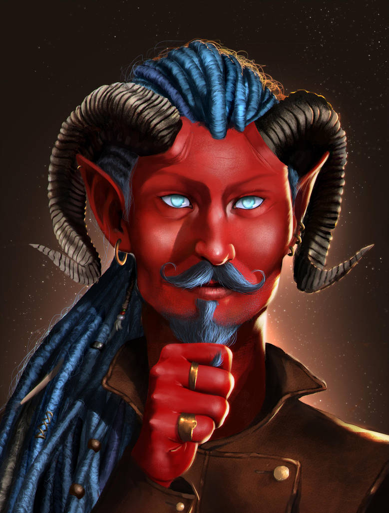
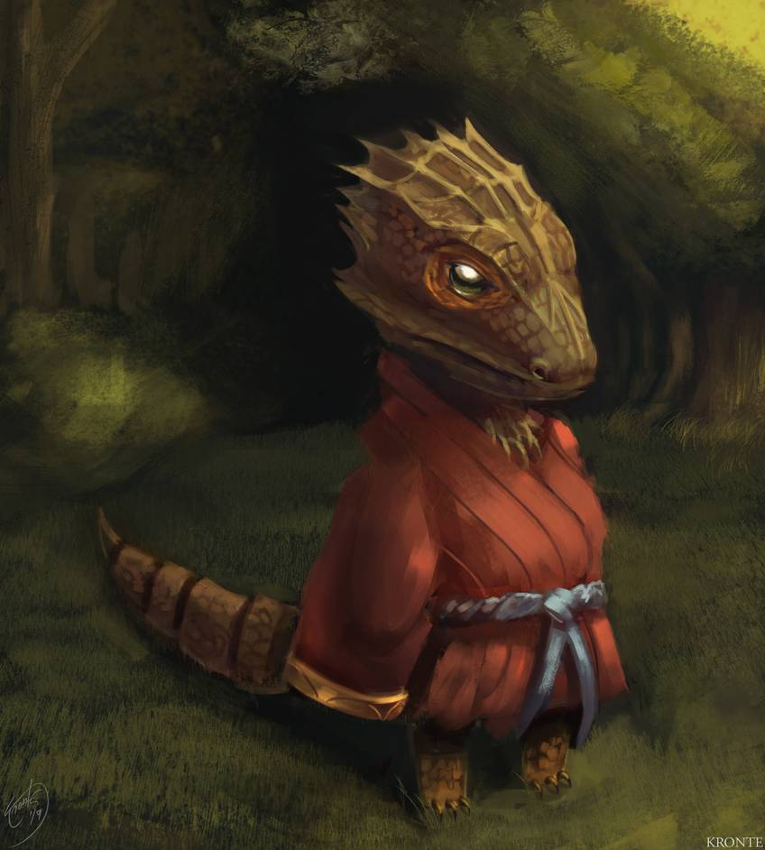
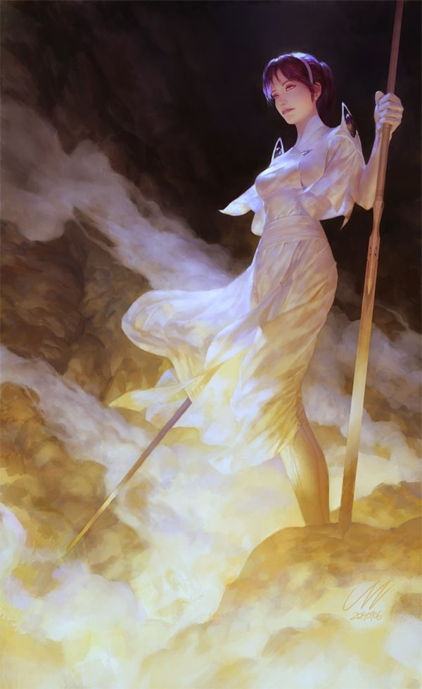

---

landscape_banner_path: /new_site/images/backdrops/landscape_character_creation.jpg

landscape_banner_link: https://www.deviantart.com/hifarry/art/Tavern-Meeting-742777343

landscape_banner_name: Tavern Meeting

landscape_banner_artist: hifarry

landscape_banner_artist_link: https://www.deviantart.com/hifarry

landscape_banner_license: CC BY-NC-ND 3.0

landscape_banner_license_link: https://creativecommons.org/licenses/by-nc-nd/3.0/


portrait_banner_path: /new_site/images/backdrops/portrait_character_creation.jpg

portrait_banner_link: https://www.deviantart.com/zezhou/art/Knight-of-Lies-562010429

portrait_banner_name: Knight of Lies

portrait_banner_artist: Zezhou

portrait_banner_artist_link: https://www.deviantart.com/zezhou

portrait_banner_license: CC BY-NC-ND 3.0

portrait_banner_license_link: https://creativecommons.org/licenses/by-nc-nd/3.0/


title: The Compendium of Character Creation

description: Everything you need to build your character!

show_download: false

---

  
# Compendium of Character Creation
_Version 2.1.3_  

   * [Building a Character](#building-a-character)  
     * [Personality and Background](#personality-and-background)  
     * [Health Dice Pieces](#health-dice-pieces)  
   * [Races](#races)  
     * [Automaton](#automaton)  
     * [Catterwol](#catterwol)  
     * [Daemonspawn](#daemonspawn)  
     * [Dwarf](#dwarf)  
     * [Elf](#elf)  
       * [Deep Elf](#deep-elf)  
       * [High Elf](#high-elf)  
       * [Wood Elf](#wood-elf)  
     * [Gnome](#gnome)  
     * [Goblin](#goblin)  
     * [Halfling](#halfling)  
       * [Fleetfoot Halfling](#fleetfoot-halfling)  
       * [Hardfoot Halfling](#hardfoot-halfling)  
     * [Hissling](#hissling)  
     * [Human](#human)  
     * [Kragraven](#kragraven)  
     * [Lizkin](#lizkin)  
     * [Orc](#orc)  
     * [Sprout](#sprout)  
     * [Waterborn](#waterborn)  
   * [Classes](#classes)  
     * [Archer](#archer)  
     * [Barbarian](#barbarian)  
       * [Path of Nature Barbarian](#path-of-nature-barbarian)  
       * [Path of Rage Barbarian](#path-of-rage-barbarian)  
     * [Bard](#bard)  
     * [Cleric](#cleric)  
       * [Cleric of Beauty](#cleric-of-beauty)  
       * [Cleric of Fertility](#cleric-of-fertility)  
       * [Cleric of Fun](#cleric-of-fun)  
       * [Cleric of Healing](#cleric-of-healing)  
       * [Cleric of Knowledge](#cleric-of-knowledge)  
       * [Cleric of Law](#cleric-of-law)  
       * [Cleric of Nature](#cleric-of-nature)  
       * [Cleric of Nothingness](#cleric-of-nothingness)  
       * [Cleric of Sin](#cleric-of-sin)  
       * [Cleric of The Downtrodden](#cleric-of-the-downtrodden)  
       * [Cleric of The Hunt](#cleric-of-the-hunt)  
       * [Cleric of The Sea](#cleric-of-the-sea)  
       * [Cleric of Undeath](#cleric-of-undeath)  
     * [Elementalist Druid](#elementalist-druid)  
     * [Fighter](#fighter)  
     * [Marksman](#marksman)  
     * [Heroic Highborn](#heroic-highborn)  
     * [Knight](#knight)  
     * [Monk](#monk)  
     * [Necromancer](#necromancer)  
     * [Paladin](#paladin)  
     * [Ranger](#ranger)  
     * [Rogue](#rogue)  
       * [Assassin](#assassin)  
       * [Thief](#thief)  
     * [Sorcerer](#sorcerer)  
     * [Wizard](#wizard)  
   * [Skills](#skills)  

  
## Building a Character
  
  
This manual contains the __Races__, __Classes__, and __Skills__ that you may choose from to create a character
in Rangers and Ruffians. This compendium assumes that you have looked over the rules set forth in
the [Rangers and Ruffians Rulebook](Rulebook.md).
  
  
In terms of gameplay, a character is made up of two major components: a __Race__ and a __Class.__
A Race represents the racial background that your character comes from. Your choice of race grants you base
abilities and stats, and can greatly affect the way that you interact with the world. If you choose to play a
tiny _Sprout_, you might ride atop the shoulders of the another player's _Orc_ character.
  
  
  
  
__Class,__ meanwhile, affects your role within your adventuring party. A _Rouge_ might spend their time
scouting, skulking, and sneaking. A _Highborn_ might use their high Charisma to barter for goods or
get information out of an important non-player character. A _Barbarian_ will spend their time in combat
shielding and soaking up damage for their more-squishy counterparts.
When you level up in Rangers and Ruffians, it is your class that grants you new abilities.
  
  
  
  
  
  
  
  

  
### Personality and Background
It is important to remember that a character can be much, _much_ more than just a sack of stats an abilities.
As a player, it is up to you to breathe life into your character, and make them into a living, breathing
part of the world that your Poohbah is weaving. To this end, consider the following:
1. Where did my character come from? Do they have family? Friends?
2. Is my character family or friends with any of the other players' characters?
2. What does my character want? Where are they going? What motivates them?
3. Why would my character be interested in going on an adventure?
4. What are a few of my characters virtues? What about vices?
5. How did my character end up being the class that they are?
6. How does my character interact with others? How do they speak? What are they're mannerisms?
  
  
  
  
As you come up with a backstory for your character remember the following:
Try to keep things vague but evocative, and which is open ended. That way, your Poohbah can easily weave it into their world.
Consider the following simple backstory: 
> "Elizabeth is from the town of Lindhearth. Some years ago she 
was visited by an aged wizard, who warned her of a great trial approaching in her future. Ever since that
day, she has been preparing for an evil that may never come." 
  
  
  
  
While quite basic, let's examine what the above backstory does well.
1. While it introduces a town, ```Lindhearth```, the town is not rigidly defined, and is simple for a Poohbah to add to their campaign setting.
  As a bonus, wouldn't it be cool if the Poohbah included Lindhearth in their campaign! Maybe some of your friends or family could make an appearance,
  or maybe even the mysterious wizard!
2. While you have been warned of a "great trial," the nature of that trial is left entirely up to the Poohbah. That means that it can easily 
  be tied into the adventure. This is awesome, as it can easily fit into any story that the Poohbah might want to tell. Just like that, you
  are personally invested in the adventure!
3. It provides a basis for you to start further fleshing out Elizabeth's character. How has she been preparing? Has she been learning magic?
  Practicing her skill with the sword? Praying to her deity? How has this training affected her personality? Is her adventuring career part
  of these preparations?
  
  
  
  
Let's make a second backstory.
> "Richard spent his entire childhood in the Lost Library. Only, it wasn't called the 'Lost' Library, but the Holy Library back then.
   He had made friends with the old Clerics and Paladins that kept their noses in books all day, and had even gotten them to
   teach him some of their divine magics. His favorite of them was an old greybeard named Scanderbeg. All of this changed
   when a Gold Dragon descended on the Library, tearing through the roof and killing many of those within. With the help of
   Scanderbeg, Richard had fled, helpless, with no home and nowhere to go, displaced and a refugee."
  
  
  
  
Again, this backstory introduces a location, the Lost Library, which can easily be integrated into a Poohbah's campaign. This
backstory also introduces a villain, an evil ```Gold Dragon.``` Perhaps this fits perfectly into the Poohbah's plans, but maybe it doesn't.
Perhaps the Poohbah is planning on running an ```undead``` heavy campaign, in which a ```Lich``` is the main villain. Together, the player and
the Poohbah can tailor Richards backstory, so that instead, it reads:
  
  
  
  
> "All of this changed the army of the dead arrived, swarming throughout the City of Linth and leaving a path of carnage in their wake. 
   With the help of the holy magics he had learned from Scanderbeg, Richard fled, but not before laying eyes on ___him.___ The face of death itself. Hozius the
   Defiler. As Richard watched, Hozius raised his hands, and all of those who had been dead rose up to join his army."
  
  
  
  
Now the backstory fits the Poohbah's campaign, and it's maybe even cooler than it was before! This is the benefit of talking things through with
your Poohbah before the game begins, and why it is a great idea to come up with vague and evocative character concepts to run past them.
  
  
  
  
  
  
  
  

  
### Health Dice Pieces
Races and Classes each have ```Health Dice Pieces```. When building a character,
you add these pieces together to get your total health dice. For example,
if you race has ```2``` health dice pieces, and your class has ```4```,
your health dice would be ```6```.
  
  
  
  
__To Create Your Character__
1. Decide how you will compute their stats as detailed in [here](Rulebook.md#how-do-i-compute-my-characters-stats) in the Rulebook.
2. Choose a race.
3. Choose a class.
4. Choose a skill, gained for free at level zero.
5. If your character is of a level greater than zero, follow the rules for [Leveling Up](Rulebook.md#leveling-up).
6. If your character is able to learn spells, select the [appropriate number of spells for your level](Rulebook.md#new-spells) from
   [The Book of Lore](Book_of_Lore.md).
  
  

  
## Races
Your racial background in Rangers and Ruffians can greatly impact the way that you interact with the world.
Will you play a short but hearty _Hardfoot Halfling?_ The incredibly  tiny _Sprout?_ A metalic _Automaton?_ Perhaps you
brutish _Orc_ or a lithe, erudite _High Elf._ Or, you could stick to the basics and play a _Human._ Races provide
you with minor stat increases and a handful of starting abilities. Any race should easily be able to be paired with any
class, though some pairings will start out slightly stronger than others. That's fine, though! It will all balance out in the end!
  
### Automaton


"[Rose"](https://www.deviantart.com/vagocool/art/Rose-488273011) by Vagocool is licensed under [CC BY-ND 3.0](https://creativecommons.org/licenses/by-nd/3.0/)  
>Well, for a time, I was working on a project to produce artificial life forms, automata, if you will. The project had limited success, and was on the brink of being defunded. In a desperate attempt to keep things going, we turned to magic as a solution. So it was, that he soul gem was discovered. To this day, I wonder what it is exactly that we created. Was it life, or was it some crude approximation? I know not. Nor, I think, does the automaton.
>
>—Simon, Gnome Tinker

  
  
The biproduct of tinkers and mages, the automaton is considered by many to be an artificial being. For this reason, many are persecuted, and treated as mere objects. And perhaps they are. To question your place is to be an automaton, and the quest for meaning is a path that all such beings must walk.
  
  
|STR|INT|PER|LUK|DEX|INF|CHA|HD|  
|:---:|:---:|:---:|:---:|:---:|:---:|:---:|:---:|  
|2|0|0|0|-1|0|-1|6|  
  
  
__Automaton Abilities:__ 
* __Rules:__   
  * __Power Core:__ The source of your power is housed within you. If you are destroyed in combat, you can be rebuilt so long as the power core survives.  
  * __Repair:__ You cannot heal using potions or rest. Rather, you must perform repairs. Self repair counts as rest. Repair with help counts as sleep. Repair with a tinker or blacksmith's help counts as sleep in a bed. Blacksmith's must have access to a forge, and tinkers to their tools. Tinker and blacksmith repairs take a minimum of 6 hours.  
  * __Upgrades:__ A tinker can craft upgrades for you.  
* __General Abilities:__   
  * __Overdrive:__ Spend 2 health per minute or turn to increase strength and dexterity by 1. Can be stacked to a maximum of +5 STR and DEX.  
  * __True Sleeplessness:__ You cannot grow tired, nor can you sleep.  
  * __Armored Exterior:__ You naturally take half damage from the following types of attack: piercing, slashing, blunt, fire, and ice. Does not stack with Berserk.  
* __Combat Abilities:__   
  * __Self Repair:__ During combat, you can self repair as an action.  
  * __Gyroscopic Center of Mass:__ It is difficult to knock you over. Add 5 to any check that involves knocking you prone.  
  * __Piston Punch:__ _(Cost 1)_ You may perform a 1d8 strength based punch on an enemy of your choice. If the enemy fails a contested strength check, it is knocked prone. Enemies larger than your size take advantage, smaller take disadvantage. At level 4, increase damage to 1d12. At level 8, to 2d12. At level 12 to 3d12.  
  
  
  
___

  
### Catterwol
>Ah, yes, well... It was then that we stumbled upon an encampment of cat-folk. They seemed a nice enough sort, so we bought some of their wares, beads and knives and potions, that sort of thing. After that, we supped with them. Well, before we knew it, we were all unconcious; they drugged the food, no doubt. They made off with everything; my staff, my hat, and even my sandles!
>
>—Archibold, the Wizard

__Silent and Dexterous__  
Stalking on padded feet, the Catterwol Rouge makes her way carefully across the rooves of the city of Linth. Her target is simple, information and nothing more. Unfortunately, the information that she needs is buried inside of a chest locked in the room of Lord Edmire himself. Far below, her party waits with baited breath, as she hops from roof to roof, and then slips into Edmire's quarters. *Roll a Stealth Check!*  
  
__Perceptive__  
Needlelike teeth show in a sharp smile as the Catterwol Bard steps forward. "Hold on, surely we can work something out?" Isak, the kingpin of the city's thieves' guild, scoffs. "Not this time." From the corner of his eye, the Bard just notices two shadowy figures slip into view. His smile grows, and with a flash, he whips around and slings a throwing knife at one of the figures. *Roll for initiative!*  
  
__Tribal__  
Cattterwol tend to live in loose, nomadic tribes. As a general rule, they are deeply distrustful of outsiders, and are known to act in their own self-interest more often than not.  
  
__Building a Cattwol Character__  
When building your Catterwol, consider how they came to belong to your party. Remember that, while Catterwol are tribal, they are deeply protective of those close to them. Is the party their family now? What members of the party is your character close to?  
  
  
  
Catterwol are among the most lithe and dexterous of the races, and are adept at passign unseen and unheard. With padded feet and strong claws for climing, more than one Catterwol has turned to the life of a sneak-theif. Catterwol hail from dense, thicketed jungles and dry, dusty deserts. They make average mages, but prefer slim, dexterity based weapons.
  
  
|STR|INT|PER|LUK|DEX|INF|CHA|HD|  
|:---:|:---:|:---:|:---:|:---:|:---:|:---:|:---:|  
|-1|0|1|1|1|-1|0|4|  
  
  
__Catterwol Abilities:__ 
* __General Abilities:__   
  * __Darkvision:__ You can see even in perfect darkness.  
  * __Land on your feet:__ You can fall 40 feet before taking fall damage.  
* __Advantages:__   
  * __Predator:__ When tracking, you have advantage on perception checks.  
  * __Loose Skin:__ You have advantage when breaking grapples.  
  * __Mantle:__ You have advantage on dexterity checks when climbing.  
* __Disadvantages:__   
  * __Fear of Water:__ You have disadvantage when soaked through.  
* __Combat Abilities:__   
  * __They're Retractable:__ You have retractable, razor sharp claws capable of doing 1d4 damage.  
  
  
  
___

  
### Daemonspawn


"[Tiefling Bard Custom DnD Char Comission"](https://www.deviantart.com/surugamonkey/art/Tiefling-Bard-Custom-DnD-Char-Comission-663338002) by SurugaMonkey is licensed under [CC BY-NC-ND 3.0](https://creativecommons.org/licenses/by-nc-nd/3.0/)  
>Never trust a daemonspawn, that's what I've alwasy been told. They're as liable to use their dark and terrible magicks as to give you a passing smile. I've never met one though; I've been careful to avoid them.
>
>—Miss Maribel Merkland, Busybody and Baker of Exquisite Pies.

  
  
The daemonspawn were born of an unholy union between elves and the demons of old. When the demons were thrown down and destroyed, the daemonspawn remained. Now, the daemonspawn are left in a world that at best doesn't understand them, and at worst fears and persecutes them. As such, the wise daemonspawn is always vigilant and trusts no one.
  
  
|STR|INT|PER|LUK|DEX|INF|CHA|HD|  
|:---:|:---:|:---:|:---:|:---:|:---:|:---:|:---:|  
|1|1|0|1|-1|0|-1|4|  
  
  
__Daemonspawn Abilities:__ 
* __General Abilities:__   
  * __True Sight:__ You are able to see invisible entities.  
  * __Sleepless:__ Your can rest without sleeping for one day, allowing you to keep watch long into the night.  
  * __Incombustible:__ You take half damage from heat and fire.  
* __Combat Abilities:__   
  * __Fix Your Eyes on Me:__ _(Cost 1)_ Conversation spell. If the person you are talking with fails an inner fire saving throw against your spell power, the world goes black for them except for you. Make charisma and intimidation checks with advantage for the remainder of the conversation. In combat, force the enemy to attack only you.  
  * __Sacrificial Rite:__ At the cost of your level in health (minimum 1), make a second action during combat.  
  
  
  
___

  
### Dwarf


"[The Hunter"](https://www.deviantart.com/ortsmor/art/The-Hunter-590846159) by ortsmor is licensed under [CC BY-NC-ND 3.0](https://creativecommons.org/licenses/by-nc-nd/3.0/)  
>Dwarves are difficult to hunt. They're thick, and sturdy; your shot has to be well placed if you want to bring one down.
>
>—Orkinshield, Orc Gunslinger

  
  
A stocky, brooding people, many dwarves are natural craftsman and artisans. Dwarves prefer low places, and many of their strongholds can be found deep within mountain ranges. Dwarves have a shrewd eye for business, and have been known to drink their adversaries under the table.
  
  
|STR|INT|PER|LUK|DEX|INF|CHA|HD|  
|:---:|:---:|:---:|:---:|:---:|:---:|:---:|:---:|  
|1|0|0|1|-2|1|0|4|  
  
  
__Dwarf Abilities:__ 
* __General Abilities:__   
  * __Incombustible:__ You take half damage from heat and fire.  
* __Advantages:__   
  * __Stocky:__ You have advantage against any check that could cause you to go prone.  
  * __Very Dangerous Over Short Distances:__ If you begin your turn next to an enemy, take advantage on your attack roll. Do not take short range disadvantage.  
  * __Boozehound:__ You have a very high tolerance for alcohol. Do not take disadvantage when drunk.  
  * __Thick Headed:__ You have advantage on any checks involving an enemy breaking into your mind or dominating you.  
  * __Forgeborn:__ When dealing with minerals or works made of stone, gain advantage on any checks made to assess or manipulate them.  
  
  
  
___

  
### Elf

  
#### Deep Elf
>Elves can be slippery folk. It seems to me that rarely say what they mean, and they seldom mean what they say. They're strong mages, though, and too clever for their own good. If you're dealing with elves, try to appeal to their pride, but be careful about it. They can see through simple flattery.
>
>—Ser Gillthunder, Human Knight, Leader of the Hetzer Company (Mercenaries)

  
  
Elves are the most magical of the races. Forest-dwellers with long lives, many elves spend their days practicing magic and honing their skills. Elves are naturally beautiful, and this beauty benefits them when they deal with the other races. Elves make strong mages and good dexterity based fighters.
  
  
|STR|INT|PER|LUK|DEX|INF|CHA|HD|  
|:---:|:---:|:---:|:---:|:---:|:---:|:---:|:---:|  
|1|0|1|1|0|0|-2|4|  
  
  
__Deep Elf Abilities:__ 
* __General Abilities:__   
  * __Sleepless:__ Your can rest without sleeping for one day, allowing you to keep watch long into the night.  
  * __Darkvision:__ You can see even in perfect darkness.  
* __Advantages:__   
  * __Winged Feet:__ You have advantage on acrobatics checks.  
* __Disadvantages:__   
  * __Born in Darkness:__ You are incredibly light sensitive, and take 1d6 damage per hour spent with your skin exposed to bright light or to the sun. As a result, you must wear protective garments during the day.  
* __Combat Abilities:__   
  * __Counter Attack:__ _(Cost 1)_ Reaction. You may strike back when an enemy attacks you.  
  
  
  
___

  
#### High Elf
>High Elves can be slippery folk. It seems to me that rarely say what they mean, and they seldom mean what they say. They're strong mages, though, and too clever for their own good. If you're dealing with elves, try to appeal to their pride, but be careful about it. They can see through simple flattery.
>
>—Ser Gillthunder, Human Knight, Leader of the Hetzer Company (Mercenaries)

  
  
High elves are among the most magical of the races. Reclusive by nature, high elves often confine themselves to gleaming costal cities. When a high elf does venture out into the world at large, it is often in a diplomatic capacity. High elves are as charming as they are naturally beautiful, and commonly feel as though it is their duty to maintain balance in the world. High elves make good mages.
  
  
|STR|INT|PER|LUK|DEX|INF|CHA|HD|  
|:---:|:---:|:---:|:---:|:---:|:---:|:---:|:---:|  
|-1|1|0|2|0|-1|1|2|  
  
  
__High Elf Abilities:__ 
* __Choices:__   
  * __Learned:__ You are fluent in an extra language of your choosing.  
* __General Abilities:__   
  * __Sleepless:__ Your can rest without sleeping for one day, allowing you to keep watch long into the night.  
  * __Low-Light Vision:__ You can see in low light.  
  * __Inherent Magic:__ You are able to cast tier zero spells naturally, and begin with 2 extra tier zero spells from any spellbook.  
  * __Detect Magic:__ _(Cost 1)_ Perform a magic detection check.  
* __Advantages:__   
  * __Wink Wink, Nudge Nudge:__ Due to your beauty, you have advantage on charisma checks when dealing with races that find you attractive.  
  
  
  
___

  
#### Wood Elf
>Elves can be slippery folk. It seems to me that rarely say what they mean, and they seldom mean what they say. They're strong mages, though, and too clever for their own good. If you're dealing with elves, try to appeal to their pride, but be careful about it. They can see through simple flattery.
>
>—Ser Gillthunder, Human Knight, Leader of the Hetzer Company (Mercenaries)

  
  
Elves are the most magical of the races. Forest-dwellers with long lives, many elves spend their days practicing magic and honing their skills. Elves are naturally beautiful, and this beauty benefits them when they deal with the other races. Elves make strong mages and good dexterity based fighters.
  
  
|STR|INT|PER|LUK|DEX|INF|CHA|HD|  
|:---:|:---:|:---:|:---:|:---:|:---:|:---:|:---:|  
|-1|0|1|1|1|-1|0|4|  
  
  
__Wood Elf Abilities:__ 
* __General Abilities:__   
  * __Sleepless:__ Your can rest without sleeping for one day, allowing you to keep watch long into the night.  
  * __Low-Light Vision:__ You can see in low light.  
* __Advantages:__   
  * __Winged Feet:__ You have advantage on acrobatics checks.  
  * __Tracker:__ You are an excellent tracker, and have advantage when looking for trails and sign of passage.  
* __Combat Abilities:__   
  * __Counter Attack:__ _(Cost 1)_ Reaction. You may strike back when an enemy attacks you.  
  
  
  
___

  
### Gnome
>Gnomes are tiny. They make things, sometimes. I can crush them.
>
>—Throgar, Barbarian and Sheriff

__Tinker__  
Moonlight paints the room as the Gnomish Tinker bites her lip. Her project is coming along quite well, better than expected, actually. Not far away, the rest of her party snores as they sleep. She should be sleeping as well, tomorrow is the big day. But then, that's why she needs a spring loaded spear-thrower in the first place. For a moment, she considers lying down, but then pulls her goggles over her eyes. Hopefully, her party was sleeping heavily. With a grin, she lights her acetaline torch, and sparks begin to fly. *Roll an intelligence check!*  
  
__None__  
__Eccentric__  
Most consider gnomes to be eccentric at best, and obtuse at worse.  
  
  
  
Tinkerers by nature, Gnomes are known to craft miraculous inventions to help them deal with difficult situations. Gnomes typically stand about three feet in height, and can be recognized by their signature goggles. Gnomes are well rounded and are capable of succeeding at anything they put their minds to.
  
  
|STR|INT|PER|LUK|DEX|INF|CHA|HD|  
|:---:|:---:|:---:|:---:|:---:|:---:|:---:|:---:|  
|0|1|-1|2|0|1|-1|2|  
  
  
__Gnome Abilities:__ 
* __Rules:__   
  * __Build:__ Once you have a recipe for an item, you can build it. You can attempt to build one item per rest, or two per sleep.  
* __General Abilities:__   
  * __Tinker:__ Every night, you can attempt to to create a device. Once you create one, you get its recipe. Must have ingredients. You begin with recipes for smokebombs, firebombs, and saddles. (Tinkering requires an intelligence check)  
  * __See and Remember:__ Once you see something, you will probably remember it.  
  * __Gather:__ You passively collect ingredients for your tinkering.  
* __Starting Items:__   
  * __Grapple Gun:__ You carry a retractable grappling gun. The gun carries 40 feet of rope.  
* __Advantages:__   
  * __Resist Magic:__ You make any rolls against an enemy's spell power with advantage.  
  
  
  
___

  
### Goblin


"[Goblin archer"](https://www.deviantart.com/fjft-art/art/Goblin-archer-551201383) by FJFT-Art is licensed under [CC BY-NC-ND 3.0](https://creativecommons.org/licenses/by-nc-nd/3.0/)  
>It is a rarity to find a kindly goblin, but when I have, I have found them to be most agreeable companions. Mind you, their penchant for raw flesh can be most off-putting... As can their little yellow eyes. Still, though, if ever you are in a pinch, a loyal goblin-ling can be a fierce, nay, a vicious ally.
>
>—Tamberdoodle, Bard Extraordinare

  
  
Small and wicked, most goblins are tricksters and thieves. Known for eating their kills and living in the dark, goblins prefer to fight with ranged or short weapons. Morally good goblins are rare, and have often been outcast from their clan and family. This can be very painful, as goblins are communal creatures by nature.
  
  
|STR|INT|PER|LUK|DEX|INF|CHA|HD|  
|:---:|:---:|:---:|:---:|:---:|:---:|:---:|:---:|  
|0|0|1|2|1|-1|-1|2|  
  
  
__Goblin Abilities:__ 
* __General Abilities:__   
  * __Still Warm:__ You can eat raw meat without penalty.  
  * __Darkvision:__ You can see even in perfect darkness.  
  * __Seek Gold:__ You are able to smell gold. You can perform gold detection checks.  
* __Advantages:__   
  * __Mantle:__ You have advantage on dexterity checks when climbing.  
* __Combat Abilities:__   
  * __Cheap Blow:__ On a critical hit, knock an enemy prone.  
  
  
  
___

  
### Halfling

  
#### Fleetfoot Halfling
>Halflings are decent enough, and fun to be around. They have potential as rogues since they can see without being seen, but I'm not sure if they're clever enough.
>
>—Vasha, Catterwol Thief

  
  
Small folk, the Halflings would rather be drinking tea and eating toast in their holes than adventuring. They are naturally tricksters, are hardy for their size, and are adept at sqeezing into tight spots. On average, the Halflings stand at three-and-a-half feet, and have warm, chestnut colored eyes and hair.
  
  
|STR|INT|PER|LUK|DEX|INF|CHA|HD|  
|:---:|:---:|:---:|:---:|:---:|:---:|:---:|:---:|  
|-2|0|1|2|1|0|0|2|  
  
  
__Fleetfoot Halfling Abilities:__ 
* __General Abilities:__   
  * __Carry a Tune:__ _(Cost 1)_ Offhand. You know a song which, when sung, grants all members of your party +1 to a stat of your choice. Concentration.  
  * __Lightweight:__ Any cup of alcohol affects you like two.  
* __Starting Items:__   
  * __Sling:__ Your character begins their journey with a 1d4 sling.  
* __Advantages:__   
  * __Padfoot:__ You have advantage on stealth checks.  
* __Combat Abilities:__   
  * __Nimble:__ Targeted ranged attacks take disadvantage against you.  
  
  
  
___

  
#### Hardfoot Halfling
>Halflings are decent enough, and fun to be around. They have potential as rogues since they can see without being seen, but I'm not sure if they're clever enough.
>
>—Vasha, Catterwol Thief

  
  
Small folk, the Halflings would rather be drinking tea and eating toast in their holes than adventuring. They are naturally tricksters, are hardy for their size, and are adept at sqeezing into tight spots. On average, the Halflings stand at three-and-a-half feet, and have warm, chestnut colored eyes and hair.
  
  
|STR|INT|PER|LUK|DEX|INF|CHA|HD|  
|:---:|:---:|:---:|:---:|:---:|:---:|:---:|:---:|  
|0|-1|0|1|-1|1|1|4|  
  
  
__Hardfoot Halfling Abilities:__ 
* __General Abilities:__   
  * __Warm Butter:__ Your are naturally talented chef. You may cook food which heals allies for an extra dice of health while resting.  
  * __Soft Bed:__ You recover two extra health dice from sleeping in a real bed.  
  * __Carry a Tune:__ _(Cost 1)_ Offhand. You know a song which, when sung, grants all members of your party +1 to a stat of your choice. Concentration.  
* __Starting Items:__   
  * __Sling:__ Your character begins their journey with a 1d4 sling.  
* __Advantages:__   
  * __Thick Headed:__ You have advantage on any checks involving an enemy breaking into your mind or dominating you.  
* __Combat Abilities:__   
  * __Courageous Blow:__ _(Cost 1)_ Add twice your Inner Fire to an attack.  
  
  
  
___

  
### Hissling


"[Kobold Sketch"](https://www.deviantart.com/kronteisdrawing/art/Kobold-Sketch-796966664) by Kronteisdrawing is licensed under [CC BY-NC-ND 3.0](https://creativecommons.org/licenses/by-nc-nd/3.0/)  
>So here's one for you: A while back, we were called to a town by the name of Broshtik to help some yokels. Apparently, things had been going missing. Little things, mostly; utensils and fire pokers and the like. Normally, we wouldn't have taken such a small job, but work had been scarce and beggars can't be choosers. So, anyway, we get to Broshtik, and we spend a good three days poking around, but can't find anything. It gets to the point that we are ready to call it quits and get out of there. Then, one of Harley's rings goes missing overnight. We look around, and find a trail, barely anything, leading through one of the windows. So, out we go, and over to one of the sewer grates in town. We pried it open, and dropped down in. And what do you think we saw? An entire civilization of tiny little lizardlings, that's what. Generations of them, all living in houses built of mud and candlesticks. All at once, the little buggers start taking off like they'd seen Melikar, skittering and running in every direction. Then, an elder approaches us. Or, at least, I think it was an elder; it only came to my knees, and wore a robe made out of a piece of towel. In broken speech, it asked us to leave them be in return for a great gift: two necklaces and a pair of children's shoes. Some times, I wonder if they're still down there.
>
>—Gillthunder, Human Knight

  
  
Next to Sprouts, Hisslings are the smallest of races. Lizardlike entities, Hisslings try their very best to be ferocious. While naturally clever, Hisslings do not cherish knowledge, but rather focus upon helping their clan flourish. The life of a Hissling is often a bleak one: while hisslings can live upwards of 40 years, they rarely do. Instead, most die early due to their fragile nature and disregard for their own safety. Because of the commonality of death in Hissling tribes, most Hisslings put the long-term wellbeing of the collective above that of themselves or even their closest friends and family. Hisslings reach full maturity after only two years, and can reproduce just a few years after. 
  
  
|STR|INT|PER|LUK|DEX|INF|CHA|HD|  
|:---:|:---:|:---:|:---:|:---:|:---:|:---:|:---:|  
|-1|0|1|2|1|-1|0|2|  
  
  
__Hissling Abilities:__ 
* __Choices:__   
  * __I'm a Red One!:__ At the start of your journey, choose your color. This choice affects elemental resistances.  
* __General Abilities:__   
  * __Small Fry:__ Your size is considered tiny. You can fit into small spaces, be easily carried, and be easily thrown.  
  * __All Tuckered Out:__ You must sleep once every six hours, or suffer exhaustion.  
  * __Tossed Around:__ You take half damage from blunt attacks, but are tossed 5 feet backward for every size larger than you your enemy is. Take full damage if you hit something as a result.  
* __Combat Abilities:__   
  * __Chomp Chomp:__ You can make a 1d4 bite attack as an offhand action. Once you have bitten an enemy, your jaw sets, and you won't let go until even after you are dead. The enemy can attempt contested dexterity checks to try to free themselves of you.  
  * __Riding High:__ Allies take no disadvantage while you ride them. You gain advantage on attacks while riding a party member.  
  * __Dig Dig Dig:__ You are able to burrow through earth at a rate of 1 foot per minute.  
  
  
  
___

  
### Human


"[Escape"](https://www.deviantart.com/gkb3rk/art/Escape-464097162) by gkb3rk is licensed under [CC BY-NC-ND 3.0](https://creativecommons.org/licenses/by-nc-nd/3.0/)  
>Humans are good, but a little bit tough. That's why you have to eat them raw.
>
>—Orkensheild, Orc Archer

  
  
Humans are the most average of the races. The race of men can become good at most things, but it takes a concerted effort for them to become great at anything. That doesn't stop them from trying, though, and it is this natural willpower that makes them a force to be reckoned with.
  
  
|STR|INT|PER|LUK|DEX|INF|CHA|HD|  
|:---:|:---:|:---:|:---:|:---:|:---:|:---:|:---:|  
|1|0|-1|1|-1|1|0|4|  
  
  
__Human Abilities:__ 
* __Choices:__   
  * __Skilled:__ Begin your journey with one extra skill.  
* __General Abilities:__   
  * __Adaptable:__ Once affected by an effect or spell, gain advantage on saves against it for the remainder of the day.  
* __Combat Abilities:__   
  * __Last Stand:__ When your health is below 25%, you can take an extra action on your turn.  
  * __Strength of Men:__ _(Cost 1)_ You have basic healing abilities. You may heal a party member for 1d6 + inner fire health.  
  * __Rally:__ _(Cost 1)_ You may use an aura which gives all of your allies a 1d8 inspiration dice.  
  
  
  
___

  
### Kragraven


"[The Reaping Raven"](https://www.deviantart.com/foxtrack/art/The-Reaping-Raven-by-burdfish-396214428) by Foxtrack is licensed under [CC BY-NC-ND 3.0](https://creativecommons.org/licenses/by-nc-nd/3.0/)  
>I don't trust them, those bird-men that live to the west. Don't trust them one bit.
>
>—Old Man Mcuffit, Racist Old Man

  
  
Kragraven stand at about the height of a human, though they are known to hunch over, slightly. Kragraven are reclusive, taking to lofty homes amidst ancient forests. Myths say that Kragraven were first created by the god Ragnhall, and that they are his servants.
  
  
|STR|INT|PER|LUK|DEX|INF|CHA|HD|  
|:---:|:---:|:---:|:---:|:---:|:---:|:---:|:---:|  
|0|1|1|1|0|-1|-1|4|  
  
  
__Kragraven Abilities:__ 
* __Choices:__   
  * __Peck:__ _(Cost 1)_ As an offhand action, peck an enemy, dealing 1d6 damage. On a critical hit, blind them until they succeed a SP save.  
* __General Abilities:__   
  * __High Jump:__ Flap your vestigial wings to jump twice your height directly upward.  
  * __Coast:__ Use your wings to coast from great heights.  
  * __Carrion:__ You can eat raw and rotten meat without penalty.  
  * __Mimic:__ You can mimic any voice you've heard.  
  
  
  
___

  
### Lizkin


"[Cleric of the three moons"](https://www.deviantart.com/themefinland/art/Cleric-of-the-three-moons-709879645) by ThemeFinland is licensed under [CC BY-NC-SA 3.0](https://creativecommons.org/licenses/by-nc-sa/3.0/)  
>Skin changes like mist. Poisoned teeth lurking within. A Lizkin fighter.
>
>—Mister Li, Gnomeish Monk

  
  
  
  
  
  
|STR|INT|PER|LUK|DEX|INF|CHA|HD|  
|:---:|:---:|:---:|:---:|:---:|:---:|:---:|:---:|  
|1|0|1|1|-1|0|-1|4|  
  
  
__Lizkin Abilities:__ 
* __General Abilities:__   
  * __Poison Resist:__ You are resistant to most poisons. You have advantage on any poison related checks, and take half damage at worst.  
  * __Shed Tail:__ Once per week, you can shed your tail to escape a grapple.  
  * __Taste Air:__ Gain advantage on tracking perception checks by tasting the air. Works in all environments.  
* __Advantages:__   
  * __Color Choice:__ _(Cost 1)_ You may choose what color your scales are. Scales may hold only three colors at a time unless Camouflage is being used. This may be used to gain advantage on a stealth check.  
  * __Smokevision:__ Your double eyelids allows you to see well when underwater or in smoke.  
* __Combat Abilities:__   
  * __Poison Bite:__ _(Cost 1)_ You may make a bite attack for 1d6 damage. If your enemy fails a D10 inner fire saving throw, they are poisoned and take an additional 1d6 damage at the start of each turn until they pass a D14 inner fire saving throw. At level 5, increase this damage to 1d12. At level 8, increase it to 10, increase it to 2d12.  
  
  
  
___

  
### Orc
>The full-orc is a dangerous specimen. Known to hunt and eat the other races, it is difficult to domesticate them. As the saying goes, you can take the orc out of the wilderness, but you can't stop him from trying to eat you.
>
>—unattributed folk wisdom

  
  
A brutish and warlike race, orcs stab first and ask questions later. Orcs are often used to living in harsh environments, and living off the land.
  
  
|STR|INT|PER|LUK|DEX|INF|CHA|HD|  
|:---:|:---:|:---:|:---:|:---:|:---:|:---:|:---:|  
|1|0|0|1|0|1|-2|4|  
  
  
__Orc Abilities:__ 
* __General Abilities:__   
  * __Still Warm:__ You can eat raw meat without penalty.  
* __Advantages:__   
  * __Predator:__ When tracking, you have advantage on perception checks.  
* __Combat Abilities:__   
  * __Bellow:__ _(Cost 1)_ On your turn, spend one action point to unleash a mighty bellow. All who hear must make an Spell Power save of be frightened.  
  * __Thunderous Blow:__ _(Cost 1)_ Roll an extra dice for your attack. On a critical hit, knock the enemy prone.  
  * __Vengeful Death:__ When you are reduced to zero hit points, you may make one last retaliatory action. If you take the retaliatory action, you must make your death coin flips with disadvantage.  
  
  
  
___

  
### Sprout
>And as I walked through the forest, I heard a sound, like the laughter of children. Fearing some trick, I summoned forth my hammer of light. To my shock, the sound came from a race of tree folk, smaller even than the smallest halfling. They were quite dexterous, and spoke the language of my people. I spent some time among their woodland village before continuing on my way.
>
>—Harley, Elf Paladin

  
  
Sprouts are among the smallest of the races, standing at about 2 feet. As a result, they are very weak, but are fast, and good at sneaking. The wise sprout should avoid the front line of combat, and instead stay in relative hiding, jumping out to attack at opportune moments. Sprouts are not necessarily wise, however, and it is not strange to see a sprout knight attempting to make a name for themself.
  
  
|STR|INT|PER|LUK|DEX|INF|CHA|HD|  
|:---:|:---:|:---:|:---:|:---:|:---:|:---:|:---:|  
|-2|0|1|2|1|0|0|2|  
  
  
__Sprout Abilities:__ 
* __General Abilities:__   
  * __Photosynthesis:__ Every turn or once per hour, regain 1d4 health.  
  * __Small Fry:__ Your size is considered tiny. You can fit into small spaces, be easily carried, and be easily thrown.  
  * __Soft Landing:__ Reduce any falling damage by 20 feet.  
  * __Commune with Nature:__ You are naturally able to speak with plants and animals.  
  * __Lightweight:__ Any cup of alcohol affects you like two.  
  * __Blade of Grass:__ Summon a 1d6 blade of woven plant fiber on command.  
  * __Harden:__ As an offhand action, harden or unharden yourself. While hardened, gain 2 armor but lose 2 dexterity. Does not stack with other armor.  
* __Advantages:__   
  * __Scurry:__ You have advantage on dexterity based athletics checks.  
* __Combat Abilities:__   
  * __Dodge:__ Any time you are the target of a targeted attack, the enemy must roll a contested Dexterity check or miss.  
  
  
  
___

  
### Waterborn
>Most Waterborn I've seen have been dried up and dying. Their need for water is their undoing, out here in the desert. Once they've been wetted down a bit, they perk right up. It's then that you have to watch yourself; Waterborn are liable to charm you when you're not looking.
>
>—Leaf, Gnome Rogue from the Wild Desert

  
  
Alien among the other races, Waterborn hail from the depths of oceans, lakes, and rivers. Waterborn come in a pleathora of colors, and have ruddy, splotched skin which dries up if it isn't exposed to water regularly. Waterborn are powerful magic users, and are naturally adept at charming the other races.
  
  
|STR|INT|PER|LUK|DEX|INF|CHA|HD|  
|:---:|:---:|:---:|:---:|:---:|:---:|:---:|:---:|  
|-1|1|0|2|0|-1|1|2|  
  
  
__Waterborn Abilities:__ 
* __General Abilities:__   
  * __Water Breathing:__ You only need to breathe once every three days. If you do not go underwater to breath, you will suffocate.  
  * __Flows Like Water:__ You can walk on water, and swim as fast as a horse can run.  
  * __Water Healing:__ When you sleep in water, it is as if you are in a bed.  
  * __Lightweight:__ Any cup of alcohol affects you like two.  
* __Combat Abilities:__   
  * __Charm:__ _(Cost 1)_ As an action, you may cast a charm spell on an entity. If the entity fails an inner fire saving throw against your spell power, they cannot attack you until you attack them or they succeed, and you gain advantage on charisma checks with them.  
  
  
  
___

  
## Classes
Choosing your class in Rangers and Ruffians is perhaps the most important choice that you will make.
While your race determines what you look like, your class determines what your role will be in your
adventuring party. Will you play a high charisma _Bard_, or a heavily armored _Knight?_ Perhaps a
_Gunslinger_ or an _Archer?_ Is magic more your style? Then perhaps you will play as a priestly _Cleric_,
an intelligent _Wizard_ or a naturalistic _Druid._ Perhaps you want an animal companion ever at your side.
In that case, the wild _Beastmaster_ may be right up your alley. While there are many choices at your fingertips,
we have worked hard to make sure that all of them are very fun, so no matter what you pick, you're certain
to have a good time!
  
### Archer


"[Bounty Hunter"](https://www.deviantart.com/johnnymorrow/art/Bounty-Hunter-618263949) by johnnymorrow is licensed under [CC BY-NC-ND 3.0](https://creativecommons.org/licenses/by-nc-nd/3.0/)  
  
  
Some of the best marksmen in the world, archers are naturals with ranged weapons. They are often attached to their bow, and carry it with them everywhere. Archers come from all walks of life; some compete in tournaments, others are hunters and farmer's sons. Still others have served in the military. Archers should stay off of the front line, instead picking off foes from a distance.
  
  
|STR|INT|PER|LUK|DEX|INF|CHA|HD|  
|:---:|:---:|:---:|:---:|:---:|:---:|:---:|:---:|  
|-3|-1|2|1|1|-2|0|4|  
  
  
  
  

<a class="btn btn-primary" href="/new_site/pages/level_up_sheet.html?class=Archer" role="button">Level Up Sheet</a>
  
___

  
### Barbarian


"[Redhead Warrior"](https://www.deviantart.com/o-melanor/art/Redhead-Warrior-759465552) by O-Melanor is licensed under [CC BY-NC-SA 3.0](https://creativecommons.org/licenses/by-nc-sa/3.0/)  

  
#### Path of Nature Barbarian
  
  
Barbarians are hearty, and can dole out a lot of damage, making them great tanks for a party of adventurers. They are marked by their berserk ability, which allows them to fly into a battle frenzy, gaining extra attacks and health. Barbarians cannot use magic, and are much better up close than at a distance. They are known for their rugged ways, and usually prefer wide open spaces to cities.
  
  
|STR|INT|PER|LUK|DEX|INF|CHA|HD|  
|:---:|:---:|:---:|:---:|:---:|:---:|:---:|:---:|  
|1|0|-1|0|2|-2|-3|6|  
  
  
  
  

<a class="btn btn-primary" href="/new_site/pages/level_up_sheet.html?class=Path of Nature Barbarian" role="button">Level Up Sheet</a>
  
___

  
#### Path of Rage Barbarian
  
  
Path of Rage Barbarians are hearty, and can dole out a lot of damage, making them great tanks for a party of adventurers. They are marked by their berserk ability, which allows them to fly into a battle frenzy, gaining extra attacks and health. Barbarians cannot use magic, and are much better up close than at a distance. They are known for their rugged ways, and usually prefer wide open spaces to cities.
  
  
|STR|INT|PER|LUK|DEX|INF|CHA|HD|  
|:---:|:---:|:---:|:---:|:---:|:---:|:---:|:---:|  
|2|-3|0|0|1|-1|-2|6|  
  
  
  
  

<a class="btn btn-primary" href="/new_site/pages/level_up_sheet.html?class=Path of Rage Barbarian" role="button">Level Up Sheet</a>
  
___

  
### Bard


"[Song of nature"](https://www.deviantart.com/yanporfirio/art/Song-of-nature-695972090) by Yanporfirio is licensed under [CC BY-NC-SA 3.0](https://creativecommons.org/licenses/by-nc-sa/3.0/)  
  
  
Showmen by nature, Bards are known for their skills at performing and distracting others from the sorrows of life. Bards are usually at least a little bit gaudy and outgoing. They are quick in a fight, and often fight with dexterity based weapons such a shortswords or knives. Bards are powerful spellcasters, and are excellent at providing support to their party and at making enemies weaker. As you prepare your bard, consider how they chose this way of life. How did they learn magic? How do they perform? Do they play music? Dance? Tell stories? How did they learn to fight? Who did they learn to fight from? How old are they? How many places have they been? Where do they perform? Why do they perform there? How will being a bard change the way you interact with your party?
  
  
|STR|INT|PER|LUK|DEX|INF|CHA|HD|  
|:---:|:---:|:---:|:---:|:---:|:---:|:---:|:---:|  
|-3|1|-2|1|0|-1|2|4|  
  
  
  
  

<a class="btn btn-primary" href="/new_site/pages/level_up_sheet.html?class=Bard" role="button">Level Up Sheet</a>
  
___

  
### Cleric


"[Before the world ends"](https://www.deviantart.com/zezhou/art/Before-the-world-ends-482099982) by Zezhou is licensed under [CC BY-NC-ND 3.0](https://creativecommons.org/licenses/by-nc-nd/3.0/)  

  
#### Cleric of Beauty
  
  
Servant  of Lady Dusk. Followers of the Pale Lady seek rewards from their dark goddess in return for helping her conform the world to her ideals.
  
  
|STR|INT|PER|LUK|DEX|INF|CHA|HD|  
|:---:|:---:|:---:|:---:|:---:|:---:|:---:|:---:|  
|-3|2|-2|2|-1|0|1|2|  
  
  
  
  

<a class="btn btn-primary" href="/new_site/pages/level_up_sheet.html?class=Cleric of Beauty" role="button">Level Up Sheet</a>
  
___

  
#### Cleric of Fertility
  
  
Servant  of Naris. Followers of Naris, aim to spread life and love throughout the world.
  
  
|STR|INT|PER|LUK|DEX|INF|CHA|HD|  
|:---:|:---:|:---:|:---:|:---:|:---:|:---:|:---:|  
|-3|2|-2|2|-1|0|1|2|  
  
  
  
  

<a class="btn btn-primary" href="/new_site/pages/level_up_sheet.html?class=Cleric of Fertility" role="button">Level Up Sheet</a>
  
___

  
#### Cleric of Fun
  
  
Servant  of Juliet. Clerics of Juliet seek to bring fun and chaos to the world.
  
  
|STR|INT|PER|LUK|DEX|INF|CHA|HD|  
|:---:|:---:|:---:|:---:|:---:|:---:|:---:|:---:|  
|-3|2|-2|2|-1|0|1|2|  
  
  
  
  

<a class="btn btn-primary" href="/new_site/pages/level_up_sheet.html?class=Cleric of Fun" role="button">Level Up Sheet</a>
  
___

  
#### Cleric of Healing
  
  
Servant  of Aunora. Followers of Aunora, called the Hands of Aunora, seek to bring peace and healing to the world.
  
  
|STR|INT|PER|LUK|DEX|INF|CHA|HD|  
|:---:|:---:|:---:|:---:|:---:|:---:|:---:|:---:|  
|-3|2|-2|2|-1|0|1|2|  
  
  
  
  

<a class="btn btn-primary" href="/new_site/pages/level_up_sheet.html?class=Cleric of Healing" role="button">Level Up Sheet</a>
  
___

  
#### Cleric of Knowledge
  
  
Servant  of Raghnal. Followers of Raghnal, called the Eyes of Raghnal, seek to gather information to safeguard the realms, and to keep knowledge from evil eyes.
  
  
|STR|INT|PER|LUK|DEX|INF|CHA|HD|  
|:---:|:---:|:---:|:---:|:---:|:---:|:---:|:---:|  
|-3|2|-2|2|-1|0|1|2|  
  
  
  
  

<a class="btn btn-primary" href="/new_site/pages/level_up_sheet.html?class=Cleric of Knowledge" role="button">Level Up Sheet</a>
  
___

  
#### Cleric of Law
  
  
Servant of Iro. Followers of Iro, called the Watchers, uphold the word of law.
  
  
|STR|INT|PER|LUK|DEX|INF|CHA|HD|  
|:---:|:---:|:---:|:---:|:---:|:---:|:---:|:---:|  
|-3|2|-2|2|-1|0|1|2|  
  
  
  
  

<a class="btn btn-primary" href="/new_site/pages/level_up_sheet.html?class=Cleric of Law" role="button">Level Up Sheet</a>
  
___

  
#### Cleric of Nature
  
  
Servant  of Ronar. Followers of Ronar, called the Ronari, are called to preserve nature and end conflict wherever they find it.
  
  
|STR|INT|PER|LUK|DEX|INF|CHA|HD|  
|:---:|:---:|:---:|:---:|:---:|:---:|:---:|:---:|  
|-3|2|-2|2|-1|0|1|2|  
  
  
  
  

<a class="btn btn-primary" href="/new_site/pages/level_up_sheet.html?class=Cleric of Nature" role="button">Level Up Sheet</a>
  
___

  
#### Cleric of Nothingness
  
  
Servant  of The Void Father. Followers of the Void Father aim to aid their master in obliterating existence.
  
  
|STR|INT|PER|LUK|DEX|INF|CHA|HD|  
|:---:|:---:|:---:|:---:|:---:|:---:|:---:|:---:|  
|-3|2|-2|2|-1|0|1|2|  
  
  
  
  

<a class="btn btn-primary" href="/new_site/pages/level_up_sheet.html?class=Cleric of Nothingness" role="button">Level Up Sheet</a>
  
___

  
#### Cleric of Sin
  
  
Servant  of Melekar. Followers of Melekar serve the Lord of Sin by expanding his influence by subjugating the weak.
  
  
|STR|INT|PER|LUK|DEX|INF|CHA|HD|  
|:---:|:---:|:---:|:---:|:---:|:---:|:---:|:---:|  
|-3|2|-2|2|-1|0|1|2|  
  
  
  
  

<a class="btn btn-primary" href="/new_site/pages/level_up_sheet.html?class=Cleric of Sin" role="button">Level Up Sheet</a>
  
___

  
#### Cleric of The Downtrodden
  
  
Servant  of Eandar. Followers of Eandar, called the Browncloaks, seek to help the common man in whatever way they can.
  
  
|STR|INT|PER|LUK|DEX|INF|CHA|HD|  
|:---:|:---:|:---:|:---:|:---:|:---:|:---:|:---:|  
|-3|2|-2|2|-1|0|1|2|  
  
  
  
  

<a class="btn btn-primary" href="/new_site/pages/level_up_sheet.html?class=Cleric of The Downtrodden" role="button">Level Up Sheet</a>
  
___

  
#### Cleric of The Hunt
  
  
Servant  of Yilena. Followers of Yilena, called Wardens, are called to protect the wilds from evil, and to keep balance in the natural world.
  
  
|STR|INT|PER|LUK|DEX|INF|CHA|HD|  
|:---:|:---:|:---:|:---:|:---:|:---:|:---:|:---:|  
|-3|2|-2|2|-1|0|1|2|  
  
  
  
  

<a class="btn btn-primary" href="/new_site/pages/level_up_sheet.html?class=Cleric of The Hunt" role="button">Level Up Sheet</a>
  
___

  
#### Cleric of The Sea
  
  
Servant  of Hesh. Followers of Hesh are called to the sea.
  
  
|STR|INT|PER|LUK|DEX|INF|CHA|HD|  
|:---:|:---:|:---:|:---:|:---:|:---:|:---:|:---:|  
|-3|2|-2|2|-1|0|1|2|  
  
  
  
  

<a class="btn btn-primary" href="/new_site/pages/level_up_sheet.html?class=Cleric of The Sea" role="button">Level Up Sheet</a>
  
___

  
#### Cleric of Undeath
  
  
Servant  of Illael. Followers of Illael seek to further their dark god's plans, and thus win necromantic immortality.
  
  
|STR|INT|PER|LUK|DEX|INF|CHA|HD|  
|:---:|:---:|:---:|:---:|:---:|:---:|:---:|:---:|  
|-3|2|-2|2|-1|0|1|2|  
  
  
  
  

<a class="btn btn-primary" href="/new_site/pages/level_up_sheet.html?class=Cleric of Undeath" role="button">Level Up Sheet</a>
  
___

  
### Elementalist Druid
  
  
Gaurdians of nature, most druids prefer to live in tribes in the forests, mountains, prairie, tundra, or desert. Druid's command powerful nature based magic, which they use to smite those who threaten them, their friends, or their home. Druids utilize intelligence based action points to cast spells, and are a good match for players interested in playing a mage. As you build your druid, consider where they came from. Why are they so attached to nature? How does their attachment to the natural world change how they think? How do they react to large towns and cities? What do they wear, and how do they speak? How do they feel about other types of magic? Why are they on their adventure? How do they feel about eating meat? What are their values? What do they think the place of people is in the world? How will being a druid change the way you interact with your party?
  
  
|STR|INT|PER|LUK|DEX|INF|CHA|HD|  
|:---:|:---:|:---:|:---:|:---:|:---:|:---:|:---:|  
|-2|0|1|1|-1|2|-3|4|  
  
  
  
  

<a class="btn btn-primary" href="/new_site/pages/level_up_sheet.html?class=Elementalist Druid" role="button">Level Up Sheet</a>
  
___

  
### Fighter


"[RHOSLYN - The Lost Princess"](https://www.deviantart.com/hifarry/art/RHOSLYN-The-Lost-Princess-609866359) by hifarry is licensed under [CC BY-NC-ND 3.0](https://creativecommons.org/licenses/by-nc-nd/3.0/)  
  
  
Fighters are powerful strength or dexterity based warriors. Unlike the knight, fighters are unarmored, and have a skillset more suited to keeping themselves alive and bringing down enemies than providing support.
  
  
|STR|INT|PER|LUK|DEX|INF|CHA|HD|  
|:---:|:---:|:---:|:---:|:---:|:---:|:---:|:---:|  
|1|-2|0|1|2|-3|-1|4|  
  
  
  
  

<a class="btn btn-primary" href="/new_site/pages/level_up_sheet.html?class=Fighter" role="button">Level Up Sheet</a>
  
___

  
### Marksman
  
  
Through luck, valor, or perhaps trickery, the Gunslinger has managed to acquire one of the rarest weapons in the world. As such, they have a close bond with their gun, which is usually their primary means of income. At the beginning of their adventure, a gunsling may choose to start with either a rifle or a pistol, a decision that determines engagement range and their upgrade path.
  
  
|STR|INT|PER|LUK|DEX|INF|CHA|HD|  
|:---:|:---:|:---:|:---:|:---:|:---:|:---:|:---:|  
|-2|1|2|1|-3|-1|0|4|  
  
  
  
  

<a class="btn btn-primary" href="/new_site/pages/level_up_sheet.html?class=Marksman" role="button">Level Up Sheet</a>
  
___

  
### Heroic Highborn
  
  
Highborns were born into a noble house and have connections and money as a result. They are well trained fighters, and have the charisma necessary to rally people to their side. While the typical highborn is not as hardened as a knight or fighter, they are able to call upon their gumption for spurts of incredible heroism.
  
  
|STR|INT|PER|LUK|DEX|INF|CHA|HD|  
|:---:|:---:|:---:|:---:|:---:|:---:|:---:|:---:|  
|-1|-2|-3|1|0|2|1|4|  
  
  
  
  

<a class="btn btn-primary" href="/new_site/pages/level_up_sheet.html?class=Heroic Highborn" role="button">Level Up Sheet</a>
  
___

  
### Knight


"[Warrior Concept"](https://www.deviantart.com/maxprodanov/art/Warrior-Concept-710277635) by maxprodanov is licensed under [CC BY-NC-SA 3.0](https://creativecommons.org/licenses/by-nc-sa/3.0/)  
  
  
Knights are heavy, armored fighters who should place themselves between their party and harm's way. The ideal knight is a bastion of good, a defender of the innocent and the embodiment of chivalry. Knights hold sway over kingsmen, and are able to protect their allies.
  
  
|STR|INT|PER|LUK|DEX|INF|CHA|HD|  
|:---:|:---:|:---:|:---:|:---:|:---:|:---:|:---:|  
|2|-1|-2|0|-3|1|0|6|  
  
  
  
  

<a class="btn btn-primary" href="/new_site/pages/level_up_sheet.html?class=Knight" role="button">Level Up Sheet</a>
  
___

  
### Monk


"[Monk Warrior"](https://www.deviantart.com/ekoputeh/art/Monk-Warrior-512015315) by ekoputeh is licensed under [CC BY-NC-ND 3.0](https://creativecommons.org/licenses/by-nc-nd/3.0/)  
  
  
Monks are masters of hand to hand combat, who use their extensive control of their bodies to overcome their foes. Monks are able to learn abilities from scrolls, which they may find scattered throughout the world. Monks have dedicated themself to the art of understanding the natural and spiritual world, and are often levelheaded and intelligent. As you create your monk, consider what their goals are. How did they become a monk, and what are they hoping to gain by doing so? How do they react in stressful situations? How do they interact with other people? Are they quiet and reserved? Confident and sure of themself? How will being a monk affect the way you interact with your party?
  
  
|STR|INT|PER|LUK|DEX|INF|CHA|HD|  
|:---:|:---:|:---:|:---:|:---:|:---:|:---:|:---:|  
|-1|-2|2|1|1|0|-3|4|  
  
  
  
  

<a class="btn btn-primary" href="/new_site/pages/level_up_sheet.html?class=Monk" role="button">Level Up Sheet</a>
  
___

  
### Necromancer


"[Necromancer"](https://www.deviantart.com/paolapieretti/art/Necromancer-519605226) by PaolaPieretti is licensed under [CC BY-NC-ND 3.0](https://creativecommons.org/licenses/by-nc-nd/3.0/)  
  
  
Death is not my enemy, nor is it my ally, it is my servant. So say Necromancers, mages who study the intricacies of death, and what follows after. Often fuled by macabre fasination or a god complex, Necromancy is deeply feared and considered taboo by almost everyone. Clerics and Paladins, in particular, may despise or hunt necromacers. At the beginning of their journey, necromancers may choose to be vegan, promising only to eat the souls of evil individuals. As you create your necromancer, consider their values. How did they end up studying such horrible magics? Was it out of necessity? Curiosity? What are they hoping to accomplish? How do they rationalize what they do? Do they have any ticks or quirks? How will being a necromancer affect how you interact with your party?
  
  
|STR|INT|PER|LUK|DEX|INF|CHA|HD|  
|:---:|:---:|:---:|:---:|:---:|:---:|:---:|:---:|  
|-1|1|-2|2|0|2|-3|2|  
  
  
  
  

<a class="btn btn-primary" href="/new_site/pages/level_up_sheet.html?class=Necromancer" role="button">Level Up Sheet</a>
  
___

  
### Paladin


"[Dwarf King of the Unicorns"](https://www.deviantart.com/jameszapata/art/Dwarf-King-of-the-Unicorns-244186494) by jameszapata is licensed under [CC BY-NC-ND 3.0](https://creativecommons.org/licenses/by-nc-nd/3.0/)  
  
  
Palidins are Soldiers of the Light, and are adept both at hand to hand combat and basic healing magic. Paladins are devoted to their deity, and aim to bring their influence into the world. Paladins are especially good at taking out evil entities, and are known for their Faithful Weapon ability, which lets them summon their weapon to their hand after throwing it.
  
  
|STR|INT|PER|LUK|DEX|INF|CHA|HD|  
|:---:|:---:|:---:|:---:|:---:|:---:|:---:|:---:|  
|1|-2|-3|0|0|2|-1|6|  
  
  
  
  

<a class="btn btn-primary" href="/new_site/pages/level_up_sheet.html?class=Paladin" role="button">Level Up Sheet</a>
  
___

  
### Ranger


"[Swordman-sketch"](https://www.deviantart.com/josephqiuart/art/Swordman-sketch-702721751) by JosephQuiArt is licensed under [CC BY-NC-ND 3.0](https://creativecommons.org/licenses/by-nc-nd/3.0/)  
  
  
Rangers are the vigilante law keepers and monster hunters of the wilds. Rangers are powerful dexterity based fighters, and are known for their abiltiy to dual weild weapons. Rangers are masters of the wilds, and are able to easily traverse the wilds, as well as to prepare simple medicines in times of need. Rangers are often known by common folk to be quiet and mysterious, however, they are well loved, as it is understood that they are the thin line that stands between many villages and an onslaught of monsters. As you create your ranger, consider how they ended up a ranger? How did they become so adept at navigating the wilderness? Do they feel the need to protect villagers? What kinds of monsters have they fought? Who trained them, if anyone? How will being a ranger affect the way that you interact with your party?
  
  
|STR|INT|PER|LUK|DEX|INF|CHA|HD|  
|:---:|:---:|:---:|:---:|:---:|:---:|:---:|:---:|  
|-2|-3|2|1|1|-1|0|4|  
  
  
  
  

<a class="btn btn-primary" href="/new_site/pages/level_up_sheet.html?class=Ranger" role="button">Level Up Sheet</a>
  
___

  
### Rogue


"[Valeros"](https://www.deviantart.com/arckyu/art/Valeros-484518336) by arckyu is licensed under [CC BY-NC-ND 3.0](https://creativecommons.org/licenses/by-nc-nd/3.0/)  

  
#### Assassin
  
  
Sneaktheives and criminals, rogues have often fallen in with bad company. Rogues are incredibly nimble and stealthy, and are able to clime, sneak, and lockpick their way into most anything. Rogues are very weak, however, and will have better luck running away than fighting if caught. When they have to fight, Rogues often pick daggers or shortswords, and strike from on high or from in the shadows, letting their more armored friends soak up the damage.
  
  
|STR|INT|PER|LUK|DEX|INF|CHA|HD|  
|:---:|:---:|:---:|:---:|:---:|:---:|:---:|:---:|  
|-3|-1|1|2|2|-2|0|2|  
  
  
  
  

<a class="btn btn-primary" href="/new_site/pages/level_up_sheet.html?class=Assassin" role="button">Level Up Sheet</a>
  
___

  
#### Thief
  
  
Sneaktheives and criminals, rogues have often fallen in with bad company. Rogues are incredibly nimble and stealthy, and are able to clime, sneak, and lockpick their way into most anything. Rogues are very weak, however, and will have better luck running away than fighting if caught. When they have to fight, Rogues often pick daggers or shortswords, and strike from on high or from in the shadows, letting their more armored friends soak up the damage.
  
  
|STR|INT|PER|LUK|DEX|INF|CHA|HD|  
|:---:|:---:|:---:|:---:|:---:|:---:|:---:|:---:|  
|-3|-1|1|2|2|-2|0|2|  
  
  
  
  

<a class="btn btn-primary" href="/new_site/pages/level_up_sheet.html?class=Thief" role="button">Level Up Sheet</a>
  
___

  
### Sorcerer


"[Sorca, Magus of the first Seal"](https://www.deviantart.com/simonpape/art/Sorca-Magus-of-the-first-Seal-645624015) by SimonPape is licensed under [CC BY-NC-ND 3.0](https://creativecommons.org/licenses/by-nc-nd/3.0/)  
  
  
Sorcerer's draw their magic not from cryptic tomes nor nuanced understanding, but rather through raw force of personality. To perform magic, a sorcerer wrestles with a spirit, natural or otherwise, and convinces them to do their bidding. To this end, Sorcerers do not use action points to cast spells, but rather must pass a charisma check to perform magic. As you create your sorcerer, consider how they learned magic. Who did they learn it from? How did they first wrestle a spirit to aid them? When they cast a spell, do they always use the same spirit, or different spirits? Is the spirit natural, or the soul of someone who is gone? How will being a sorcerer change the way that you interact with the world and your party?
  
  
|STR|INT|PER|LUK|DEX|INF|CHA|HD|  
|:---:|:---:|:---:|:---:|:---:|:---:|:---:|:---:|  
|-1|0|-3|1|-2|1|2|4|  
  
  
  
  

<a class="btn btn-primary" href="/new_site/pages/level_up_sheet.html?class=Sorcerer" role="button">Level Up Sheet</a>
  
___

  
### Wizard


"[Spellcaster"](https://www.deviantart.com/ncorva/art/Spellcaster-768564631) by ncorva is licensed under [CC BY-NC-ND 3.0](https://creativecommons.org/licenses/by-nc-nd/3.0/)  
  
  
Often eccentric, wizards are known to be wayfarers and meddlers. Most keep to themselves, approaching others only to entwine them in schemes only they know about. Wizards arrive precisely when they mean to. To use magic, Wizards use action points to cast spells. Wizards gain access to new spell tiers before any other class. As you create your wizard, consider what their past is. How old are they? What kind of family did they come from? How long have they been a wizard? Are they mysterious? Are they competent? How do they interact with others? Who taught them magic? How will being a wizard affect how you interact with your other party members?
  
  
|STR|INT|PER|LUK|DEX|INF|CHA|HD|  
|:---:|:---:|:---:|:---:|:---:|:---:|:---:|:---:|  
|-3|2|-1|2|-2|1|0|2|  
  
  
  
  

<a class="btn btn-primary" href="/new_site/pages/level_up_sheet.html?class=Wizard" role="button">Level Up Sheet</a>
  
___

  
## Skills
When you reach an even level, you are presented with a choice. You can either gain
2 stat points to spend, or you can unlock a new skill. These skills are enumerated
in this section. Skills are similar to abilities,
but their affects are generally somewhat more interesting. Using skills, you can break
the mold of your ordinary character by allowing them to do out of the ordinary things.
Many skills have requirements. These are either __stat based__ or __skill based__. 
If a skill has a stat based requirement, you must have a certain value for a stat
before you can learn the skill. If a skill has a skill requirement, you must learn
the required skill or skills first.
* __Cook:__ During a rest, you may cook food which heals 1d6 health.  
* __Master Chef:__ During a rest, you may cook food which heals 2d6 health.  
  * Skill Requirements: _Cook_  
* __Light Sleeper:__ Make perception checks with advantage while sleeping  
* __Restful Sleeper:__ Roll healing dice with advantage when resting or sleeping.  
* __Shield Master:__ Don't take movement penalties from shield use.  
  * Stat Requirements: _Strength: 1, Dexterity: 2_  
* __Hearty:__ When you level up, you may roll your health dice with advantage.  
* __One Handed Weapon Proficiency:__ You may wield one handed physical weapons without disadvantage.  
* __Dual Wielding Proficiency:__ You may wield two one handed weapons without disadvantage.  
  * Skill Requirements: _One Handed Weapon Proficiency_  
  * Stat Requirements: _Dexterity: 3_  
* __Two Handed Weapon Proficiency:__ You may wield two handed weapons without disadvantage.  
* __Ranged Weapon Proficiency:__ You may wield non-firearm ranged weapons without disadvantage  
  * Stat Requirements: _Dexterity: 1_  
* __Firearm Proficiency:__ You may wield firearms without disadvantages  
  * Stat Requirements: _Intelligence: 3, Dexterity: 1_  
* __Basic Magic:__ You may use tier zero magic from the Novice Spell Book. Each time you level up, gain a tier zero spell.  
  * Stat Requirements: _Intelligence: 3_  
* __Advanced Magic:__ You may use tier one magic. Each time you level up, gain a tier one spell.  
  * Skill Requirements: _Basic Magic_  
  * Stat Requirements: _Intelligence: 5_  
* __Quick Draw:__ You may roll initiative with advantage.  
  * Stat Requirements: _Perception: 3, Dexterity: 2_  
* __Tinker:__ You may attempt to make items and contraptions during rests.  
  * Stat Requirements: _Intelligence: 3, Dexterity: 1_  
* __Nimble Navigator:__ Don't take penalty from difficult terrain. Stand up for free after being knocked prone.  
  * Stat Requirements: _Dexterity: 3_  
* __En Garde:__ Reaction. Once per turn, when attacked, decrease the attack damage by your dexterity.  
  * Stat Requirements: _Dexterity: 1_  
* __Shrug it Off:__ Reaction. Once per turn, when attacked, decrease the attack damage by your strength.  
  * Stat Requirements: _Strength: 1_  
* __Leader:__ Give all allies a 1d6 inspiration dice at the start of each battle.  
  * Stat Requirements: _Inner Fire: 3, Charisma: 3_  
* __Mage Hunter:__ Gain advantage on breaking enemy concentration and on SP saves.  
  * Stat Requirements: _Inner Fire: 3_  
* __Minor Movement Distance Increase:__ Move an additional 5 feet per turn.  
* __Greater Movement Distance Increase:__ Move an additional 5 feet per turn.  
  * Skill Requirements: _Minor Movement Distance Increase_  
* __Major Movement Distance Increase:__ Move an additional 5 feet per turn.  
  * Skill Requirements: _Greater Movement Distance Increase_  
* __Lip-Reader:__ You can read the lips of anyone you can see.  
  * Stat Requirements: _Perception: 3_  
* __Insomniac:__ You can gain the benefits of normal sleep for one night without sleeping.  
  * Stat Requirements: _Inner Fire: 2_  
* __Battle Mage:__ Gain advantage on concentration checks. Re-roll 1's made on attack spells.  
* __Ventriloquist:__ You can throw your voice without a skill check.  
* __Fight from the Shadows:__ You are able to attempt to hide as an offhand action.  
  * Stat Requirements: _Dexterity: 3_  
* __Phallanx:__ When you are adjacent to an ally, enemy attacks are at disadvantage.  
* __Medic:__ You can stabilize a teammate as an action, and heal a teammate for 1d6 health for 1 AP.  
* __Greater Medic:__ You are able to heal a teammate for 2d6 health for 1 AP.  
  * Skill Requirements: _Medic_  
  * Stat Requirements: _Inner Fire: 2, Dexterity: 1_  
* __Functioning Alcoholic:__ When intoxicated, gain advantage on charisma, strength, inner fire, and luck checks.  
  * Stat Requirements: _Inner Fire: 3_  
* __Sage:__ Re-roll any ones or twos rolled while casting magic.  
  * Stat Requirements: _Intelligence: 5, Inner Fire: 3_  
* __Close Quarters Combat:__ Do not take disadvantage with ranged weapons in close quarters.  
* __Two Handed Weapon Master:__ Carry two handed weapons with one hand.  
  * Stat Requirements: _Strength: 5, Dexterity: 1_  
* __Master of Concentration:__ Concentrate on two spells at the same time  
  * Stat Requirements: _Inner Fire: 5, Intelligence: 3_  
* __Duelist:__ When fighting an enemy take advantage on attacks if there are no other combatants within 30 feet.  
* __Demolitionist:__ Do double damage with non-spell based explosives.  
* __Controlled Retreat:__ Take half damage when retreating.  
* __Pivot:__ Swap positions with an adjacent teammate.  
* __Tumble:__ Take 20 feet less fall damage.  

